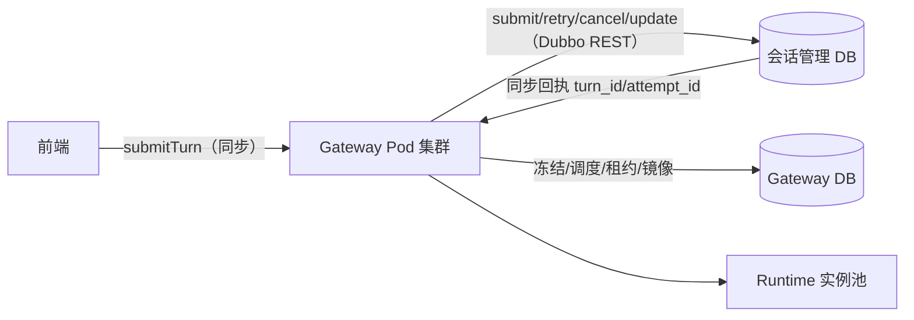
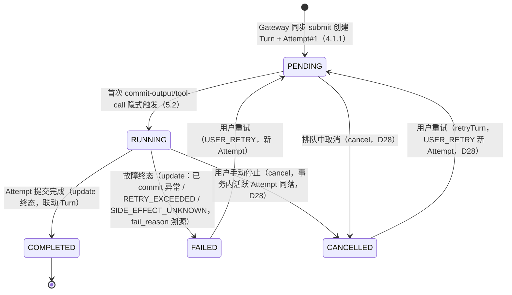
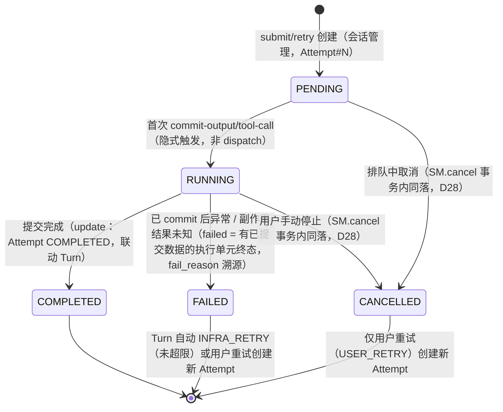
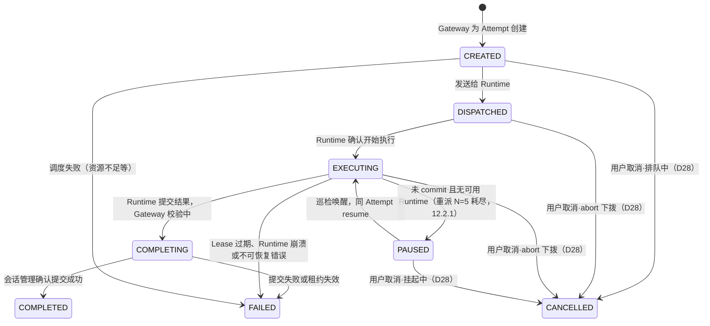
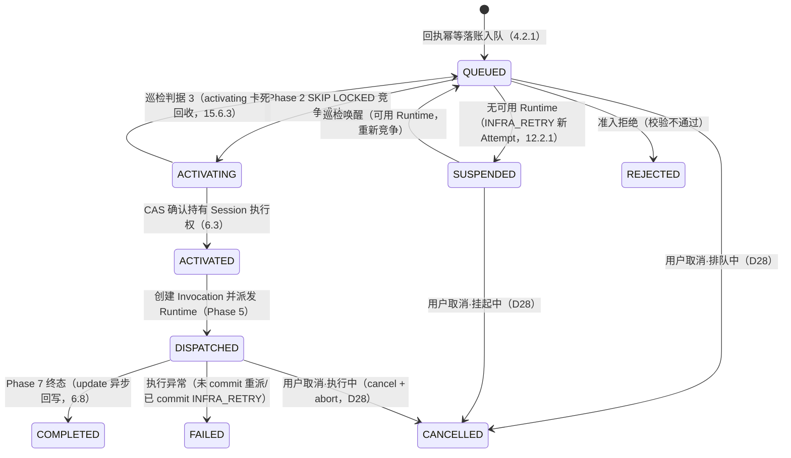
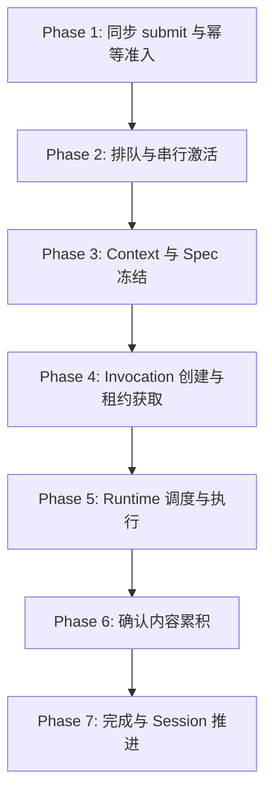
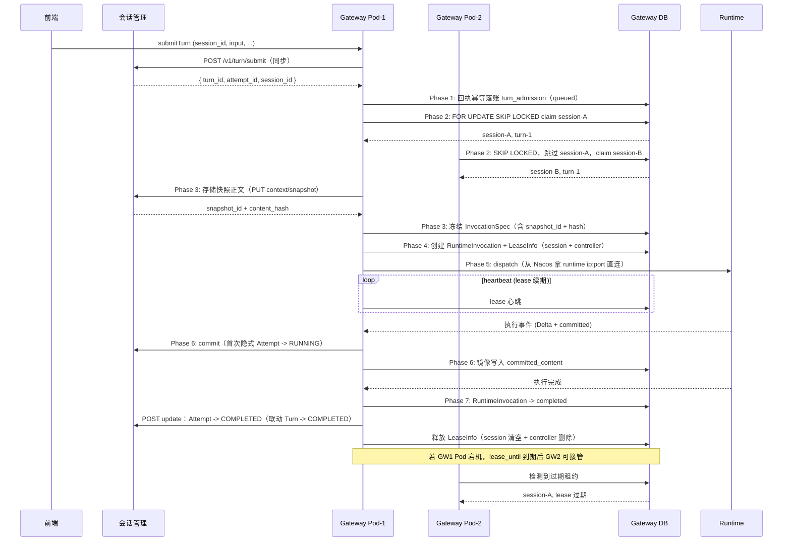
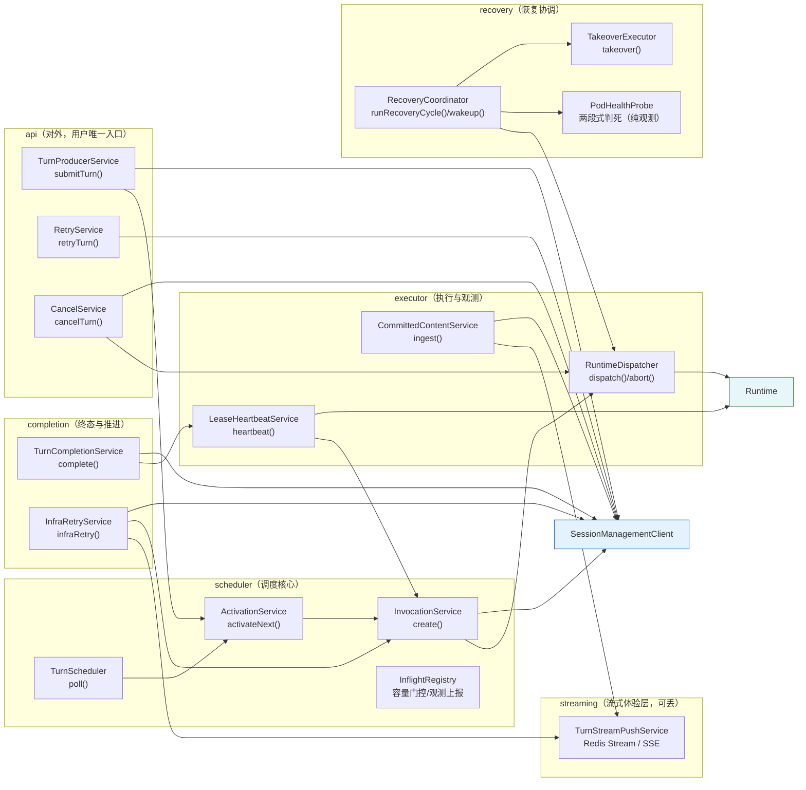

# TurnScheduler 分布式调度方案 v2

> 评审版本：v2.0
> 技术栈：Java 17+、Spring Boot、Spring JDBC/MyBatis、PostgreSQL
> 部署形态：Kubernetes 多 Pod 副本
> 对齐文档：统一 Agent Runtime 与 Runtime Driver 技术方案、专题 02：Session、Turn 与 Context

## 1. 目标与约束

### 1.1 目标

- 同一 Session 的 Turn 严格按 Turn ID 顺序执行，同一 Session 同时最多一个活动 Invocation。
- 不同 Session 可由不同 Gateway Pod 并行执行。
- 多个 Producer 可并发写入 Turn。
- 多个 Gateway Pod 可并发消费不同 Session，通过数据库行锁保证互斥。
- Gateway Pod 宕机后，租约过期，其他 Pod 自动接管未完成的 Invocation。
- 旧 Gateway Pod 不能控制当前 Invocation（通过 Controller Lease 隔离）。
- 旧 Invocation 不能写 Sandbox 或产生新副作用（通过 Fencing Token 隔离）。
- 调度状态可查询、可审计、可人工干预。

### 1.2 非目标

- 不在数据库事务中执行 Runtime 或远程 AI 调用。
- 不依赖 JVM 本地锁或本地队列保证分布式互斥。
- 不把消息队列的消费确认当作业务成功确认。
- 不恢复 Runtime 的 PID、内存、Socket、后台进程和依赖缓存。

### 1.3 核心执行语义

```text
Session
  +-- Turn (PENDING -> RUNNING -> COMPLETED / FAILED / CANCELLED)
       +-- Attempt (PENDING -> RUNNING -> COMPLETED / FAILED / CANCELLED)
            +-- RuntimeInvocation (CREATED -> DISPATCHED -> EXECUTING -> COMPLETING -> COMPLETED / FAILED / CANCELLED / PAUSED)
                 +-- Runtime Execution (瞬时，Worker 执行实例)
```

- 一次用户输入产生一个 Turn；重试（用户或系统）不创建新 Turn，而是在原 Turn 下创建新 Attempt。
- Attempt 业务记录只由会话管理创建（submit 建 Attempt#1，retry 建 Attempt#N）；Gateway 消费返回的 attempt_id，为 Attempt 创建 RuntimeInvocation，冻结 InvocationSpec，调度 Runtime 执行。
- 所有异常默认走自动重试（INFRA_RETRY，见 12.2）：已产生确认输出的 Attempt 失败后置 failed，Turn 自动创建新 Attempt 继续；未产生确认输出的故障在同一 Attempt 内重派。
- Gateway 故障接管接管原 Invocation，不创建新的 Attempt 或 Invocation。
- 推荐把调度粒度定义为 Session，把执行粒度定义为 RuntimeInvocation。

### 1.4 三个不可变对象

| 对象 | 回答的问题 | 特性 |
|---|---|---|
| ContextSnapshot | 这次 Attempt 实际看到了什么上下文 | 不可变，含消息水位和内容 Hash |
| InvocationSpec | 这次获准以什么版本、能力、资源和预算执行 | 不可变，由 Gateway 冻结 |
| RuntimeObservation（并入 runtime_invocation） | 实际在哪里、使用什么环境、执行到了哪里 | 单调推进，由 Runtime 上报，只用于观测不参与状态判定 |

### 1.5 架构不变量（与总纲第 8 节对齐）

1. Session 创建时固定 Agent Revision，不绑定 Runtime Replica。
2. 同一 Session 同一时间最多一个合法活动 Invocation。
3. Runtime 不拥有跨 Turn 的权威状态。
4. Gateway 不代理模型执行、大文件正文或 MCP 请求正文。
5. Sandbox 按需创建，可跨 Turn 复用文件现场。
6. 新 Attempt 不等于新 SandboxInstance；只有环境完整重建才创建新实例 ID。
7. Artifact 是用户交付版本，Checkpoint 是系统恢复点。
8. 所有可版本化定义使用精确 Revision 和 Hash。
9. InvocationSpec 不可变，运行事实不能改写执行计划。
10. 失败不能导致不安全的外部副作用重放。
11. Secret、Capability、临时 URL 和二进制正文不得进入 Prompt 或普通 Trace。
12. 每一种权威数据只有一个所有者。

## 2. 总体架构



### 2.1 K8s 部署拓扑

```text
Kubernetes Cluster
  +-- Gateway Deployment (N replicas)
  |     +-- Pod-1: TurnScheduler + RuntimeDispatcher
  |     +-- Pod-2: TurnScheduler + RuntimeDispatcher
  |     +-- Pod-N: TurnScheduler + RuntimeDispatcher
  +-- Session Management Deployment
  +-- Runtime Deployment (M replicas)
  +-- PostgreSQL (主从)
```

关键约束：
- 每个 Gateway Pod 运行独立的 TurnScheduler 轮询循环。
- 所有 Pod 共享同一个 Gateway PostgreSQL。
- 分布式互斥完全依赖数据库行锁（FOR UPDATE SKIP LOCKED），不依赖 Pod 本地状态。
- Pod 扩缩容不影响已 dispatch 的 Invocation，租约机制保证接管安全。

### 2.2 两侧数据库职责

| 数据库 | 持有的事实 | 所有者 |
|---|---|---|
| 会话管理 DB | Session、Turn、Attempt、Message、ContextSnapshot **正文**、确认输出（权威）、Artifact 引用 | 会话管理服务 |
| Gateway DB | TurnAdmission（调度队列，同步回执落账）、RuntimeInvocation（含观测水位）、InvocationSpec（含 snapshot_id + content_hash）、LeaseInfo（统一租约，session/controller）、Committed Content（**Gateway 本地镜像/缓存，非权威，4.2.5**） | Gateway |

任何 Runtime Replica、Gateway Pod 或 Sandbox Pod 都可以被替换；权威状态不能依赖其本地磁盘。

### 2.3 四类数据流

- **控制流**：Gateway 驱动调度、资源、取消和完成。
- **模型与 Tool 执行流**：Runtime 运行 Agent Loop 并决定 Tool Call。
- **大文件数据流**：Sandbox、Connector、对象存储和文件管理直接传输。
- **权威状态流**：会话管理和 Gateway DB 保存可恢复事实。

它们不能被实现成一条由 Gateway 同步转发所有正文的 RPC 长链。

### 2.4 基础可用组件

TurnScheduler 依赖以下平台基础组件，均为部署环境保证可用的基础设施：

| 组件 | 在调度系统中的角色 | 核心用法 | 职责边界 |
|---|---|---|---|
| **Kubernetes** | 部署形态与副本管理 | Gateway/Runtime 以 Deployment 多副本运行；K8s 负责 Pod 编排、Liveness/Readiness 健康探测、滚动更新与优雅关闭（SIGTERM） | 不参与调度互斥；readiness/liveness 只决定流量分配与滚动更新节奏，不参与任务所有权判定（详见 15.6） |
| **PostgreSQL** | 权威状态 + 分布式互斥 | 调度队列、三类租约、RuntimeInvocation、InvocationSpec、CommittedContent 的唯一权威事实源；`FOR UPDATE SKIP LOCKED` 承担跨 Pod 互斥 | 单实例吞吐决定调度上限；全部 Pod 连接总数必须控制在 `max_connections` 的 60% 以内；故障恢复真相只以 PG 数据为准 |
| **Nacos** | 服务注册发现 + 健康感知 + 配置管理 + **观测上报（纯观测）** | Gateway 与 Runtime 注册/摘除/发现（**实例元数据携带 ip:port，调度方直连寻址**，见下方寻址模型）；调度选 Runtime 时过滤不健康实例；运行时配置按精确 Revision 下发；Gateway Pod 将本 Pod InflightRegistry 快照上报 Nacos（14.5），仅用于观测大盘与容量计数 | 心跳感知存在探测窗口（网络分区下可能误判），只能缩短"发现时间"，不能替代租约做"安全接管"判定；**Nacos 上报的值调度决策永不引用**（决策 1）；上报数据取自 Pod 内存（InflightRegistry），不查库 |
| **Redis** | 短时态与实时体验层 | `assistant_output_delta` 短期事件流（供前端实时展示，不进长期业务表）；可选：幂等快速路径缓存、Nacos 实例列表本地缓存 | 属于观测/体验数据，不是恢复真相；故障恢复一律以会话管理消息表（权威）+ Gateway 侧 `committed_content` 镜像（决策 D2）为准 |

组件在调度流水线中的出现位置：

```text
前端 submitTurn ──> [Gateway 对外 API] ──> [SM] 同步 submit/retry/cancel/update（外部契约 4.1.1）
待执行 Turn ──> [PG] admission / queue / 租约 / invocation   （权威状态流）
    │
    ├─> [Nacos] 发现健康 Runtime 实例（元数据 ip:port，直连寻址）      （控制流）
    │
    └─> [Redis] Runtime 实时 Delta 事件流（仅体验）        （体验层）
    │
    └─> [K8s]  所有 Pod 的部署、探测、灰度与优雅关闭       （部署层）
```

**寻址模型（身份 vs 地址，决策 D14）**：`holder_pod`（lease_info）与 `runtime_replica_id`（runtime_invocation）存的是**实例身份标识**（Pod 名），不是可访问地址。要连接某实例时，实时查 Nacos 该 service 的实例元数据拿 `ip:port` 直连（K8s 内 Pod IP 互通；本地 debug 注册 `127.0.0.1`）；Pod 重启 IP 变化由 Nacos 心跳注册自动更新。**不建 id→地址解析表**，Nacos 即注册表。

## 3. 核心对象层级与职责边界

### 3.1 对象定义

| 对象 | 语义 | 权威所有者 | 关键约束 |
|---|---|---|---|
| Session | 用户与某个固定 Agent Revision 的连续业务会话 | 会话管理 | 创建时固定 agent_id + agent_revision |
| Turn | 一次用户输入及其回答过程 | 会话管理 | 用户重试不复制输入 |
| Attempt | 同一 Turn 的一次具体回答尝试 | 会话管理（业务记录只由会话管理创建，Gateway 消费 attempt_id，不直接 INSERT，决策 D7） | 输出互相隔离，selected_attempt_id 指向正式回答；重试（用户 USER_RETRY 或系统 INFRA_RETRY）创建新 Attempt |
| RuntimeInvocation | Gateway 为 Attempt 创建的执行工单 | Gateway | 一个 Attempt 对应一个 Invocation |
| Runtime Execution | Runtime 根据 Invocation 创建的 Worker 执行实例 | Runtime 瞬时持有 | Invocation 结束后可清理 |

### 3.2 调度侧与会话侧的状态分离

```text
会话管理侧                        Gateway 侧
-----------                       -----------
Turn: PENDING -> RUNNING          TurnAdmission: QUEUED -> ACTIVATING
     -> COMPLETED / FAILED             -> ACTIVATED -> DISPATCHED
     / CANCELLED                       -> COMPLETED / REJECTED / FAILED / CANCELLED
                                          |  SUSPENDED（无可用 Runtime 挂起，12.2.1）
                                          |
Attempt: PENDING -> RUNNING             |
     -> COMPLETED / FAILED        RuntimeInvocation: CREATED -> DISPATCHED
     / CANCELLED                       -> EXECUTING -> COMPLETING
                                          -> COMPLETED / FAILED / CANCELLED
                                          |  PAUSED（未 commit 故障挂起，12.2.1）
```

两个视角独立演进：**通过同步 submit 回执和 update 回调同步**（外部契约见 4.1.1）；Attempt 终态用 COMPLETED（非 SUCCESS）。

## 4. 数据模型

### 4.1 会话管理侧（参考，非本模块实现）

会话管理持有 Session、Turn、Attempt、Message、ToolCall/Result、ContextSnapshot（正文权威）和确认输出（权威）。详细表结构见专题 02 与《统一会话管理改造技术方案》。

关键状态枚举（决策 D5）：

```text
Turn 状态: PENDING -> RUNNING -> COMPLETED / FAILED / CANCELLED
Attempt 状态: PENDING -> RUNNING -> COMPLETED / FAILED / CANCELLED
注意: Attempt 终态为 COMPLETED（非 SUCCESS）；PENDING -> RUNNING 由首次 commit-output/tool-call 隐式触发（非 dispatch）；
     CANCELLED 仅由用户取消触发（SM.cancel 事务内 Turn+Attempt 同落，决策 D28），系统故障一律 FAILED + fail_reason 溯源
```

#### 4.1.1 同步提交通道与外部契约（替代原 turn_ready_outbox）

**Gateway 是用户唯一入口**（永久）：前端/Producer 的一切交互（提交 Turn、SSE 订阅、retry、cancel、查询）都终止于 Gateway；Gateway 通过**同步 Dubbo REST 调用**与会话管理交互（决策 D1）：

```text
前端 submitTurn
  -> Gateway 调 会话管理 POST /v1/turn/submit（同步）
  -> 会话管理事务内创建 Turn + Attempt#1（PENDING），返回回执 { turn_id, attempt_id, session_id }
  -> Gateway 以回执幂等落账 turn_admission（4.2.1），进入调度队列（Phase 2~7）
  -> 终态经 update 接口回写会话管理（6.8）
```

调度侧消费的外部契约（A1~A12 子集，完整见《统一会话管理改造技术方案》）：

| 方法 | 契约 | 方向 | 关键语义 |
|---|---|---|---|
| **submit** | `POST /v1/turn/submit` | GW → SM | 创建 Turn + Attempt#1（PENDING）；请求仅 session_id/input/attachment_ids/selected_skill_ids，**无 client_app_id/request_id**（决策 D15） |
| **retry** | `POST /v1/turn/{turn_id}/retry` | GW → SM | `trigger_type: USER_RETRY / INFRA_RETRY`；创建新 Attempt（attempt_number+1，复用快照），Turn → PENDING；**配额分列（决策 D21）**：INFRA_RETRY 单独计数 `infra_retry_count`（独立上限），不消耗 USER_RETRY 配额——基础设施故障不得耗尽用户重试机会 |
| **cancel** | `POST /v1/turn/{turn_id}/cancel` | GW → SM | 用户手动停止；**事务内同落 Turn=CANCELLED + 活跃 Attempt=CANCELLED（决策 D28）**，停止自动重试，仅用户可恢复（12.2）；Attempt 的 CANCELLED 永不经 update 写 |
| **commit** | `POST /v1/attempt/{attempt_id}/commit` | GW → SM | 提交确认输出（按 message_id 幂等 upsert 消息表）；**首次 commit 隐式推进 Attempt → RUNNING**（5.2）；请求携带 `attempt_id + controller_epoch`（fencing），旧 Attempt / 非当前 holder 的写入被拒绝（决策 D18，6.7）；**Attempt 已 CANCELLED 时拒收（迟到的取消后写入）** |
| **update** | `POST /v1/turn/{turn_id}/update` | GW → SM | 提交终态（Attempt COMPLETED / FAILED → 联动 Turn），幂等；**枚举仅系统终态两种（决策 D28），用户取消经 cancel 落账** |
| **context-snapshot** | `PUT/GET /v1/context/snapshot/{attempt_id}` | GW ↔ SM | 快照正文存会话管理（权威），Gateway 只留 snapshot_id + content_hash（9.1） |

三段映射（前端 API → Gateway → 会话管理契约）：

| 前端（11.3） | Gateway 动作 | 会话管理契约 |
|---|---|---|
| submitTurn | 调 submit，拿回执落 admission | `submit` |
| retryTurn（用户） | 调 retry（USER_RETRY），为新 attempt_id 建 Invocation | `retry` |
| （自动） | 异常 → 接管 → 调 retry（INFRA_RETRY） | `retry` |
| cancelTurn | 调 cancel，停止自动重试 | `cancel` |
| （执行中） | commit 确认输出 | `commit` |
| （终态） | 调 update 标记终态 | `update` |
| subscribeTurnEvents | SSE 订阅（submit 同步返回后即可建立） | — |

**Attempt 创建归属（决策 D7）**：Attempt 业务记录只由会话管理创建（submit 建 #1，retry 建 #N）；Gateway 消费返回的 attempt_id 创建 RuntimeInvocation，**不直接 INSERT attempt**。

**重试模型（决策 D9~D12）**：见 12.2——所有异常默认自动重试；已产生确认输出的 Attempt 失败后置 failed，Turn 自动 INFRA_RETRY 新 Attempt；未产生确认输出的故障在同一 Attempt 内重派（N=5 退避）。

### 4.2 Gateway 侧（本模块核心）

#### 4.2.1 turn_admission（同步回执落账 + 调度队列，Gateway 侧幂等准入）

Gateway 同步调用会话管理 submit 拿到回执后的准入记录，**承担调度队列**：以回执 `(session_id, turn_id, attempt_id)` 为幂等键 `INSERT ... ON CONFLICT DO NOTHING` 落账，前端重复提交被静默吸收；随后同一行通过状态机流转 `queued → activating → activated → dispatched → …`，被多个 Pod 以 `FOR UPDATE SKIP LOCKED` 竞争消费。无可用 Runtime 时行可置 `suspended` 挂起（唤醒后重新竞争，见 12.2.1）。

```sql
create table turn_admission (
    id                    bigint primary key,
    session_id            varchar(128) not null,
    turn_id               bigint not null,
    attempt_id            bigint not null,
    enqueue_seq           bigint not null,       -- 同 session 排队顺序（单调）
    activation_priority   integer not null default 0,
    status                varchar(16) not null default 'queued',
    failed_from           varchar(16),                 -- 终态溯源：进入 failed 前的最后状态
    fail_reason           varchar(32),                 -- 终态溯源：COORDINATOR_DEAD/RUNTIME_STALLED/RETRY_EXCEEDED/DISPATCH_REJECTED
    failed_at             timestamp with time zone,    -- 终态溯源
    cancelled_from        varchar(16),                 -- 终态溯源：进入 cancelled 前的最后状态
    cancel_reason         varchar(64),                 -- 终态溯源：用户取消（决策 D28：协调者中断/系统故障一律走 failed + fail_reason，不占用 cancelled）
    created_at            timestamp with time zone not null,
    updated_at            timestamp with time zone not null,

    constraint uk_turn_admission_session_turn_attempt unique (session_id, turn_id, attempt_id),
    constraint ck_turn_admission_status check (status in ('queued', 'activating', 'activated', 'dispatched', 'completed', 'rejected', 'failed', 'cancelled', 'suspended'))
);

create index idx_turn_admission_claim
    on turn_admission (status, activation_priority desc, enqueue_seq)
    where status in ('queued', 'activating');

create index idx_turn_admission_session
    on turn_admission (session_id, status);
```

状态机：

```text
queued（同步回执落账即入队，Phase 1）→ activating（SKIP LOCKED 竞争，Phase 2）
→ activated（租约获取成功，Phase 4）→ dispatched（下拨 Runtime，Phase 5）
→ completed / rejected / failed / cancelled（终态）
suspended（已 commit 失败的 INFRA_RETRY 新 Attempt 在无可用 Runtime 时挂起，12.2.1）
→ 唤醒后经 queued 重新竞争
```

`failed` 为终态（不再自动流转），`fail_reason` 枚举：

| fail_reason | 触发场景 | 处理路径 |
|---|---|---|
| `COORDINATOR_DEAD` | 协调者死亡（判据 1 命中） | 已 commit → Attempt failed + INFRA_RETRY（12.2）；未 commit → 同 Attempt 重派/挂起 |
| `RUNTIME_STALLED` | Runtime 事件停滞（判据 2 命中，5min 阈值） | 同上，按 commit 分界走自动重试 |
| `RETRY_EXCEEDED` | 自动重试超限（重派 N=5 耗尽且 INFRA_RETRY 耗尽/无可用 Runtime） | Turn 置 failed，此后才允许用户重试（12.3） |
| `DISPATCH_REJECTED` | Runtime 拒绝下拨（fencing/spec 校验失败等） | 重派换实例；持续失败按 commit 分界走自动重试 |

`cancelled` 对称补充 `cancelled_from` / `cancel_reason`（**仅用户取消，决策 D28**：协调者中断/系统故障一律走 `failed` + `fail_reason`，不占用 cancelled）。`runtime_invocation` 已持有 `error_code` / `error_message`，不重复记录技术错误。

> 状态 `suspended` 专用于"无可用 Runtime"的挂起（12.2.1）：已 commit 失败的 Attempt 置 failed 后，其 INFRA_RETRY 新 Attempt 若遇无可用 Runtime，在 admission 层 `suspended` 挂起，不参与竞争；巡检发现可用 Runtime 后按"最新 Turn 的最新 Attempt"优先唤醒置回 queued（决策 D12/D13）。

幂等语义（与 8.1 对应，决策 D15）：

- `(session_id, turn_id, attempt_id)`：同步回执幂等（会话管理返回的 Turn/Attempt 回执唯一；重试产生新 Attempt = 新回执，不会被旧回执吞掉）；
- 用户级防重放（前端重复点击）前移到 Gateway 对外接口 submitTurn 自持 request 幂等键（11.3），**不进调度表**。

#### 4.2.2 runtime_invocation（执行工单 + Runtime 观测）

Gateway 为 Attempt 创建的执行工单，是调度的最小单位；同时吸收原 `runtime_observed_state` 的观测字段（Runtime 上报的运行时事实，单调推进，不反向修改），避免 1:1 冗余表。

```sql
create table runtime_invocation (
    id                    bigint primary key,
    invocation_id         varchar(128) not null,
    session_id            varchar(128) not null,
    turn_id               bigint not null,
    attempt_id            bigint not null,
    admission_id          bigint not null,
    spec_hash             varchar(64) not null,
    sandbox_mode          varchar(16) not null default 'none',
    sandbox_instance_id   varchar(128),
    fencing_token         bigint not null default 0,
    status                varchar(16) not null default 'created',
    runtime_type          varchar(64),
    runtime_replica_id    varchar(128),
    worker_id             varchar(128),
    error_code            varchar(64),
    error_message         text,
    current_phase         varchar(32) not null default 'initializing',  -- 观测：Runtime 当前阶段
    event_sequence        bigint not null default 0,                    -- 观测：事件水位（单调）
    last_event_at         timestamp with time zone,                     -- 观测：最近事件时间
    model_request_sent    boolean not null default false,
    tool_calls_count      integer not null default 0,
    output_tokens         bigint not null default 0,
    created_at            timestamp with time zone not null,
    updated_at            timestamp with time zone not null,

    constraint uk_runtime_invocation_id unique (invocation_id),
    constraint uk_runtime_invocation_attempt unique (attempt_id),
    constraint ck_invocation_status check (status in ('created', 'dispatched', 'executing', 'completing', 'completed', 'failed', 'paused'))
);

create index idx_invocation_session
    on runtime_invocation (session_id, status);

create index idx_invocation_status
    on runtime_invocation (status, created_at);
```

observation 语义：`current_phase / event_sequence / tool_calls_count / output_tokens` 等由 Runtime 事件驱动单调更新，只用于健康感知与观测（见 15.6），不参与状态机判定。

> `paused` 语义（决策 D12）：**未产生确认输出（未 commit）**的 Attempt 遇到无可用 Runtime 故障时，其 Invocation 置 `paused` 挂起——租约仍由持有 Pod 续期（防止其他 Turn 插入同一 Session），Runtime 恢复后由巡检唤醒同 Attempt resume；**一旦曾 commit 过**，则不再置 paused，Attempt 直接走 failed + INFRA_RETRY 新 Attempt（12.2）。

#### 4.2.3 invocation_spec

不可变的执行计划，随 RuntimeInvocation 创建后不再修改。

```sql
create table invocation_spec (
    invocation_id         varchar(128) primary key,
    session_id            varchar(128) not null,
    turn_id               bigint not null,
    attempt_id            bigint not null,
    agent_revision        varchar(128) not null,
    runtime_type          varchar(64) not null,
    model_policy          jsonb not null,
    skill_revisions       jsonb not null default '[]',
    tool_revisions        jsonb not null default '[]',
    config_refs           jsonb not null default '{}',
    sandbox_profile       jsonb,
    external_access       jsonb,
    security_templates    jsonb,
    execution_limits      jsonb not null default '{}',
    plan_hash             varchar(64) not null,
    context_snapshot_id   varchar(128) not null,
    context_content_hash  varchar(64) not null,  -- 快照正文 Hash（正文权威在会话管理，Gateway 只存引用 + Hash，决策 D3）
    created_at            timestamp with time zone not null
);

comment on table invocation_spec is '不可变执行计划，创建后永不修改；context_snapshot_id/context_content_hash 指向会话管理存储的快照正文（权威），Gateway 不持有正文（决策 D3）';
```

#### 4.2.4 lease_info（统一租约：Session + Controller）

三类租约中，`session_lease`（Session 串行执行权）与 `controller_lease`（Invocation 控制权）结构雷同，合并为一张表以 `lease_type` 区分；Runtime 侧 fencing token 不落库，保持运行时内存语义（见 7.3）。

```sql
create table lease_info (
    id                    bigint primary key,
    lease_type            varchar(16) not null,    -- 'session' / 'controller'
    session_id            varchar(128) not null,
    invocation_id         varchar(128) not null,
    holder_pod            varchar(128) not null,
    controller_epoch      bigint not null default 0,  -- 仅 controller 类型使用，递增防旧 Pod
    lease_until           timestamp with time zone not null,
    heartbeat_at          timestamp with time zone not null,
    lease_version         bigint not null default 0,
    created_at            timestamp with time zone not null,
    updated_at            timestamp with time zone not null,

    constraint uk_lease_session unique (lease_type, session_id),
    constraint uk_lease_controller unique (lease_type, invocation_id)
);

create index idx_lease_recover
    on lease_info (lease_until)
    where lease_until < now();
```

类型语义：

- `lease_type='session'`：同一 Session 同时只有一个 Pod 持有有效租约（`uk_lease_session`）；
- `lease_type='controller'`：同一 Invocation 只有一个协调 Pod，通过 `controller_epoch` 递增防止旧 Pod 回写（`uk_lease_controller`）。

#### 4.2.5 committed_content

确认内容记录（**Gateway 本地镜像/缓存，非权威**——权威在会话管理消息表，决策 D2）。是 Gateway 侧故障恢复的边界与续读水位：Delta 丢失后从这里恢复；会话管理侧以 `message_id` 幂等 upsert，本镜像按 `committed_sequence` 去重，可随时丢弃重建。

```sql
create table committed_content (
    id                    bigint primary key,
    invocation_id         varchar(128) not null,
    attempt_id            bigint not null,
    committed_sequence    bigint not null,
    content_type          varchar(32) not null,
    content_ref           varchar(256) not null,
    content_hash          varchar(64),
    created_at            timestamp with time zone not null,

    constraint uk_committed_content unique (invocation_id, committed_sequence)
);

create index idx_committed_content_invocation
    on committed_content (invocation_id, committed_sequence);
```

## 5. 状态机

### 5.1 Turn 状态机（会话管理侧）



> 系统故障一律 FAILED + fail_reason（D28），Turn 不再有 INTERRUPTED 态；CANCELLED 仅用户取消可达，且仅 USER_RETRY 可恢复（自动重试对 CANCELLED 不生效，12.2）。

### 5.2 Attempt 状态机（会话管理侧）



### 5.3 RuntimeInvocation 状态机（Gateway 侧）



> CANCELLED 由用户取消触发（D28）：Gateway 置 admission/invocation 终态后经 **abort 接口**通知 Runtime 停止（6.6）；abort 携带 fencing token、幂等，丢失或超时由 Runtime Execution Lease 到期自停 + fencing 拒收兜底（**abort 是加速器，不是正确性依赖**）。

### 5.4 TurnAdmission 状态机（Gateway 侧）

> 补充自架构审阅 D1：`turn_admission`（4.2.1）是调度队列 + 幂等台账，状态枚举 `queued/activating/activated/dispatched/completed/rejected/failed/cancelled/suspended`，此处补齐 mermaid 图（与 5.2 的 Attempt / 5.3 的 Invocation 三视图并列，各管各的权威域）。



> 用户取消可将**任意非终态** admission 行终态化为 cancelled（D28，图中画三条主路径；ACTIVATING/ACTIVATED 瞬态窗口内取消由 CAS 回收/下拨前检查兜底）；cancelled 行与 failed 行同样走终态归档（16.8）。

> Admission 行是**纯调度视角**，与 Attempt（会话管理）一对多演进无关：重试/重派产生的新 Attempt = 新回执 = **新的 admission 行**（新幂等键），同一 Turn 的多个 Attempt 对应多行 admission（各自排队/执行/终态）。

### 5.5 状态归属与权威边界

| 状态机 | 归属（权威） | 存储位置 | 说明 |
|---|---|---|---|
| Turn | 会话管理（业务权威） | 会话管理 `turn.status` | PENDING→RUNNING→终态；CANCELLED 仅用户触发 |
| Attempt | 会话管理（业务权威） | 会话管理 `attempt.status` | Attempt 终态后不可变，重试创建新 Attempt（D7） |
| TurnAdmission | Gateway（调度权威） | `turn_admission.status` | 调度队列态，含 `suspended` 挂起（12.2.1） |
| RuntimeInvocation | Gateway（运行权威，可重建） | `runtime_invocation.status` | 运行态，含 `paused` 挂起（12.2.1） |

> 两套权威各管其域：会话管理管"业务真相"（这个 Turn 该不该重试、哪个 Attempt 是正式回答）；Gateway 管"调度真相"（这个 Attempt 现在排到哪、由谁在执行）。同步提交通道与 update 回调负责两者对齐（4.1.1）。

### 5.6 状态转换规则

| 当前状态 | 事件 | 触发条件 | 下一状态 | 执行方 |
|---|---|---|---|---|
| Turn PENDING | commit-output / tool-call | 首次收到（隐式） | RUNNING | 会话管理 |
| Attempt PENDING | commit-output / tool-call | 首次收到（隐式） | RUNNING | 会话管理 |
| Turn RUNNING | update(Attempt=COMPLETED) | 终态提交 | COMPLETED（selected_attempt_id=该 Attempt） | Gateway 调 update |
| Turn RUNNING | update(Attempt=FAILED) | 终态提交 | FAILED（fail_reason 溯源） | Gateway 调 update |
| Turn FAILED | retry(USER_RETRY) | 用户点击（12.3） | PENDING（新 Attempt） | 会话管理 |
| Turn FAILED | retry(INFRA_RETRY) | 已 commit 故障自动重试（12.2） | PENDING（新 Attempt，复用快照） | 会话管理 |
| Turn PENDING / RUNNING | cancel | 用户手动停止（12.2，D28） | CANCELLED（**活跃 Attempt 同事务置 CANCELLED**） | 会话管理 |
| Turn CANCELLED | retryTurn（USER_RETRY） | 用户重试（12.2，D28） | PENDING（新 Attempt） | 会话管理 |
| Invocation DISPATCHED / EXECUTING / PAUSED | abort（用户取消） | cancelTurn 触发（6.6，D28） | CANCELLED | Gateway |
| Admission QUEUED / SUSPENDED / DISPATCHED | cancel 联动 | cancelTurn 触发（D28） | CANCELLED | Gateway |
| Invocation EXECUTING | Runtime 失联（未 commit） | 重派 N=5 耗尽且无可用 Runtime | PAUSED | Gateway |
| Invocation PAUSED | 巡检唤醒（可用 Runtime） | 唤醒器扫描（12.2.1） | EXECUTING（同 Attempt resume） | Gateway |
| Admission QUEUED | 新 Attempt 遇无可用 Runtime | INFRA_RETRY 且 Runtime 池空（12.2.1） | SUSPENDED | Gateway |
| Admission SUSPENDED | 巡检唤醒（可用 Runtime） | 唤醒器扫描（12.2.1） | QUEUED（重新竞争） | Gateway |

## 6. 调度流水线

整个调度过程分为 7 个阶段，在 K8s 多 Pod 场景下，每个阶段的分布式安全性由数据库行锁保证。

### 6.1 阶段总览



### 6.2 Phase 1: 同步 submit 与幂等准入

Gateway 是用户唯一入口，submit 流程全部同步（决策 D1），不再有 outbox 消费/ack。

**步骤 0（Gateway 对外 API）：接收 submitTurn**

```text
前端 submitTurn(session_id, input, attachment_ids, selected_skill_ids)
  -> Gateway 校验 + 用户级防重放（submitTurn 自持 request 幂等键，Redis 快速路径可选，11.3）
  -> 调会话管理 POST /v1/turn/submit（同步，4.1.1）
  -> 会话管理事务内创建 Turn + Attempt#1（PENDING），返回回执 { turn_id, attempt_id, session_id }
```

**步骤 1（Gateway 侧，本地事务）：回执幂等落账入队**

```sql
-- 事务 BEGIN
-- 回执为幂等键：会话管理已保证 (session_id, turn_id, attempt_id) 唯一，重复提交/重放命中已有行
insert into turn_admission (
    id, session_id, turn_id, attempt_id,
    enqueue_seq, activation_priority, status, created_at, updated_at
) values (?, ?, ?, ?, ?, ?, 'queued', now(), now())
on conflict (session_id, turn_id, attempt_id) do nothing;
-- 事务 COMMIT
```

**失败/重试语义：**

- submit 同步调用成功但落账前崩溃 → 调用方重放，会话管理幂等返回同一回执，落账 `on conflict` 静默跳过；
- 落账成功但响应前端超时 → 前端重试 submitTurn，回执幂等命中已有行；
- 同步调用失败（会话管理不可用）→ 直接返回 5xx，由调用方重试，**不做异步缓冲**。
- 计费/审计的关注点：落账与调度同库，回执入库即入队（无 outbox 中间态）。

### 6.3 Phase 2: 排队与串行激活（分布式竞争）

这是多 Pod 分布式竞争的核心阶段。多个 Gateway Pod 同时轮询，通过 FOR UPDATE SKIP LOCKED 确保同一 Session 只被一个 Pod 激活。

```sql
-- Phase 2 竞争激活（合并版）：一步排除有活动 Session 租约的 Session
-- 决策 12：LEFT JOIN lease_info 过滤忙碌 Session，SKIP LOCKED 保持互斥
-- 安全不变：Phase 4 获取 Session 租约时的唯一键 + CAS 仍是最终兜底
select a.id as admission_id, a.session_id, a.turn_id, a.attempt_id
from turn_admission a
left join lease_info l
       on l.lease_type = 'session'
      and l.session_id  = a.session_id
      and l.lease_until > now()          -- 有未过期 Session 租约 = 忙碌
where a.status = 'queued'
  and l.id is null                       -- 排除忙碌 Session 的排队 Turn
order by a.activation_priority desc, a.enqueue_seq
for update skip locked
limit 1;

-- 锁到行后标记 activating
update turn_admission
set status = 'activating', updated_at = now()
where id = ? and status = 'queued';
```

> 实现选型（决策 13）：**不引入 Spring Integration**。`JdbcPollingChannelAdapter` 无法表达"跨库两段语义 + 租约检查 + 容量门控"的组合（三表跨库、多态租约、空闲跳过），硬凑会退化回定制代码；保持 `@Scheduled` + `JdbcTemplate` 手写 poll 循环（14.3），单纯简单、可测、可加门控。

### 6.4 Phase 3: Context 与 Spec 冻结

激活后，Gateway 构建不可变快照（决策 D3）：

1. **构建 ContextSnapshot（Gateway 侧）**：Gateway 依据消息水位、摘要、附件引用组装快照正文，**调会话管理存储正文**（`PUT /v1/context/snapshot/{attempt_id}`），返回 `snapshot_id` + `content_hash`；正文权威在会话管理，Gateway 只持引用。
2. **冻结 InvocationSpec**：解析 Agent Revision、Model Policy、Skill/Tool Revision、Config、Sandbox Profile、Security Policy 和执行预算，形成不可变执行计划；写入 `context_snapshot_id` + `context_content_hash`。
3. **计算 plan_hash**：对 InvocationSpec 内容取 Hash，用于后续校验。

```sql
-- 写入 InvocationSpec（不可变，无 UPDATE 语句）
insert into invocation_spec (
    invocation_id, session_id, turn_id, attempt_id,
    agent_revision, runtime_type, model_policy, skill_revisions,
    tool_revisions, config_refs, sandbox_profile, external_access,
    security_templates, execution_limits, plan_hash, context_snapshot_id,
    context_content_hash, created_at
) values (?, ?, ?, ?, ?, ?, ?, ?, ?, ?, ?, ?, ?, ?, ?, ?, ?, now());
```

### 6.5 Phase 4: Invocation 创建与租约获取

在同一个事务中完成：

```sql
-- 事务 BEGIN

-- 1. 创建 RuntimeInvocation
insert into runtime_invocation (
    id, invocation_id, session_id, turn_id, attempt_id, admission_id,
    spec_hash, sandbox_mode, fencing_token, status, created_at, updated_at
) values (?, ?, ?, ?, ?, ?, ?, ?, ?, 'created', now(), now());

-- 2. 获取 Session Execution Lease（排他锁，lease_type='session'）
-- 如果已有有效租约，CAS 失败则放弃
insert into lease_info (
    id, lease_type, session_id, invocation_id, holder_pod, lease_until,
    heartbeat_at, lease_version, created_at, updated_at
) values (?, 'session', ?, ?, ?, now() + interval '120 seconds', now(), 1, now(), now())
on conflict (lease_type, session_id) do update
set invocation_id = excluded.invocation_id,
    holder_pod = excluded.holder_pod,
    lease_until = excluded.lease_until,
    heartbeat_at = excluded.heartbeat_at,
    lease_version = lease_info.lease_version + 1,
    updated_at = now()
where lease_info.lease_until < now()
   or lease_info.invocation_id = excluded.invocation_id;

-- 3. 获取 Controller Lease（lease_type='controller'，epoch 从 1 起）
insert into lease_info (
    id, lease_type, session_id, invocation_id, holder_pod, controller_epoch,
    lease_until, heartbeat_at, lease_version, created_at, updated_at
) values (?, 'controller', ?, ?, ?, 1, now() + interval '120 seconds', now(), 1, now(), now());

-- 4. 更新 turn_admission 状态为 activated（租约获取成功）
update turn_admission
set status = 'activated', updated_at = now()
where id = ? and status = 'activating';

-- 事务 COMMIT
```

### 6.6 Phase 5: Runtime 调度与执行

事务提交后（Lease 已持有），调用 Runtime：

```text
0. 容量门控：running_count（InflightRegistry 中未过期 lease 条目数，内存计数）已达本 Pod
   max_running（Nacos 动态配置，默认 30~50）时，本 Pod 暂停 claim 并上报 oversubscription（14.5）
1. 更新 runtime_invocation.status = 'dispatched'
2. 从 Nacos 拉取健康 Runtime 实例列表（决策 D14）
   - 过滤 Nacos 心跳超时 / K8s readiness=false 的实例
   - 实例元数据携带 ip:port（K8s Pod IP；本地 debug 用 127.0.0.1），**直连寻址**
   - 按剩余 Worker 容量最大优先，无容量上报时 round-robin
3. 记录选中实例到 runtime_invocation.runtime_replica_id（绑定即事实，身份标识非地址）
4. 发送 RuntimeInvocation（含 InvocationSpec、ContextSnapshot 引用、fencing_token）——连接端点为步骤 2 的 ip:port
5. Runtime 校验 InvocationSpec 和 fencing_token
6. Runtime 开始执行 Agent Loop
7. 更新 runtime_invocation.status = 'executing'

下拨失败 / Runtime 失联时的自动重试（决策 6 / D9~D12）：
  - 未产生确认输出（未 commit）：同一 Attempt 内自动重派最多 N=5 次，退避 1s -> 2s -> 4s -> 8s -> 16s；
    每次重派重新走步骤 2~4（重新选实例、签发新 fencing token）
  - 5 次仍失败且无可用 Runtime：Invocation 置 paused 挂起（12.2.1），巡检唤醒后 resume；
    始终无可用 Runtime：按 RETRY_EXCEEDED 收敛
  - 已产生确认输出（已 commit）：Attempt 判 failed，Turn 自动 INFRA_RETRY 创建新 Attempt
    （复用快照，全新租约 + watermark），不回滚已提交内容
```

**abort 接口（Gateway → Runtime，取消下发，决策 D28）**：

```text
POST /v1/invocation/{invocation_id}/abort        # Runtime 侧提供（Runtime driver 职责"响应取消"的接口化）
  携带：fencing_token（Runtime 校验；不匹配直接拒绝——旧控制者的 abort 无效）
  语义：幂等（重复 abort 无副作用）；Runtime 停止 Agent Loop、取消进行中的新 Tool Call、
        清理该 Invocation 的 Sandbox 进程（进程组回收）
  时序：CancelService.cancelTurn() -> SM.cancel()（事务内 Turn+Attempt=CANCELLED）
        -> admission/invocation 置 cancelled（本地事务）
        -> RuntimeDispatcher.abort()（携带 fencing_token）
        -> 释放 Session/Controller 租约
  兜底（abort 是加速器，不是正确性依赖）：
    abort 丢失/超时/拒绝 -> Runtime Execution Lease 到期自停（Runtime 停止 Agent Loop 与新 Tool Call）；
    迟到的 commit/事件 -> Attempt 已 CANCELLED，会话管理终态守卫拒收（4.1.1）；
    fencing token 失配的残留写入 -> Sandbox/执行端 Capability 校验拒绝（7.3）
```

执行期间的心跳：

```sql
-- Session Lease 心跳（每个 heartbeat_interval 执行）
update lease_info
set lease_until = now() + interval '120 seconds',
    heartbeat_at = now(),
    updated_at = now()
where lease_type = 'session'
  and session_id = ?
  and holder_pod = ?
  and lease_version = ?;

-- Controller Lease 心跳
update lease_info
set lease_until = now() + interval '120 seconds',
    heartbeat_at = now(),
    updated_at = now()
where lease_type = 'controller'
  and invocation_id = ?
  and holder_pod = ?
  and controller_epoch = ?;
```

### 6.7 Phase 6: 确认内容累积

Runtime 周期性发送已确认内容片段（携带 `attempt_id + controller_epoch`，即 fencing token），Gateway 幂等写入 committed_content。

> **commit fencing 校验（决策 D18，修订自架构审阅 A2）**：commit 请求必须携带 `attempt_id + controller_epoch`，Gateway 双侧校验后才写入镜像：
> - **attempt 校验**：`attempt_id` 必须是当前活跃 Attempt（会话管理侧创建的最新 Attempt）；旧 Attempt 的滞留写入一律拒绝——Attempt 终态后不可变（D5/D7）。
> - **epoch 校验**：`controller_epoch` 必须匹配 lease_info 中当前 Controller Lease holder（12.1 接管递增）；**接管后旧 Worker 的 commit 被 fencing 隔离**，不污染 committed_content 镜像。
> - 被拒写入丢弃并计指标（fencing 冲突计数，见 17.1），不参与状态机。

```sql
-- 0. fencing 校验（在写入事务内，持锁防并发接管）
select controller_epoch from lease_info
where lease_type = 'controller'
  and invocation_id = ?
  and controller_epoch = ?          -- 会话管理侧当前活跃 Attempt + Gateway 侧当前 holder
  and lease_until > now();

-- 1. 幂等插入（重复 sequence 自动忽略；fencing 通过后才可写入）
insert into committed_content (
    id, invocation_id, attempt_id, committed_sequence,
    content_type, content_ref, content_hash, created_at
) values (?, ?, ?, ?, ?, ?, ?, now())
on conflict (invocation_id, committed_sequence) do nothing;
```

故障时只丢失未确认的 Delta；已确认内容权威在会话管理消息表，Gateway 侧 `committed_content` 仅本地镜像/缓存（决策 D2），接管时装载镜像续读（12.1），可随时丢弃重建。

### 6.8 Phase 7: 完成与 Session 推进

> **终态回写异步化（决策 D17，修订自架构审阅 A1）**：`update`（远程 RPC）**不放在本地事务内**——本地事务只落终态 + 释放租约，COMMIT 后再异步调会话管理 `update`。消灭"RPC 夹在事务中"的两类窗口：RPC 超时拖住事务行锁、以及 update 已生效但本地 COMMIT 失败导致的两库永久分歧。终态未送达由巡检判据 4 补发（15.6.3）。

```sql
-- 事务 BEGIN

-- 1. 校验 Controller Lease 仍然有效
select controller_epoch from lease_info
where lease_type = 'controller'
  and invocation_id = ?
  and holder_pod = ?
  and lease_until > now();

-- 2. 标记 RuntimeInvocation 完成（终态 + 对齐标记）
update runtime_invocation
set status = 'completed', updated_at = now()
where invocation_id = ?
  and status in ('executing', 'completing');

-- 3. 释放 Session Lease（清空执行权，行保留为 uk 占位）
update lease_info
set invocation_id = null,
    holder_pod = null,
    lease_until = now(),
    updated_at = now()
where lease_type = 'session'
  and session_id = ?
  and holder_pod = ?;

-- 4. 释放 Controller Lease（删除控制权）
delete from lease_info
where lease_type = 'controller'
  and invocation_id = ?;

-- 事务 COMMIT

-- COMMIT 后（异步，不占事务）：
-- 5. 调会话管理 update：Attempt -> COMPLETED，联动 Turn -> COMPLETED
--    （POST /v1/turn/{turn_id}/update，幂等；外部契约见 4.1.1，决策 D8）
--    失败/未送达 -> 巡检判据 4（15.6.3）补发，直至会话管理对齐
```

### 6.9 完整时序图



## 7. 三类 Lease 模型

> 物理落点：Session 与 Controller 两类租约都存于 **`lease_info`（4.2.4）**，以 `lease_type` 区分；Runtime 侧 fencing token 为运行时内存语义，不落库。

### 7.1 Session Execution Lease（`lease_info`，lease_type='session'）

| 属性 | 说明 |
|---|---|
| 保证 | 同一 Session 同时最多一个活动 Invocation |
| 持有者 | Gateway Pod（claim session 时获取） |
| 续期 | heartbeat_interval 定时续期 |
| 过期后果 | 当前 Pod 失去执行权，其他 Pod 可接管 |
| 防护 | 防止多个 Pod 同时执行同一 Session 的 Turn |
| 唯一键 | uk_lease_session (lease_type='session', session_id) |

### 7.2 Controller Lease（`lease_info`，lease_type='controller'）

| 属性 | 说明 |
|---|---|
| 保证 | 同一 Invocation 只有一个 Gateway Pod 协调 |
| 持有者 | Gateway Pod（创建 Invocation 时获取） |
| 续期 | heartbeat_interval 定时续期 |
| 过期后果 | 旧 Pod 不能推进 Invocation 状态，新 Pod 通过递增 controller_epoch 接管 |
| 防护 | 防止旧 Gateway Pod 回写已完成的 Invocation |
| 唯一键 | uk_lease_controller (lease_type='controller', invocation_id) |

### 7.3 Runtime Execution Lease（Fencing Token）

| 属性 | 说明 |
|---|---|
| 保证 | Runtime Worker 只在有效期内运行 |
| 持有者 | Runtime Worker（dispatch 时获得 fencing_token） |
| 续期 | Runtime 内部管理 |
| 过期后果 | Runtime 停止 Agent Loop 和新 Tool Call，Sandbox 拒绝旧 token 的写入 |
| 防护 | 防止旧 Invocation 的 Worker 继续写 Sandbox 或产生副作用 |

> **生命周期定义（决策 D23，修订自架构审阅 B2）**：fencing token 有效期 = **Invocation 生命周期**（`dispatched` 到终态），**不按固定 lease_duration 过期**——单次 LLM 调用可能超过心跳间隔，固定时长过期会造成慢执行中途失效。代际号 = `controller_epoch`：每次接管（12.1）递增，旧 token 即刻失效。签发时机：Phase 5 dispatch（6.6）与每次重派（重派 = 新 holder、新 token）；校验时机：Runtime 每次写 Sandbox / 调 Tool / commit 前校验；失效语义：Runtime 停止 Agent Loop 与 Tool Call，Sandbox 拒绝写入，commit 被 Gateway fencing 校验拒绝（6.7，决策 D18）。

### 7.4 时间关系

```text
heartbeat_interval < lease_duration / 3

推荐配置:
  lease_duration:      120s
  heartbeat_interval:  30s
  poll_interval:       200ms
  max_retry_attempts:  3
```

## 8. Admission 与幂等

### 8.1 同步提交 + 幂等准入（替代 Outbox/Inbox）

同步化后不再有 OUTBOX：前端请求终止于 Gateway，Gateway 同步调会话管理 submit 拿到回执，再以回执幂等落账 `turn_admission`（决策 D1/D15）：

| 概念 | 物理落地点 | 身份 |
|---|---|---|
| 同步回执 | 会话管理返回 `(turn_id, attempt_id, session_id)` | 幂等键源：会话管理事务内保证唯一递增 |
| 调度队列 | `turn_admission`（Gateway 库，4.2.1） | 队列 + 幂等台账：`on conflict (session_id, turn_id, attempt_id) do nothing` 吸收重复提交 |

完整链路（对应 6.2 的步骤 0/1）：

1. 前端 submitTurn → Gateway 调会话管理 `submit`（同步），会话管理事务内创建 Turn + Attempt#1；
2. Gateway 以回执 `INSERT turn_admission`，幂等键 `(session_id, turn_id, attempt_id)`；
3. 前端重试/同步重放：命中国唯一键静默跳过；
4. 会话管理不可用：直接返回 5xx，前端重试，不做异步缓冲。

幂等键设计（决策 D15）：

- 调度侧唯一幂等键 = `(session_id, turn_id, attempt_id)`（会话管理回执，Attempt 粒度——重试产生新 Attempt = 新回执）；
- 用户级防重放（前端重复点击）前移到 Gateway 对外 API `submitTurn` 自持 request 幂等键，不进调度表。

> **终态拒绝（决策 D26，修订自架构审阅 R11）**：`turn_admission` 终态行归档/清理后，重放防护**不得依赖行存在性**（`on conflict` 只对活表行生效）——落账前必须做**终态检查**：回执对应的 `(session_id, turn_id)` 若已有终态记录（活表或归档表）则直接返回该 Turn 的终态结果，**不再插入新 queued 行**。这是"重放防护上移"：防线从"行存在性"变为"终态拒绝"，与 A1 的终态异步化共用"对齐检查"路径。数据留存活期见 16.8。

### 8.2 幂等键体系

| 键 | 作用 | 去重位置 |
|---|---|---|
| submitTurn 的 request 幂等键（Gateway 对外 API 自持） | 用户提交幂等 | Gateway API 层（Redis 快速路径可选） |
| (session_id, turn_id, attempt_id) | 回执幂等（Attempt 粒度） | turn_admission |
| (session_id, message_sequence) | 确认输出去重（权威） | 会话管理消息表（参考，专题 02） |
| (invocation_id, committed_sequence) | 确认内容镜像去重 | committed_content |
| (attempt_id) | Invocation 与 Attempt 一对一 | runtime_invocation |

### 8.3 唯一键汇总

全库唯一键一览（Gateway 侧 5 表 + 会话管理侧参考键；所有唯一键都服务于"幂等落账 / 一对一映射 / 串行执行权"，无业务外冗余唯一键）：

| 表 | 唯一键 | 语义 |
|---|---|---|
| turn_admission | `uk(session_id, turn_id, attempt_id)` | 同步回执幂等（决策 D15） |
| runtime_invocation | `uk(invocation_id)` / `uk(attempt_id)` | Invocation 与 Attempt 一对一 |
| invocation_spec | `pk(invocation_id)` | 一次 Invocation 一份不可变执行计划 |
| lease_info | `uk(lease_type, session_id)` / `uk(lease_type, invocation_id)` | Session 串行执行权 / Controller 控制权各一份（7.3） |
| committed_content | `uk(invocation_id, committed_sequence)` | 确认内容镜像去重（可重建） |
| turn（参考） | `uk(session_id, turn_seq_id)` | 会话内 Turn 序号唯一 |
| attempt（参考） | `uk(turn_id, attempt_number)` | Turn 内 Attempt 序号唯一 |
| message（参考） | `uk(session_id, message_sequence)` | 确认输出幂等（权威） |

## 9. ContextSnapshot 与 InvocationSpec

### 9.1 ContextSnapshot 构建（决策 D3）

**Gateway 构建快照正文 → 调会话管理存储（正文权威在会话管理）→ Gateway 只持引用 + Hash**：

1. Gateway 依据消息水位、摘要策略组装快照正文；
2. 调会话管理 `PUT /v1/context/snapshot/{attempt_id}` 存储正文，返回 `snapshot_id` + `content_hash`；
3. Gateway 将二者写入 `invocation_spec`（4.2.3）；Runtime 执行时按 `snapshot_id` 从会话管理取正文（不落 Gateway 库）。

快照至少包含：

| 字段 | 说明 |
|---|---|
| context_snapshot_id | 不可变快照标识 |
| through_message_seq | 覆盖到的消息水位 |
| selected_messages | 原文保留的消息和 Tool 事件 |
| summary_blocks | 对早期历史的结构化摘要 |
| omitted_message_ranges | 被省略的范围和原因 |
| attachment/artifact_refs | 当前上下文使用的稳定文件引用 |
| context_policy_revision | 选择、摘要和预算策略版本 |
| content_hash | 整份快照 Hash |

Runtime 只能使用 Gateway 传入的快照，不得自行查询完整历史或静默裁剪。

> **孤儿快照回收（决策 D24，修订自架构审阅 B3）**：Phase 3 快照正文已存入会话管理，但若随后本地事务（Phase 4）回滚/失败，该 `snapshot_id` 无 Invocation 引用——会话管理侧形成**孤儿快照**（正文仍占用存储）。回收策略：**Attempt 终态时显式回收**——会话管理在 Attempt 进入终态（COMPLETED/FAILED/CANCELLED）时，对该 Attempt 的 `snapshot_id` 做引用计数减一，计数归零即删除正文；Gateway 侧 `invocation_spec` 引用随行归档（16.8）不产生孤儿。孤儿兜底：会话管理侧按"快照创建时间 + 无活跃 Attempt 引用"周期扫描清理（TTL 保留 24h 后删除）。

### 9.2 InvocationSpec 冻结

Gateway 解析所有输入后冻结执行计划，包含：

```text
InvocationSpec
  identity       invocation/session/turn/attempt/trace
  caller         principal/delegation/client app
  agent          agent revision/runtime type/driver protocol
  context        context snapshot/input/attachment/artifact refs
  model          model policy/budget
  skills         active and candidate skills
  tools          resolved tools
  configuration  exact config refs and hashes
  resources      sandbox requirement/profile/restore intent
  external       external access policy and target scopes
  security       capability templates
  limits         deadline/tool/output limits
  integrity      schema version and plan hash
```

InvocationSpec 不包含动态 Runtime Replica、真实 Secret、临时 URL、可写本地路径和实际 SandboxInstance ID。

## 10. Sandbox 编排

### 10.1 三种模式

```text
NONE      已知不需要或不允许 Sandbox
OPTIONAL  启动时不创建，运行中可能请求
REQUIRED  Runtime 启动前必须 Ready
```

### 10.2 模式选择

| 场景 | 建议结果 |
|---|---|
| "你好"或纯文本问答 | NONE |
| 必须处理原始附件 | REQUIRED |
| 用户明确继续编辑 Workspace 文件 | REQUIRED |
| 已激活资源型 Skill | REQUIRED |
| 只有可选 Sandbox Tool 或自动候选资源 Skill | OPTIONAL |

### 10.3 OPTIONAL 模式流程

```text
1. Runtime 以无 Sandbox 方式启动
2. 运行中 Runtime 发送 ResourceRequired 事件
3. Gateway 暂停当前 Invocation（Lease 保持有效）
4. Gateway 请求 Sandbox Service 创建 SandboxInstance
5. Sandbox Ready 后，Gateway 发送 ResourceReady 恢复 Invocation
6. 不创建新 Attempt 或 Invocation
```

## 11. 流式内容与确认模型

### 11.1 Delta 与 Committed Content

```text
Runtime 持续发送:
  assistant_output_delta     -> 实时体验，写入 Redis 短期事件流，不进长期表
  assistant_content_committed -> 确认内容，幂等写入 committed_content（PG）
```

三层职责各归其位：

| 层 | 存储 | 角色 | 丢失容忍 |
|---|---|---|---|
| 实时 Delta | Redis Stream（TTL 建议 10 分钟） | 体验层，断线补水位 | 可丢（未确认） |
| 确认内容 | 会话管理消息表（**权威**）+ PG `committed_content`（Gateway 镜像，决策 D2） | 权威在会话管理；镜像供 Gateway 续读/恢复 | 权威永不丢；镜像可重建 |
| 终态结果 | 会话管理 turn/attempt | 恢复真相 | 永不丢 |

### 11.2 多 Pod 流式链路（Redis Stream 作为事件总线）

> **事件获取：拉模型（决策 D22，修订自架构审阅 B1）**：事件由 **Gateway 主动向 Runtime 拉取**（或长连接持续拉取），而非 Runtime 反向推送 SSE——拉模型的持有方天然跟着 holder 走：接管（12.1）后新 Pod 直接向同一 Runtime 建立新拉取连接，**无需 Runtime 端"事件该推给谁"的寻址协议**。拉取端点 = dispatch 时记录的 `runtime_replica_id` 的 Nacos 实例元数据 ip:port（决策 D14），复用 Invocation 装载后的同一连接。

多 Pod 部署下，**事件产生的 Pod 与用户 SSE 连接的 Pod 不一定相同**，必须满足两点：

1. 事件统一落地 Redis Stream，不保存在产生它的 Pod 本地。
2. SSE 连接在哪个 Pod，就由哪个 Pod 负责从 Stream 消费并推送。

```text
Gateway 持有 Pod（holder）--主动拉取--> Runtime（Agent Loop 事件流）
                    |
                    v 统一写（不本地持有）
        Redis Stream: turn_events:<session_id>
        XADD 每条事件带单调 sequence，事件带完整上下文
            { session_id, turn_id, attempt_id, sequence, type, payload }
        （TTL 10 分钟，持续写通过 maxlen 裁剪）
                    |
       +------------+---------------+
       |                            |
   持有连接的 Pod              其他 Pod（可读，不推送）
   按客户端水位消费              （接管/重连时也能从 Stream 续读）
       |
       v
   用户 session 级 SSE（推送内容见 11.3）
```

关键点：

- **不要用 Redis Pub/Sub 广播**：Pub/Sub 不持久，Pod 重启或断连窗口期事件丢失；Stream 天然支持按 ID 断点续读（`XRANGE turn_events:7 <watermark> +`）。
- **拉模型与接管（12.1 联动）**：旧 holder Pod 断连后，接管 Pod 直接向同一 Runtime 重建拉取连接；若 Runtime 已不可达，按 12.2 的 commit 分界走自动重试。**不存在"Runtime 事件推给旧 Pod 后丢失"的寻址窗口**——拉取方决定连接，跟 holder 走。
- 推送 Pod 崩溃：客户端断线重连到其他 Pod，从 Watermark 续读，无感知。
- Redis 中没有的事件不代表丢失——权威在会话管理消息表（Gateway 镜像 `committed_content` 供续读），短期流只补体验缺口。
- **断连 ≠ 死亡（决策 5）**：只有协调者死亡 / Runtime 中断才 `stream_reset` 或终止流；SSE 传输层断连一律自动重连——指数退避 1s→30s + jitter，4min 重连窗口内按 `event_seq` 续读；**4min < 判据 2 的 5min 阈值**，保证重连窗口落在官方恢复时序内。前端在重连窗口内不渲染"中断"。

### 11.3 前端屏蔽 Attempt：推送契约

设计原则：

> **Attempt 是 Gateway 与 Runtime 之间的执行语义；对用户和前端，Turn 是唯一可见对象。实时流按活跃 Attempt 过滤推送，查询层按 `selected_attempt_id` 呈现正式回答。**

对象级 API 暴露范围：

| API | 暴露内容 | Attempt 可见性 |
|---|---|---|
| `submitTurn` | 返回 turn_id | 屏蔽 |
| `subscribeTurnEvents` | 仅推"当前活跃 Attempt"的事件（attempt_id 剥离） | 屏蔽 |
| `retryTurn` | 语义为"重新回答"（USER_RETRY，会话管理创建新 Attempt） | 屏蔽 |
| `cancelTurn` | 用户手动停止（调用 cancel，自动重试停止，仅用户可恢复，12.2） | 屏蔽 |
| `getTurn` | Turn、Attempts、选中回答、文件引用 | 保留（审计/回看） |

> **订阅时机（决策 D6/D9）**：SSE 订阅在 submit 同步返回后即可建立（回执即 `turn_id`）；自动重试（INFRA_RETRY）期间连接不断，Attempt 切换由 `stream_reset` 信号同步（见下）。

实现要点：

**① 过滤发生在 Gateway 推送方，不在前端**——Gateway 维护"当前 session 的活跃 attempt"，推送时只发该 attempt 的事件；Redis Stream 内部仍保留 attempt_id 用于水位隔离。

**② Attempt 切换必须有流控制信号**（否则前端会把新旧回答拼在一起）：

```text
用户提交 retryTurn
    -> 新 Attempt 开始，Gateway 在 session 流上推控制事件:
       { type: "stream_reset", turn_id, from_sequence: <新attempt水位> }
    -> 前端收到后清空渲染缓冲，开始接收新回答
```

**③ 断线重连按"活跃 Attempt 水位"续读**：

```text
客户端重连
  -> 先拉权威状态（PG：当前 turn 的活跃 attempt + 已确认内容）
  -> 若 attempt 已切换：丢弃旧 attempt 残留事件，从新 attempt 水位起始
  -> 用 Redis Stream 水位补齐未完成的实时展示
前端永不收到旧 Attempt 的残余 Delta，也不会把不同 Attempt 内容拼接。
```

#### 11.3.1 管理端人工干预（决策 D20）

> 修订自架构审阅 A4：§1.1 目标承诺"调度状态可查询、可审计、可人工干预"，此处落地**管理员干预路径**，全部落 `admission_audit` 审计轨迹（干预者、动作、时间、对象、原因），与查询层（11.3）同权分离（admin 而非用户 API）。

| 接口 | 动作 | 目标状态 | 前置条件 | 说明 |
|---|---|---|---|---|
| `adminAdjustPriority` | 调整 `activation_priority` | 调度序次变化（Phase 2 按 priority 竞争） | 目标行未到终态 | 满足 §1.1"可人工干预"与 §18 全局公平 |
| `adminForceFail` | 强制置 failed | admission → failed；invocation → failed | 目标行非终态 | 对"卡死不收敛"任务人工兜底；走 12.2 的 commit 分界语义（已 commit 内容保留） |
| `adminWakeup` | 唤醒挂起任务 | suspended → queued / paused → executing | 目标行当前 suspended/paused | 提前唤醒（不等巡检节奏 12.2.1） |
| `adminRequene` | 手动重排 | 任意非终态 → queued | 目标行非终态 | 干预异常入队（配合巡检判据 3 的人工版） |

- 与用户 API 隔离：以上仅 admin 权限（RBAC），用户侧对已终态 Turn 只能 `retryTurn` / `cancelTurn`（11.3）；
- 审计落点：`admission_audit(id, session_id, turn_id, actor, action, target_status, reason, created_at)`——**不可变、可追溯**，与终态行同转归档（16.8）；
- 干预与状态机的接缝：forceFail/wakeup 均须走状态机合法迁移（5.6 表内已允许的转移），不直接 UPDATE 绕过约束。

### 11.4 故障恢复语义

- 保留已经确认的内容（committed_content 镜像 + 会话管理权威）。
- 丢弃未确认 Delta。
- 已产生确认输出：Attempt 标记 FAILED，Turn 自动 INFRA_RETRY（前端经 stream_reset 续看新 Attempt，无感）；未产生确认输出：同一 Attempt 内重派/挂起（paused），前端不断连。
- 用户手动停止：SM.cancel 事务内同落 Turn=CANCELLED + 活跃 Attempt=CANCELLED（D28），自动重试停止，仅用户可再次发起（USER_RETRY）；Gateway 侧异步收敛（admission/invocation 置 cancelled + Runtime abort，6.6）。
- 用户重试或 INFRA_RETRY 创建新 Attempt，旧 Attempt 仍可审计（查询层可见）。

## 12. 故障恢复

**故障处理矩阵（总览）**——先看全景，再按 §12.1~12.3 细读：

| # | 故障场景 | 检测方式 | 处理策略 | 恢复保证 |
|---|---|---|---|---|
| F1 | Gateway Pod 宕机 / 失联 | Session/Controller Lease 心跳超时；两段式判死（15.6.4） | PG 弱一致接管：递增 `controller_epoch` + 新 fencing token 后接管（12.1）；旧 holder 被 fencing 拒绝 | 接管后继续调度，Session 单活，Turn 不丢 |
| F2 | Runtime 崩溃 / 失联（未 commit） | Controller Lease 心跳缺失；事件停滞（判据 2/3，15.6.3） | 同 Attempt 重派 N=5 退避（12.2）；耗尽且无可用 Runtime → invocation `paused` | 调度层自动续跑同 Attempt，用户无感 |
| F3 | Runtime 故障（已 commit） | 事件停滞 / 终态异常 | 已 commit 部分保留；Attempt → FAILED，Turn → INFRA_RETRY 新 Attempt（12.2） | 已确认内容不丢，自动续答（新 Attempt） |
| F4 | 无可用 Runtime | **任务级证据（决策 D27，修订自架构审阅 C3）**：Nacos 健康列表为空 + 该任务连续 N 次派发失败（下拨重试 6.6 耗尽），两条件同时成立——**不单凭 Nacos 瞬时视图**，避免网络分区误挂起健康任务 | 未 commit：invocation `paused`；已 commit 新 Attempt：admission `suspended`（12.2.1） | 唤醒器巡检自动恢复最新 Turn 最新 Attempt |
| F5 | 用户手动停止 | `cancelTurn` 对外 API | SM.cancel 事务内 Turn+Attempt 同落 CANCELLED（D28）；Gateway 联动 admission/invocation 置 cancelled + Runtime abort（6.6）；停止一切自动重试（12.2） | 仅 USER_RETRY 可重新发起 |
| F6 | 会话管理不可用 / 5xx | 同步 submit/update 超时或异常（4.1.1） | submit 失败直接回 5xx 给前端（8.1）；update 失败重试 | 前端可见失败，幂等重放安全 |
| F7 | 多 Pod 调度竞争 | PG 唯一约束 / SKIP LOCKED 冲突 | Session 串行执行权 + Lease 版本校验；输者放弃（6.3/15.1） | 每个 Turn 恰好被一个 Pod 调度 |
| F8 | 重派 / 重试超限 | 重派 N=5 耗尽；INFRA_RETRY 超限 | 自动重试降级为"等待用户"：Turn → FAILED，仅 USER_RETRY 可恢复（12.3） | 不无限重试，交由用户决策 |

矩阵规律：**以 commit 为分界**（D9~D12）——未 commit 同 Attempt 续跑，已 commit 新 Attempt 续答；只有用户停止（F5）不走自动重试。

### 12.1 Gateway Pod 宕机

```text
1. Pod 持有的 Session Lease 和 Controller Lease 过期
2. 其他 Pod 的轮询检测到过期租约
3. 新 Pod 通过递增 controller_epoch 接管 Invocation
4. 按 runtime_replica_id 查 Nacos 实例元数据拿 ip:port，重建 Runtime 连接并重新拉取事件流（拉模型 11.2——拉取方跟 holder 走，无需 Runtime 端寻址；如果 Runtime 仍在运行；决策 D14）
5. 继续从 committed_content 水位恢复（镜像装载到新 Pod）

接管后若 Runtime 已不可恢复（连接失败 / 事件停滞），按 12.2 的 commit 分界走自动重试（未 commit 重派/挂起；已 commit → Attempt failed + INFRA_RETRY）。
```

恢复耗时取决于故障类型，采用分层恢复策略：

| 层级 | 触发条件 | 恢复耗时 | 安全性 |
|---|---|---|---|
| **L0** | Pod 优雅关闭（SIGTERM），主动释放自身全部租约 | 秒级（下一轮 poll 即接管） | 最安全：Pod 自我声明退出，不再写入 |
| **L1** | Nacos 心跳超时 + K8s 节点级证据（Pod 被驱逐 / 节点 NotReady）→ 允许提前接管 | 10~30s | 需 fencing 兜底：新 controller_epoch + 新 fencing token 使旧 Pod 写入全部失效；**v1.0 不实现该层级（决策 D25，修订自架构审阅 B4）**——K8s 节点级证据需要 EventWatcher/Informer 组件订阅 Pod 驱逐与节点状态，v1.0 不引入，接管一律走 L2 租约过期（保守但自洽）；L1 作为后续增强项 |
| **L2** | 数据库租约自然过期（最恶劣网络分区下的兜底） | 租约剩余时长（≤120s） | 最保守：宁可慢，不可双活 |

接管铁律：**任何提前接管都必须保证旧 Controller 的写入已被物理拒绝（新 controller_epoch + 新 fencing token）。** Nacos/K8s 的感知只能缩短"发现时间"，不能作为唯一接管依据——网络分区下 Nacos 可能误判健康 Pod 下线，此时若直接接管会造成双活和外部副作用重放。

执行形态（决策 7）：v1 采用**全员巡检**——每个 Pod 周期运行 `RecoveryCoordinator`（14.6），用 SKIP LOCKED 竞争接管名额，无单点、无 watch 依赖；`PodHealthProbe`（15.6.4）与 `TakeoverExecutor` 完全解耦，探测结论只决定"何时尝试接管"的时机，接管安全性仍由下方 SQL 的租约 + epoch 保证。

接管 SQL：

```sql
-- 检测并接管过期的 Session Lease（lease_type='session'）
select l.session_id, l.invocation_id, l.lease_version
from lease_info l
where l.lease_type = 'session'
  and l.holder_pod != ?
  and l.lease_until < now()
  and exists (
      select 1 from runtime_invocation ri
      where ri.invocation_id = l.invocation_id
        and ri.status in ('dispatched', 'executing')
  );

-- 递增 controller_epoch 接管（lease_type='controller'）
update lease_info
set holder_pod = ?,
    controller_epoch = controller_epoch + 1,
    lease_until = now() + interval '120 seconds',
    heartbeat_at = now(),
    updated_at = now()
where lease_type = 'controller'
  and invocation_id = ?
  and (lease_until < now() or holder_pod = ?);
```

### 12.2 自动重试模型（决策 D9~D12，取代原"v1 一律中断"语义）

**分界点：是否已产生确认输出（commit 过）。**

```text
异常发生（Runtime 宕机 / 事件停滞 / 连接失败）
  ├─ 未 commit（无已提交数据，重试安全）
  │    └─ 同一 Attempt 内自动重派：最多 N=5 次，退避 1s->2s->4s->8s->16s，
  │       每次重派重新选 Runtime 实例（Nacos ip:port）+ 签新 fencing token
  │        └─ 无可用 Runtime → runtime_invocation 置 paused 挂起，巡检唤醒后 resume
  │            （唤醒对象 = 最新 Turn 的最新 Attempt，12.2.1）
  └─ 已 commit（有已提交数据）
       └─ 该 Attempt 判 failed（终态溯源 fail_reason 见 4.2.1），已确认内容保留
           └─ Turn 自动 INFRA_RETRY：调 retry(trigger_type=INFRA_RETRY)
               → 会话管理创建新 Attempt（attempt_number+1，复用快照，Turn -> PENDING）
               → Gateway 为新 attempt_id 建 RuntimeInvocation（新租约 + 新 watermark，
                 SSE stream_reset 续看，前端无感）
               → 若无可用 Runtime：新 Attempt 在 turn_admission 置 suspended 挂起（12.2.1）
```

**自动重试停止与恢复（两条规则）：**

| 停止时机 | 停止后 | 恢复方式 |
|---|---|---|
| 无可用 Runtime | attempt 挂起（invocation `paused` 或 admission `suspended`） | RecoveryCoordinator 巡检发现可用 Runtime 后，**逐个唤醒最新 Turn 的最新 Attempt**（12.2.1） |
| 用户手动停止（cancel） | 永久挂起（**SM.cancel 事务内 Turn+Attempt 同落 CANCELLED，D28**） | **只能用户点击重试**（USER_RETRY，会话管理创建新 Attempt） |

重试超限（INFRA_RETRY 总次数达上限，如 N=3）仍失败 → Turn 置 failed（fail_reason=RETRY_EXCEEDED），**此后才允许用户重试**。

> 旧决策 4"v1 一律中断 Attempt 不续跑"已由本模型取代：无 commit 故障在同一 Attempt 内重派；有 commit 故障自动 INFRA_RETRY 新 Attempt，均不打断用户。

### 12.2.1 无可用 Runtime 的挂起与唤醒（决策 D12/D13）

巡检（RecoveryCoordinator，14.6）兼任"唤醒器"（不新增组件）：

1. 巡检维护"当前可用 Runtime 池"（Nacos 健康实例 + readiness 过滤，元数据 ip:port）；
2. 无可用 Runtime 时（**判定含任务级证据，决策 D27**：Nacos 池空 + 该任务连续派发失败——不单凭 Nacos 瞬时视图，见 12 矩阵 F4）：已 commit 失败的 INFRA_RETRY 新 Attempt 在 `turn_admission` 置 `suspended`（不参与 Phase 2 竞争）；未 commit 的 Invocation 置 `paused`（租约保持，暂停计时）；
3. 巡检扫描到可用 Runtime 后：按 `activation_priority desc, enqueue_seq` 顺序**逐个唤醒最新 Turn 的最新 Attempt**（suspended → queued 重新 SKIP LOCKED 竞争；paused → resume 同 Attempt 续跑）；
4. 唤醒即竞争：多个 Pod 同时唤醒同一行由 SKIP LOCKED 保证只一个成功。

挂起期间 Session/Controller Lease 仍由持有 Pod 续期（防止其他 Turn 插入同一 Session）；若持有 Pod 同时死亡，走 12.1 接管流程，接管者继续承担挂起与后续唤醒。

### 12.3 幂等重试

- 排队或 Runtime 无槽：基础设施重试，不增加 Attempt；Runtime 长期不可用 → 挂起等待巡检唤醒（12.2.1）。
- 未 commit 的不可恢复故障：同一 Attempt 内自动重派 N=5，不增加 Attempt。
- 已 commit 的不可恢复故障：Attempt 判 failed → Turn 自动 INFRA_RETRY 新 Attempt（复用快照）；超限后 failed，用户才能 USER_RETRY。
- 外部副作用结果未知：不自动重放——Attempt 判 **FAILED（fail_reason='SIDE_EFFECT_UNKNOWN'，D28）**，不自动 INFRA_RETRY，交用户决策（USER_RETRY）；前端文案由 fail_reason 驱动（"结果不确定，请确认后重试"）。

> **重试配额分列（决策 D21，修订自架构审阅 A5）**：INFRA_RETRY 与 USER_RETRY 配额**互相独立，不共用 attempt_number 上限**：
> - INFRA_RETRY 上限 = `infra_retry_count`（独立字段/计数，建议上限 3）——基础设施故障（F1~F4 自动路径）每次触发 +1，耗尽后 Turn 置 failed；
> - USER_RETRY 配额单独维护（用户主动 `retryTurn`，12.3）——**系统性基础设施故障即使触发满额 INFRA_RETRY，也不消耗用户配额**；
> - 杜绝"基础设施抖动耗尽用户重试机会"的体验事故：用户在一次与自己无关的故障后，仍保有完整的手动重试机会。

## 13. 幂等与一致性

### 13.1 至少一次执行

该方案默认是"至少一次执行"而不是"恰好一次执行"：

- Gateway 在 Runtime 已成功后宕机，任务可能被重新执行。
- Runtime 或业务处理必须支持幂等。
- 使用 `(session_id, turn_id, attempt_id)` 作为业务幂等键（Attempt 粒度，决策 D15）。
- 外部副作用必须带幂等请求号。
- 完成接口必须使用 `controller_epoch` 条件更新。

### 13.2 双写窗口

不能仅依赖数据库状态宣称 exactly-once，因为数据库提交和外部 Runtime 成功之间存在天然的双写窗口。

## 14. Spring Boot 实现分层

### 14.1 组件结构

组件依赖全景（箭头 = 调用/依赖方向）：



模块职责速览（命令行接口细节见下；模块分层对应源码目录）：

```text
api（对外，用户唯一入口）
    -> TurnProducerService.submitTurn()           // 前端 submitTurn（11.3）
        -> SessionManagementClient.submit()       // 同步调会话管理（4.1.1）
        -> TurnAdmissionRepository.insertReturn() // 回执幂等落账（6.2 步骤 1）
    -> RetryService.retryTurn()                   // USER_RETRY（用户）→ SessionManagementClient.retry()
    -> CancelService.cancelTurn()                 // 用户手动停止（D28）：
                                                  //   1. SessionManagementClient.cancel()（事务内 Turn+Attempt=CANCELLED）
                                                  //   2. admission/invocation 置 cancelled（本地事务，幂等收敛）
                                                  //   3. RuntimeDispatcher.abort()（携 fencing_token，6.6；排队中跳过）
                                                  //   4. 释放 Session/Controller 租约

scheduler
    -> TurnScheduler.poll()
        -> ActivationService.activateNext()
            -> TurnAdmissionRepository.claimNext()
            -> LeaseInfoRepository.checkAndAcquire('session')
        -> InvocationService.create()
            -> ContextSnapshotClient.store()      // Gateway 构建快照正文 → 会话管理存储（9.1）
            -> InvocationSpecFreezer.freeze()
            -> RuntimeInvocationRepository.create()
            -> LeaseInfoRepository.acquire('session')
            -> LeaseInfoRepository.create('controller')

executor
    -> RuntimeDispatcher.dispatch()               // 从 Nacos 拿 runtime ip:port 直连（6.6）
    -> LeaseHeartbeatService.heartbeat()
    -> CommittedContentService.ingest()           // commit 确认输出 → 镜像 committed_content

completion
    -> TurnCompletionService.complete()
        -> RuntimeInvocationRepository.markCompleted()
        -> LeaseInfoRepository.release('session')
        -> LeaseInfoRepository.release('controller')
        -> SessionManagementClient.update()       // 终态回写（Attempt -> COMPLETED，联动 Turn，6.8）

retry/infra
    -> InfraRetryService
        -> SessionManagementClient.retry(INFRA_RETRY)   // 已 commit 失败后自动新 Attempt（12.2）
        -> RuntimeInvocationRepository.createForRetry()

recovery
    -> RecoveryCoordinator.runRecoveryCycle()   // leaderless|leader 模式开关（14.6）
        -> PodHealthProbe.probe()               // 两段式判死，纯观测（15.6.4）
        -> ExpiredLeaseRecovery.recover()       // 过期租约回收 + activating 卡死回收（15.6.3）
        -> StaleInvocationRecovery.recover()    // 卡死判定（判据 2/3）
        -> RuntimeWakeup.recover()              // 唤醒器：可用 Runtime 扫描 + 唤醒 suspended/paused（12.2.1）
    -> TakeoverExecutor.takeover()              // 安全接管：PG 租约 + epoch 递增 + 新 fencing token（12.1）

streaming
    -> TurnStreamPushService.pushDeltaToStream() // 确认内容/Delta XADD turn_events:<session>（体验层，可丢）
    -> TurnStreamPushService.pushToClient()      // 活跃 attempt 过滤 + SSE 推送 + stream_reset 控制（11.3）
```

#### 14.1.1 六域模块边界与能力（模块划分权威定义）

> 划分原则：**按故障域与职责正交切分**——数据面（streaming，可丢）、控制面（recovery，横切）、权威面（其余四域各管一段状态流转）分离；任何单域崩溃不得传染执行链。"哪个 Gateway Pod 协调某 Turn"**不是任何模块的决策**，由 Phase 2 SKIP LOCKED 竞争涌现（6.3）；模块间只存在唯一的真决策：Runtime 实例选型（executor 域）。

| 域 | 核心职责 | 模块 | 独占写（own） | 关键能力（接口） | 边界（禁止） |
|---|---|---|---|---|---|
| **api** | 用户唯一入口终接；同步提交通道编排 | TurnProducerService、RetryService、CancelService | `turn_admission` INSERT（幂等落账，D15/D28） | `submitTurn`（SM.submit→回执落账）、`retryTurn`（USER_RETRY）、`cancelTurn`（D28 取消链编排：cancel→终态→abort→释放租约） | 不感知调度细节（竞争/选型）；不写 invocation/lease；对用户屏蔽 attempt |
| **scheduler** | 排队竞争激活；冻结；创建 Invocation + 双层租约 | TurnScheduler 主循环、ActivationService、InvocationService、InflightRegistry | `turn_admission` 状态流转（queued→activated）、`invocation_spec` 写入、`lease_info` acquire | `activateNext`（SKIP LOCKED+Session 串行）、`create`（冻结+建单+租约）、`hasCapacity`（容量门控，决策 10） | 不选型不下拨（executor 的活）；不消费事件流；"分配 Pod"不存在——竞争涌现 |
| **executor** | Runtime 选型与下拨；abort；心跳续期；确认内容幂等落库；事件观测 | RuntimeDispatcher、LeaseHeartbeatService、CommittedContentService、RuntimeEventRouter | `runtime_invocation` 执行态流转（dispatched/executing/paused）+ 观测字段、`committed_content` INSERT | `dispatch`（Nacos 健康+容量选型）、`abort`（D28，携 fencing token）、`heartbeat`（两类租约续期）、`ingest`（seq 幂等） | 不判终态（completion）；不释放租约；abort 仅在 cancel/admin 授权后触发 |
| **completion** | 终态判定；update 异步回写；Session 推进；INFRA_RETRY 触发 | TurnCompletionService、InfraRetryService | `runtime_invocation`/`turn_admission` **终态字段**（completed/failed）、`lease_info` release | `markSuccess`/`markFailure`（commit 分界判定，12.2）、`infraRetry`（新 Attempt，复用快照） | 不选型不调度；不持租约续期（续期归持有者 executor）；不直接调 Runtime |
| **recovery** | 接管；判死（纯观测）；卡死回收；挂起唤醒；admin 干预 | RecoveryCoordinator（兼唤醒器 D13）、TakeoverExecutor、PodHealthProbe、ExpiredLeaseRecovery | **跨域抢租约的唯一合法入口**（controller_epoch 递增）；admission suspended↔queued、invocation paused→executing 唤醒 | `takeover`（epoch+新 fencing token）、`runRecoveryCycle`（巡检+唤醒）、`probe`（两段式判死）；admin 四干预（11.3.1） | 判死≠接管（只缩短时机）；一切干预走状态机合法迁移（5.6）；不参与取消链（取消不是故障） |
| **streaming** | Delta 体验层推送；断连续读；stream_reset | TurnStreamPushService、SSE 网关 | Redis Stream `turn_events:*`（**唯一写者**，TTL+maxlen 可丢） | `pushDeltaToStream`、`pushToClient`（活跃 attempt 过滤）、stream_reset 控制 | **永不写 PG 权威状态**；本域崩溃不影响执行链（事件源在 executor/completion）；健康判定不依赖本域（D22 拉模型） |

**数据写权限矩阵**（一行一表，✓=允许写，(✓)=条件写）：

| 表 | api | scheduler | executor | completion | recovery | streaming |
|---|---|---|---|---|---|---|
| turn_admission | ✓ INSERT 幂等落账 | ✓ queued→activated 流转 | ✓ →dispatched | ✓ 终态 completed/failed/cancelled 联动 | (✓) 唤醒/卡死回收/admin 干预 | — |
| runtime_invocation | — | ✓ CREATE | ✓ 执行态+观测 | ✓ 终态 | (✓) 接管 epoch/唤醒/forceFail | — |
| invocation_spec | — | ✓ 冻结写入 | — | — | — | — |
| lease_info | — | ✓ acquire | ✓ 心跳续期 | ✓ release | (✓) 接管重获（epoch+1） | — |
| committed_content | — | — | ✓ INSERT（seq 幂等） | — | — | — |
| Redis Stream | — | — | — | — | — | ✓ XADD（唯一写者） |

**跨域不变量**（违反任何一条即架构破坏）：

1. **调用方向单向**：api→SM/落账 → scheduler→executor（交接 invocation）→ executor→completion（终态触发）→ completion→SM（update/retry）；recovery 横切全部域但只经状态机合法迁移；streaming 只读事件，无人依赖 streaming 完成任何权威动作。
2. **三面分离**：streaming 崩溃 → 执行与终态照常（用户丢实时流，重连续读补齐）；recovery 判死不依赖 streaming/SSE 通道（断连≠死亡，决策 5）；权威状态只落 PG/会话管理。
3. **租约两权分置**：持有者续期（executor heartbeat），非持有者接管（recovery epoch 递增）——任何模块不得同时具备两种路径。
4. **取消链独立于恢复链**（D28）：cancelTurn 是用户意图直达 SM 的事务动作，Gateway 侧为幂等收敛（admission/invocation 终态 + abort + 释放租约），不经 recovery、不触发判死。
5. **容量门控在 scheduler**（InflightRegistry，决策 10）：executor 只汇报在飞事实，不做准入裁决；上报值（Nacos 观测）永不参与调度决策。

**六域 ↔ 既有模块编号映射**（跨文档导航，hld §4.4 / lld §2）：

| 域 | hld M 编号 | lld M 编号 |
|---|---|---|
| api | M0 TurnAdmission、M1 AdmissionService | M0+M1 |
| scheduler | M2 QueueActivation、M3 ContextFreeze、M4 InvocationService、M15 InflightRegistry | M2/M3/M4 |
| executor | M5 RuntimeDispatcher、M6 CommitService、M8 LeaseHeartbeat | M5/M6/M8 |
| completion | M7 CompletionService（+InfraRetryService） | M7 |
| recovery | M9 RecoveryService、M14 PodHealthProbe | M9 |
| streaming | M10 SSEPushService | M10 |
| 基础设施横切（非业务域） | M11 ShardRouter、M12 IdempotencyStore、M13 Metrics | M11 |

### 14.2 关键接口

**对外调用契约（Gateway → 会话管理，完整签名见 4.1.1，决策 D8）：**

```java
public interface SessionManagementClient {
    SubmitReceipt submit(SubmitRequest req);            // POST /v1/turn/submit，同步回执
    RetryReceipt retry(String turnId, RetryTrigger trigger, String attemptId); // USER_RETRY | INFRA_RETRY
    void cancel(String turnId, CancelReason reason);    // 用户手动停止
    void commit(String attemptId, CommittedChunk chunk); // 确认输出（首次隐式推进 RUNNING）
    void update(String turnId, AttemptTerminalState state, String failReason); // 终态回写
    SnapshotRef storeContextSnapshot(String attemptId, ContextSnapshotBody body); // 快照正文存储（9.1）
}
```

**对内组件接口（调度侧）：**

```java
public interface ActivationService {
    Optional<ActivatedTurn> activateNext(String gatewayPodId);
}

public interface InvocationService {
    RuntimeInvocation create(ActivatedTurn turn, ContextSnapshot snapshot, InvocationSpec spec);
}

public interface TurnCompletionService {
    boolean markSuccess(RuntimeInvocation invocation);
    boolean markFailure(RuntimeInvocation invocation, Throwable error);
}

public interface InfraRetryService {
    Optional<RuntimeInvocation> infraRetry(RuntimeInvocation failed); // 已 commit 失败 → 新 Attempt（12.2）
}

public interface LeaseHeartbeatService {
    void heartbeatSession(String sessionId, String podId, long leaseVersion);
    void heartbeatController(String invocationId, String podId, long epoch);
}
```

### 14.3 调度循环

```java
@Scheduled(fixedDelayString = "${turn-scheduler.poll-interval:200ms}")
public void poll() {
    while (activationService.hasCapacity()) {
        // Phase 2: 竞争 Admission 并激活（Phase 1 同步回执落账已在 submit 时完成）
        Optional<ActivatedTurn> activated = activationService.activateNext(gatewayPodId);
        if (activated.isEmpty()) {
            return;
        }
        // Phase 3-4: 构建 Context + Spec，创建 Invocation + Lease
        RuntimeInvocation invocation = invocationService.create(
            activated.get(),
            contextClient.build(activated.get()),
            specFreezer.freeze(activated.get())
        );
        // Phase 5: 调度 Runtime
        runtimeDispatcher.dispatch(invocation);
    }
}
```

### 14.4 心跳循环

```java
@Scheduled(fixedDelayString = "${turn-scheduler.heartbeat-interval:30s}")
public void heartbeat() {
    leaseHeartbeatService.heartbeatAllActiveLeases(gatewayPodId);
}
```

### 14.5 InflightRegistry：Pod 本地执行注册表（决策 1 / 10）

每个 Gateway Pod 在内存维护"本 Pod 正在协调的 Invocation"注册表，作为**容量计数 + Nacos 观测上报 + Lease 续期锚定**的唯一数据源：

```java
public class InflightRegistry {
    // key: invocationId -> 条目（sessionId、leaseVersion、controller_epoch、fencingToken、registeredAt）
    private final ConcurrentMap<String, InflightEntry> entries;

    void register(InflightEntry e);       // Phase 4 获取租约成功后注册（生命周期钩子）
    void unregister(String invocationId); // 完成 / 失败 / 取消 / 移交后注销
    int runningCount();                   // 未过期 controller lease 条目数（内存计数，不查 DB）
    Set<String> snapshot();               // Nacos 观测上报：仅条目摘要，不查库
}
```

设计要点：

- **上报即内存快照**：每 5s 将 `runningCount()` / 条目摘要上报 Nacos，仅作观测；调度决策（claim / 接管 / 扩容）永不引用上报值（决策 1）。
- **lease 续期锚定**：Session / Controller 心跳线程由注册条目持有并驱动；条目注销即停心跳（避免孤儿心跳刷库）。
- **容量门控（决策 10）**：`running_count = runningCount()`（内存）；`max_running` = Nacos 动态配置 `turn-scheduler.max-running-turns.per-pod`，默认 30~50，热生效。`poll()` 在 `running_count >= max_running` 时暂停 claim，不参与竞争（集群均衡 = 竞争 + 门控 + poll jitter 三者叠加）；达上限时本 Pod 执行本机资源检查，若 CPU/内存水位允许且 `oversubscription.enabled=true` 可临时超卖。
- **超卖指标来源（修订自架构审阅 D4）**：本机资源水位读取 Spring Boot Actuator 指标，不另写探测——CPU 用 `GET /actuator/metrics/system.cpu.usage`（0~1，阈值如 < 0.8）、内存用 `GET /actuator/metrics/jvm.memory.used`（相对 `jvm.memory.max` 水位，阈值如 < 0.85）；为本地决策而非上报值，不经过 Nacos（决策 1）。阈值与 `oversubscription.enabled` 均为 Nacos 动态配置。
- **验收标准**：稳态下各 Pod 并发最大/最小比 < 2。
- 注意：InflightRegistry 是**进程内易失数据**，不是权威；Pod 重启即空，权威仍在 PG 租约与 `runtime_invocation`。

### 14.6 恢复执行者抽象：RecoveryCoordinator（决策 7）

故障恢复执行逻辑统一收敛到 `RecoveryCoordinator` 接口，为后续演进预留模式开关：

```java
public interface RecoveryCoordinator {
    RecoveryMode mode();                          // leaderless | leader
    void onHealthProbeResult(PodHealthProbe.Result r); // 探测结论 -> 记日志/指标（判死 ≠ 接管）
    void runRecoveryCycle();                      // 全员巡检：回收过期租约 + 卡死判定（15.6.3）
    void takeover(TakeoverContext ctx);           // 提前接管：经 PG 租约 + epoch 递增 + 新 fencing token
}

// PodHealthProbe 与 TakeoverExecutor 完全解耦：
// Probe 只回答"目标 Pod 是否死亡"（观测），Takeover 只回答"能否安全接管"（PG 裁决）
```

- `recovery.mode=leaderless`（默认，v1）：全员巡检 + SKIP LOCKED 竞争接管，无单点。
- `recovery.mode=leader`（预留，v2）：由 watch leader 单点巡检，避免多 Pod 重复扫描；对用户透明。
- 两模式共享同一接管 SQL 与 fencing 协议（12.1），切换只影响"谁执行巡检"，不影响安全性。

**巡检兼任唤醒器（决策 D13）**：`RuntimeWakeup.recover()` 在巡检循环内执行——维护可用 Runtime 池（Nacos 健康实例 + readiness，元数据 ip:port），扫描发现可用后按"最新 Turn 的最新 Attempt"唤醒挂起任务（admission `suspended` → queued；invocation `paused` → resume），见 12.2.1。唤醒不引入新组件，复用全员巡检的 SKIP LOCKED 竞争。

## 15. K8s 分布式部署专项

### 15.1 Pod 间竞争模型

```text
多个 Gateway Pod 同时执行 poll():
  1. 每个 Pod 扫描 turn_admission WHERE status = 'queued'
  2. FOR UPDATE SKIP LOCKED 确保同一行只被一个 Pod 锁住
  3. 未锁到行的 Pod 在下一轮 poll 重新扫描
  4. 锁到行的 Pod 进入激活流程
```

关键点：
- SKIP LOCKED 只跳过被其他事务锁住的行，不跳过逻辑上已处理的行。
- 状态从 'queued' -> 'activating' -> 'activated' 保证同一 Turn 只被一个 Pod 激活。
- 多个 Pod 竞争同一 Session 时，只有一个能获取 Session Lease（lease_info 中 lease_type='session'）。

### 15.2 Pod 扩缩容安全

| 场景 | 处理方式 |
|---|---|
| Pod 扩容 | 新 Pod 加入 poll 循环，自然参与竞争 |
| Pod 缩容 | 优雅关闭：停止 poll，等待 in-flight Invocation 完成或超时 |
| Pod 崩溃 | 租约过期，其他 Pod 自动接管 |
| 滚动更新 | 先停止旧 Pod poll，等待租约过期，新 Pod 启动后接管 |

### 15.3 优雅关闭流程

```text
1. 接收 SIGTERM
2. 停止 poll 循环（不再 claim 新 Turn）
3. 等待 in-flight Invocation 完成（设置 deadline）
4. 如果超时未完成，主动释放 Controller Lease（lease_info 中 lease_type='controller'）
5. 更新 lease_info 中 session 租约的 holder_pod 为 null（如果该 Pod 是唯一持有者）
6. 等待数据库连接关闭
7. Pod 终止
```

### 15.4 数据库连接池配置

```yaml
spring:
  datasource:
    hikari:
      # 每个 Pod 的连接池大小
      maximum-pool-size: 20
      # 所有 Pod 总连接数不超过 PostgreSQL max_connections 的 80%
      # 例如: PostgreSQL max_connections=200, 10 个 Pod -> 每 Pod 16 个
      minimum-idle: 5
      connection-timeout: 5000
      idle-timeout: 30000
      max-lifetime: 600000
```

### 15.5 锁竞争监控

```sql
-- 监控 SKIP LOCKED 竞争率
-- 如果 skip_rate 持续高，考虑增加 Pod 数或优化 poll 间隔
select
    count(*) filter (where status = 'queued') as queued_count,
    count(*) filter (where status = 'activating') as activating_count,
    count(*) filter (where status = 'activated') as activated_count
from turn_admission;
```

### 15.6 任务级健康感知与卡死检测

#### 15.6.1 三层健康感知模型

| 感知层 | 工具 | 回答的问题 | 是否参与调度决策 |
|---|---|---|---|
| **Pod 级** | Nacos 心跳 + K8s readiness/liveness 探针 | Pod 活着吗？能接新任务吗？ | 只影响"是否向该 Pod 分配新任务" |
| **任务级** | PG：`lease_info.heartbeat_at`（session/controller 两行）、`runtime_invocation.event_sequence` | 该 Invocation 还在推进吗？（权威） | 是：任务接管与卡死判定的依据 |
| **Worker 级** | Runtime 事件流（Delta / committed 水位） | 实际执行到哪一步了？ | 间接：通过事件上报推高 `runtime_invocation` 观测字段（current_phase / event_sequence） |

设计原则：

> **Pod 健康感知（Nacos/K8s 探针）只决定"是否停止向该 Pod 分配新任务"；任务所有权判定一律以 PG 租约与事件水位为准。**
>
> 不依赖"询问当事 Pod"获取任务状态——目标 Pod 网络分区时，问它自身得到的回答会失真甚至超时，而查 PG 永远可查。

#### 15.6.2 Gateway 探针接口（K8s 使用，非调度使用）

```text
/actuator/health/liveness    进程级存活：JVM 堆、线程池正常   -> K8s livenessProbe
/actuator/health/readiness   任务接收就绪：连接池可用、poll 循环正常
                             -> K8s readinessProbe
                             注意：readiness=false 只让 K8s 摘除新流量，
                             调度接管仍等租约过期（安全授权）
/debug/active-invocations    运维排查：返回当前 Pod 持有的 lease/invocation 列表
                             调试专用，调度逻辑永不引用
```

优雅关闭时序（探针在滚动更新/缩容中的真正价值）：

```text
SIGTERM
  -> readiness 置 false（K8s 停止新流量）
  -> 停止 poll 循环（不再 claim 新 Turn）
  -> preStop 等待 in-flight Invocation 收尾（deadline 内）
  -> 主动释放自身全部 Session Lease + Controller Lease（L0 秒级恢复的关键）
  -> 退出
```

#### 15.6.3 任务卡死检测

Invocation 卡死判据（任一命中即视为卡死）：

```sql
-- 判据 1：Controller 心跳停滞（Gateway 侧协作者死亡）
select l.session_id, l.invocation_id, l.holder_pod
from lease_info l
where l.lease_type = 'controller'
  and l.lease_until < now() - interval '1 minute'
  and exists (
      select 1 from runtime_invocation ri
      where ri.invocation_id = l.invocation_id
        and ri.status in ('dispatched', 'executing')
  );

-- 判据 2：Runtime 事件水位长期停滞（Runtime 侧卡死）
select ri.invocation_id,
       ri.event_sequence,
       ri.updated_at
from runtime_invocation ri
where ri.updated_at < now() - interval '5 minutes'
  and ri.status in ('dispatched', 'executing');

-- 判据 3：activating 卡死（Phase 2 竞争成功后协调者死亡，激活中途无进展）
-- 决策 3：10s 巡检节奏、60s 阈值，回收并入 ExpiredLeaseRecovery
select a.id as admission_id, a.session_id, a.updated_at
from turn_admission a
where a.status = 'activating'
  and a.updated_at < now() - interval '60 seconds';

-- 判据 4：终态未对齐会话管理（决策 D17 的补发通道）
-- status='completed' 但会话管理侧仍未对齐（update 未送达/未成功）=> 发送对齐检查信号
select ri.invocation_id, ri.updated_at
from runtime_invocation ri
where ri.status = 'completed'
  and not exists (
      select 1 from sync_alignment_state -- 由 sync 通道维护的本地表（决策 D17），记录已确认对齐的 invocation_id
      where invocation_id = ri.invocation_id
  )
  and ri.updated_at < now() - interval '30 seconds';

-- 判据 5：执行超时强制（决策 D19，修订自架构审阅 A3）
-- "活动但永不结束"死循环兜底：无论事件水位是否推进，超过 InvocationSpec.deadline 一律判死
select ri.invocation_id, s.deadline, ri.updated_at
from runtime_invocation ri
join invocation_spec s on s.invocation_id = ri.invocation_id
where ri.status in ('dispatched', 'executing')
  and now() > s.created_at + s.deadline;
```

处理动作：

- 判据 1 命中：走 Session Lease 接管流程（见 12.1），接管者递增 `controller_epoch` 并刷新 fencing token。
- 判据 2 命中：按 commit 分界走 12.2 自动重试——未 commit：同 Attempt 重派/挂起（paused）；已 commit：Attempt 判 failed，Turn 自动 INFRA_RETRY 新 Attempt（已确认内容保留在会话管理 + committed_content 镜像）。
- 判据 3 命中（决策 3）：对该行执行 `FOR UPDATE SKIP LOCKED` 原子回收回 `queued`（CAS：`where id=? and status='activating'`），下一轮重新竞争；若该 Session 已被新协调者持有租约，Session Lease 唯一键 CAS 自然失败，**session 租约兜底杜绝双活**。
- 判据 4 命中（决策 D17）：异步补发会话管理 `update`（幂等，4.1.1），直至对齐确认（`sync_alignment_state` 清除该行）；RPC  transient 失败按退避重试，**不改状态机、不触碰租约**——纯对齐补偿动作。
- 判据 5 命中（决策 D19）：按 commit 分界走 12.2 自动重试（与判据 2 同路径）——覆盖"无限推事件但永不产终态"的死循环 Agent Loop，杜绝资源白占与 Session 串行被卡死。

#### 15.6.4 Pod 死亡判定（两段式，决策 8 / 9）

**红线：判死 ≠ 接管。** 判死是观测结论（记日志 + 指标），接管必须重新走 PG 租约 + `controller_epoch` 递增 + 新 fencing token（12.1）——探测永不直接授权接管。

```text
两段式流程:
  第一段 线索（Nacos）:   Nacos 心跳超时 -> 候选死亡 Pod 列表（内存 30s 节流缓存，不落库）
  第二段 确证（探测）:    对候选 Pod 调 /internal/health，2s 超时，连续失败视为"疑似死亡"
  最终裁决（PG）:        接管动作一律经 PG 租约 CAS —— 探测只决定"何时去试接管"，不决定"能否接管"
```

`/internal/health` 契约（Gateway 内部接口，独立于 K8s 探针，非调度依赖）：

```json
{
  "podId": "gateway-7f9c2d",
  "status": "ACTIVE",                        // ACTIVE | SHUTTING_DOWN
  "lastPollAt": "2026-09-13T10:00:00Z",      // 最近 poll() 时间
  "lastHeartbeatAt": "2026-09-13T10:00:00Z"  // 最近 lease 心跳时间
}
```

- 探测方：单次 HTTP GET，2s 超时；`lastPollAt` 距当前 < 30s 视为新鲜（判断调度循环存活）。
- 节流：同一候选 Pod 30s 内只探测一次（本地缓存，避免探测风暴）。
- 判死结论仅用于：日志、指标（`pod_health_event_total{outcome=confirmed|alive}`）、触发"更早尝试接管"的时机。
- 活性数据三权分立（决策 9）：**Nacos 给线索、探测给确证、PG 给裁决**；探测数据 = 目标 Pod 内存自报，不落表；将来如需审计再落 `pod_health_event`（v2 开放项）。

## 16. 容量规划与演进路线

### 16.1 设计容量假设（以部门 745 人为基准）

| 参数 | 值 | 说明 |
|---|---|---|
| 部门人数 | 745 | 活跃 Session 上限 |
| 每 Session 同时活跃 Invocation | 1 | 架构不变量：同 Session 单活 |
| 亲和性要求 | **无** | 决策 2：同 Session 连续 Turn 可落不同 Pod，串行由 session lease 保证，不做亲和调度 |
| 平均 Turn 执行时长（含 Agent Loop） | 10~20s | LLM 调用 + Tool 往返 |
| 每人提交间隔（活跃期） | 30~60s | 阅读 + 思考时间 |
| **峰值并发 Invocation** | **≤ 745** | 受 Runtime 池容量约束 |

### 16.2 吞吐测算（公式 + 敏感性）

调度吞吐取决于"每个 Session 完成一个 Turn 的周期"，不是单纯 745 相除：

```text
稳态调度吞吐 = 活跃 Session 数 / (平均执行时长 + 平均提交间隔)
极端峰值     = 活跃 Session 数 / 平均执行时长      （全员同时连续提交）
```

| 场景 | 执行时长 | 提交间隔 | 吞吐需求 |
|---|---|---|---|
| 正常使用 | 10s | 40s | ~19 turns/s |
| 偏忙碌 | 10s | 20s | ~37 turns/s |
| 高压（快速问答） | 5s | 10s | ~50 turns/s |
| 极端峰值（全员同时提） | 5s | 0 | ~149 turns/s |

**结论：稳态需求 20~50 turns/s，极端峰值 <150 turns/s。**

### 16.3 单实例能力与瓶颈（分表 ≠ 分库）

关键澄清——**单表行数和单实例吞吐是两个不同的瓶颈**：

| 瓶颈类型 | 表现 | 解法 |
|---|---|---|
| 单表行数膨胀 | 索引退化、vacuum 压力、表膨胀 | **分区表**（同实例内按 hash(session_id) 拆物理分区） |
| 单实例吞吐 | CPU/IO 打满、连接耗尽、锁竞争加剧 | **分库**（拆到多个 PG 实例） |

单 PG 实例优化后的能力（合并 CTE claim、去中间态、批量心跳）：

| 指标 | 值 |
|---|---|
| 完整 Turn 吞吐 | 峰值 150~200 turns/s，稳态安全 80~100 |
| Claim 吞吐 | 500~1000 claims/s（不同 session 并行） |
| 连接 | 全部 Pod 总数 ≤ max_connections 的 60% |

对照 16.2 的需求测算：

- **稳态（20~50 turns/s）**：单实例完全够。
- **极端峰值（~150）**：紧贴单实例上限——745 人全员同时连续提交时接近临界。
- **同步化后的吞吐特性（决策 D1/D16）**：submit/update 为同步 Dubbo REST 调用，写路径 = 会话管理 1 事务（Turn+Attempt）+ Gateway 1 事务（admission 落账），不再有 outbox 轮询/ack 消耗；RPC 最大并发 = 峰值 turns/s × 每 Turn RPC 数（submit 1 + 终态 update 1），150 turns/s 时 ≈ 300 RPC/s，健康。
- 心跳写放大：每实例每 30s 心跳写 = 活跃 Invocation × 2 行（同一 lease_info 表的 session/controller 两行，单 UPDATE）/ 30，即使 745 全部活跃 ≈ 50 写/s，健康。
- INFRA_RETRY 写放大：按重试率 ~5%（50 中 2~3 次失败重试）计，仅 5000×5% × 2 行 ≈ 500 行/天的量级，可忽略；重派（未 commit 同 Attempt）只走 RuntimeInvocation UPDATE，无新增行。

### 16.4 分片设计（v1 就绪，可先 N=1）

分片键：**session_id**（v2 所有 Gateway 表以 session_id 为第一维度，天然可分片）。

```text
Router: shard_id = hash(session_id) % N
        同 Session 的 admission/queue/invocation/lease 全部路由到同一 shard
        无跨 shard 事务（同 session 的所有读写天然同库）
```

实现方式：Spring `AbstractRoutingDataSource` 或 MyBatis 多数据源按 session_id 选择，JdbcTemplate 无感知。

| 部署阶段 | 分片数 N | 每 shard 承载 | 说明 |
|---|---|---|---|
| v1 上线 | **1**（单实例 + 分区表） | 745 session 全量 | 稳态 20~50 绰绰有余 |
| 触发扩容 | **2** | ~373 session | 每 shard 稳态 10~25、极端 ~75，从容 |
| 远期增长 | **4** | ~186 session | 舒适区，可承载 3~5 倍业务增长 |

v1 建议：**Router 组件与分片逻辑从第一天就实现**，部署时 N=1（单实例 + 分区表）。将来扩 N 只需要加实例 + 迁移数据，调度代码零改动——这是"设计可分片、v1 不分"的落地点。

### 16.5 资源规模（745 峰值）

| 资源 | 估算 | 依据 |
|---|---|---|
| Gateway Pod | 15~25 个 | 每 Pod 承载 30~50 并发 Invocation |
| 每 Pod 每实例连接池 | 8~12 | 25 Pod × 10 = 250 连接/实例 |
| PG max_connections | 400~500 | 留 60% 余量 |
| **Runtime Pod** | **~95 个** | 745 ÷ 每 Pod 8 Worker 并发——真正的大头 |
| 模型 API 配额 | 745 并发 LLM 调用 | RPM/TPM 是最容易先触顶的天花板 |

> 调度器不是容量瓶颈：745 并发的成本大头在 Runtime 池规模和模型 API 配额，二者任一不足都会先于调度器成为瓶颈。
>
> 单 Pod 并发由 `turn-scheduler.max-running-turns.per-pod`（默认 30~50，Nacos 动态配置热生效）门控；15~25 Pod 是"每 Pod 跑满 max_running"的期望形态，实际 Pod 数随容量门控与负载自动伸缩（14.5）。

### 16.6 演进触发条件

| 阶段 | 形态 | 触发条件（达到即执行下一阶段） | 动作 |
|---|---|---|---|
| 1 | 单实例 + 分区表 | 上线初期 | 无 |
| 2 | 2 实例分库 | 稳态吞吐持续 >80 turns/s，或单实例 CPU 持续 >70%，或连接池 >60% | Router N=2，按 session_id 迁移 |
| 3 | 4 实例 | 阶段 2 同一指标超限 | Router N=4 |
| 4 | Kafka 承载传输 | 万级 turns/s（远超 745 场景） | DB 只留权威状态，链路重构 |

监控先行：以上阈值依赖 16.2 的指标持续观测，**不要靠预估扩容，靠监控数据触发**。

### 16.7 压测验收

上线前压测至少覆盖：100 Producer、25 Gateway Pod、745 并发 Session、150 turns/s 峰值、lease 过期接管、单 Session 高并发写入、Runtime 执行超时、连接池水位。

**竞争/接管专项测试清单（修订自架构审阅 D2）**——压测之外，以下分布式竞争场景必须有**确定性用例**（非仅压测偶发覆盖）：

| 专项 | 场景 | 预期行为 |
|---|---|---|
| 同秒双 Pod 接管 | 两个 Gateway Pod 同秒发现同一 Session lease 过期、同时 SKIP LOCKED 竞争 | 恰好一个成功（epoch CAS 胜出），另一个 conflict 计数 +1（17.1） |
| SKIP LOCKED 并发竞争 | N 个 Pod 同时 poll 同一批 queued admission 行 | 行级互斥：无重复激活，无死锁（锁等待超时可控） |
| RPC 超时注入 | submit/update 通道注入 5s/30s/∞ 超时 | submit：回执幂等重试可重入；update：异步化后本地事务不受拖累（6.8），巡检判据 4 补发 |
| commit 与接管竞态 | Runtime 慢 commit 期间 lease 被接管 | fencing 双侧校验拒绝旧 holder 写入（D18）；新 holder 重新执行 |
| 终态未对齐 | update 永久失败（网络分区） | 判据 4 持续重试直至对齐；状态分歧计数可观测（17.1） |

> **数据库迁移策略（修订自架构审阅 D3）**：全部 DDL（表/索引/归档操作）纳入**版本化迁移工具**（Flyway/Liquibase），随应用发布；归档 Job、历史表迁移脚本与常规迁移共用版本序列，保证 `turn_admission` 冷热分层（16.8）等结构变更可回滚、可审计。

### 16.8 终态数据生命周期与归档（决策 D26/D27）

> 修订自架构审阅 C1/R11：Turn 终态后五表数据不能一刀切"清删"或"全留"，按职责分层——**台账冷热分层，执行事实转历史，镜像可删，租约自清理**。

| 表 | 职责 | 终态后处理 | 保留周期（建议） |
|---|---|---|---|
| `turn_admission` | 调度队列 + **幂等台账**（8.1 重放吸收） | **冷热分层，不物理删除**：终态行转入归档区；活表只留未终态 + 重放窗口内终态行 | 活表保留 30 天（覆盖重放窗口），到期转归档，归档长期保留 |
| `runtime_invocation` | 执行工单 + 观测 | **转历史表**（审计：谁执行了、error_code、耗时） | 180~365 天 |
| `invocation_spec` | 不可变执行计划 | **转历史表**（随 invocation 1:1） | 180~365 天 |
| `committed_content` | 确认内容**镜像**（权威在会话管理，D2） | **可删**（可重建，不涉及重放防护） | 短周期保留（如 7 天）仅供本地排障 |
| `lease_info` | 三类租约 | **现状已自清理，无需归档**：controller 完成即 delete；session 恒一行空壳（uk 占位） | — |

**归档前置条件（重放防护上移，决策 D26）**：归档/删除 admission 行前，防重放必须从"行存在性"升级为"**终态拒绝**"——落账前查回执对应 `(session_id, turn_id)` 是否已有终态（活表或归档表），有则直接返回终态结果、不再插入 queued 行（见 8.1）。此检查与 A1 的终态对齐共用路径，未落地前不得启用归档。

**落地**：
- 归档 Job（Gateway 侧定时任务）：终态行按保留周期批量迁 `turn_admission_archive` / `runtime_invocation_archive` / `invocation_spec_archive`（结构同活表 + `archived_at`），迁移采用"先插后删"，单批限行避免长事务；
- 查询层（11.3 getTurn / 管理查询）按需 union 活表 + 归档表；
- 归档/迁移脚本随 D3 的迁移工具（Flyway/Liquibase）一并管理。

## 17. 监控与告警

### 17.1 指标

| 指标 | 说明 |
|---|---|
| turn_admission_total | 准入总数（按 status 分） |
| turn_activation_total | 激活总数（按 Pod 分） |
| turn_activation_conflict_total | 激活冲突数（SKIP LOCKED 跳过） |
| invocation_dispatch_total | 调度总数 |
| invocation_execution_duration_seconds | 执行耗时 |
| invocation_pending_age_seconds | 等待激活的年龄 |
| lease_expired_total | 租约过期数（按 lease_type 分） |
| lease_takeover_total | 租约接管次数（controller_epoch 递增） |
| takeover_attempt_total | 接管尝试次数（按 source_pod / outcome=ok,conflict,denied 分） |
| takeover_conflict_total | 接管冲突次数（epoch CAS 失败） |
| pod_health_event_total | 判死事件（按 outcome=confirmed / alive 分） |
| inflight_running_count | 本 Pod InflightRegistry 运行数（内存计数） |
| inflight_gate_hit_total | 容量门控命中次数（running_count >= max_running） |
| committed_content_lag_seconds | 确认内容延迟（镜像写入水位） |
| invocation_retry_total | 重试次数（按 trigger_type=INFRA_RETRY/USER_RETRY 分） |
| invocation_redispatch_total | 未 commit 同 Attempt 重派次数 |
| invocation_paused_total | Invocation paused 挂起数（无可用 Runtime，12.2.1） |
| admission_suspended_total | admission suspended 挂起数（12.2.1） |
| runtime_wakeup_total | 唤醒器唤醒次数（12.2.1，按 suspended/paused 分） |
| sm_submit_duration_ms | 同步 submit 调用耗时（会话管理侧） |
| sm_update_duration_ms | 同步 update 终态回写耗时 |
| invocation_stuck_total | 卡住的 Invocation 数 |
| invocation_ttft_ms | **TTFT（首个 Token 到达耗时）**——端到端体验关键指标（submit 回执 → 首个确认输出） |
| runtime_pool_healthy_count | **Runtime 池健康实例数**（Nacos 健康 + readiness 过滤后的可用数，F4 判据来源，12 矩阵） |
| runtime_worker_usage_ratio | **Runtime Worker 占用率**（活跃 Invocation / 总 Worker 容量，池健康度核心视图） |
| fencing_conflict_total | **fencing 冲突计数**（commit/写入被 epoch 或活跃 attempt 校验拒绝，决策 D18——观测"接管后旧 Worker 残留写入"的量） |
| state_divergence_total | **Gateway 与会话管理状态分歧数**（终态未对齐、同步通道分歧——A1/D17 可观测性前提） |
| admin_intervention_total | 管理员人工干预次数（按 action 分，决策 D20） |
| database_connection_pool_usage | 连接池使用率 |
| poll_cycle_duration_ms | 单次 poll 循环耗时 |

### 17.2 告警

- pending 最老任务超过阈值。
- Session 租约过期数量持续增长。
- Controller 接管次数异常增多。
- claim 成功率下降或事务耗时上升。
- committed_content lag 持续增长。
- 数据库连接池长期接近上限。
- 单 Pod 独占率过高（其他 Pod 长期空闲）。

## 18. 评审决策项

1. 数据库选 PostgreSQL 还是 MySQL 8（推荐 PostgreSQL，SKIP LOCKED 语义更清晰）。
2. turn_id 由谁生成，以及如何保证 session 内唯一递增。
3. ✅ 已拍板（D9~D12 取代）：failed 为终态前先走自动重试——未 commit 同 Attempt 重派 N=5，已 commit Attempt 判 failed 后 Turn 自动 INFRA_RETRY，超限才置 failed（fail_reason 枚举见 4.2.1）。
4. ✅ 已拍板（D9~D12 取代）：重派 N=5 + 退避 1s→2s→4s→8s→16s 仅用于未 commit 阶段；已 commit 阶段由 INFRA_RETRY 新 Attempt 接管（12.2）。
5. Runtime 是否支持幂等执行。
6. lease 时长、heartbeat 周期和最长执行时间。
7. ✅ 已拍板：`turn-scheduler.max-running-turns.per-pod` 默认 30~50，Nacos 动态配置热生效（决策 10）。
8. Session 是否允许长时间 blocked。
9. 是否需要全局公平，还是只保证 Session 内顺序。
10. 预计峰值：Producer 数、Gateway Pod 数、active Session 数、turn/s、平均执行时长。
11. Pod 优雅关闭的 in-flight Invocation 等待超时时间。
12. 数据库连接池总大小与 Pod 数量的比例。

## 19. 决策记录（v2 统一会话管理改造，决策 D1~D28）

> 本节记录基于《统一会话管理改造技术方案》的调度侧重大决策；每一项均已拍板，标注修订位置。

| # | 决策 | 内容 | 修订位置 |
|---|---|---|---|
| D1 | 提案 1：同步提交通道 | 废弃 outbox 轮询，Gateway 同步调会话管理 submit 拿回执，回执幂等落账 turn_admission | 4.1.1 / 6.2 / 8.1 |
| D2 | committed_content 降级 | 权威移至会话管理消息表；Gateway 侧 committed_content 仅作本地镜像/缓存（可重建） | 4.2.5 / 11.1 |
| D3 | 快照正文归属会话管理 | 快照正文权威在会话管理（snapshot 接口存储）；invocation_spec 只留 snapshot_id + content_hash | 4.2.3 / 6.4 / 9.1 |
| D4 | Phase 2~7 不变 | 调度流水线核心（排队/租约/下拨/续读）维持既有设计 | 6 |
| D5 | 状态机走新方案 | Turn PENDING 起点（非 QUEUED）、终态 COMPLETED；Attempt PENDING→RUNNING 由首次 commit 隐式触发；Attempt 终态 COMPLETED（非 SUCCESS） | 3.2 / 5.1 / 5.2 |
| D6 | 三段映射 | 前端 API→Gateway→会话管理契约逐条映射（submit/retry/cancel/commit/update） | 4.1.1 / 11.3 |
| D7 | Attempt 归会话管理 | Attempt 业务记录只由会话管理创建（submit 建 #1，retry 建 #N）；Gateway 消费 attempt_id 建 Invocation，不直接 INSERT attempt | 4.1.1 |
| D8 | 内部接口围绕外部契约 | 14.2 接口按 A1~A12 契约重写（SessionManagementClient 签名） | 14.2 |
| D9 | 异常默认自动重试 | 所有异常默认自动重试（INFRA_RETRY），非"v1 一律中断" | 12.2 / 12.3 |
| D10 | Commit 分界 | 未 commit → 同一 Attempt 内重派 N=5 退避；已 commit → Attempt 判 failed，Turn 自动 INFRA_RETRY 新 Attempt（复用快照） | 12.2 / 6.6 |
| D11 | 停止与恢复 | 自动重试停止 = 无可用 Runtime（挂起）/ 用户手动停止（永久挂起，仅 USER_RETRY）；恢复 = 巡检唤醒 | 12.2 |
| D12 | 挂起落点 | 未 commit 挂 invocation `paused`（resume 续跑）；已 commit 失败后新 Attempt 挂 admission `suspended`（唤醒后重新竞争） | 12.2.1 / 4.2.1 / 4.2.2 |
| D13 | 唤醒不新增组件 | 复用 RecoveryCoordinator 巡检兼任唤醒器，逐个唤醒最新 Turn 的最新 Attempt | 12.2.1 / 14.6 |
| D14 | 直连 Pod IP 寻址 | Nacos 元数据带 ip:port（K8s Pod IP；本地 debug 127.0.0.1）；holder_pod/runtime_replica_id 为身份标识非 endpoint | 2.4 / 6.6 / 5.3.2 |
| D15 | 幂等键调整 | turn_admission 删 client_app_id/request_id；幂等键 = (session_id, turn_id, attempt_id) 回执；用户防重放前移 Gateway 对外 API | 4.2.1 / 8.1 / 8.2 |
| D16 | 容量测算局部修订 | §16 删 outbox 测算，补同步 RPC + INFRA_RETRY 写放大（重试率 ~5%） | 16.3 |

> **本批决策 D17~D27（采纳《architecture-review.md》审阅建议 R1~R11 及 C3，编号延续）**：逐条拍板，标注修订位置。

| # | 决策 | 内容 | 修订位置 |
|---|---|---|---|
| D17 | 终态回写异步化 | Phase 7 本地事务只落终态 + 释放租约，COMMIT 后再异步调会话管理 `update`；巡检判据 4 补发终态直至对齐（消除 RPC 夹在事务中的双写窗口） | 6.8 / 15.6.3 / 12.1 / 17.1 |
| D18 | commit fencing 校验 | commit 携带 attempt_id + controller_epoch，Gateway 与会话管理双侧校验（活跃 attempt + 当前 holder），旧 holder 残留写入一律拒绝 | 6.7 / 4.1.1 / 4.2.5 |
| D19 | deadline 强制超时 | 巡检判据 5：`executing` 且超 spec.deadline → 按 commit 分界走自动重试（12.2），杜绝死循环/无限卡死 | 15.6.3 / 9.2 |
| D20 | 人工干预接口 | admin 提优先级 / 强制 failed / 唤醒重排，全部落 `admission_audit` 审计轨迹；干预须走状态机合法迁移 | 11.3.1 / 5.6 |
| D21 | 重试配额隔离 | `infra_retry_count` 独立计数（上限 3），与 USER_RETRY 配额互不消耗——基础设施故障不得耗尽用户重试机会 | 4.1.1 / 12.3 |
| D22 | Runtime 事件拉模型 | 事件改为 Gateway 主动长连/轮询拉取（跟 holder 走），免 Runtime 端事件推送与发现逻辑 | 11.2 / 12.1 |
| D23 | fencing token 生命周期 | token 有效期 = Invocation 生命周期，代际 = controller_epoch（被接管即失效） | 7.3 |
| D24 | 快照孤儿回收 | Attempt 终态时会话管理侧引用计数递减回收正文；孤儿兜底 = 创建时间 + 无活跃引用周期扫描（TTL 24h） | 9.1 / 6.4 |
| D25 | L1 降级声明 | v1.0 不实现 K8s 节点级提前接管（L1），接管一律 L2 租约过期；L1 作为后续增强项 | 12.1 |
| D26 | 终态数据生命周期分层 | admission 冷热分层不物理删除（重放防护上移为"终态拒绝"，8.1）；invocation/spec 转历史表（审计）；committed_content 可删（镜像可重建）；lease_info 保持现状自清理 | 16.8 / 8.1 / 4.2.5 |
| D27 | 任务级证据 | F4 无可用 Runtime 判定 = Nacos 池空 + 连续派发失败（任务级证据），避免单点误判 | 12 / 12.2.1 |
| D28 | 取消语义正交化 | 停止语义按**触发者**正交：INTERRUPTED 态全层删除（v1 残留）；用户取消四层同名 CANCELLED（Turn/Attempt 经 SM.cancel 事务内同落，Admission/Invocation 由 Gateway 联动）；update 枚举收敛为 COMPLETED/FAILED；系统故障一律 FAILED + fail_reason（副作用未知 = SIDE_EFFECT_UNKNOWN，不自动重试）；cancel_reason 仅'用户取消'；CANCELLED 可 USER_RETRY 恢复；排队/挂起中均可取消；Runtime 提供 abort 接口（fencing 校验 + lease 到期兜底）；挂起无自动超时（仅用户 cancel / admin forceFail 终态化） | 5.1~5.6 / 4.1.1 / 4.2.1 / 6.6 / 11.4 / 12.2 / 12.3 / 14 |
