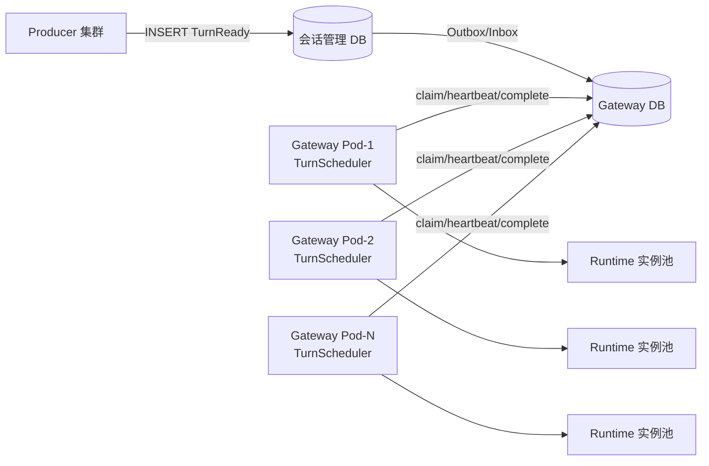
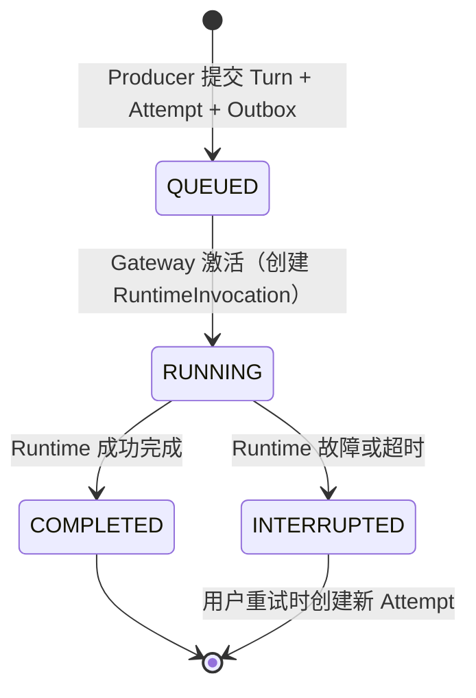
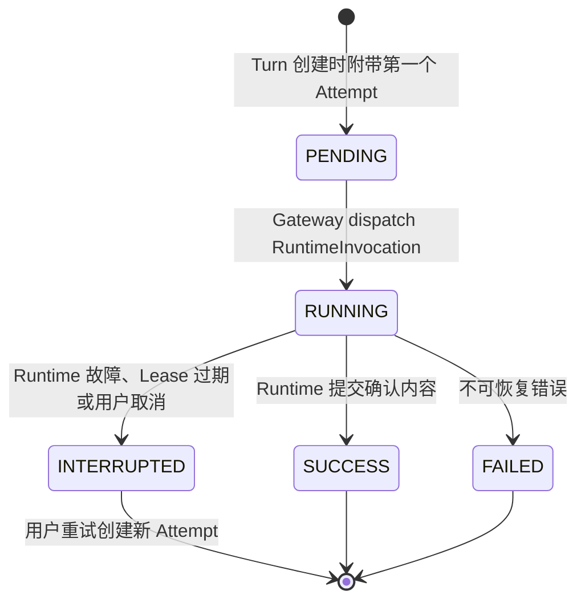
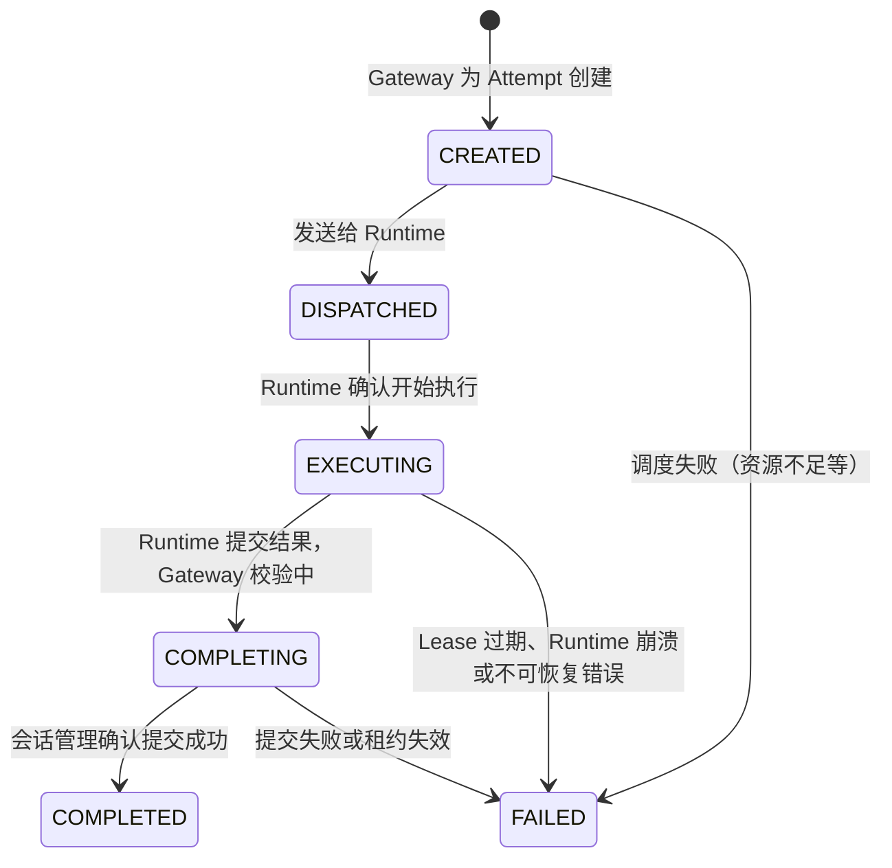
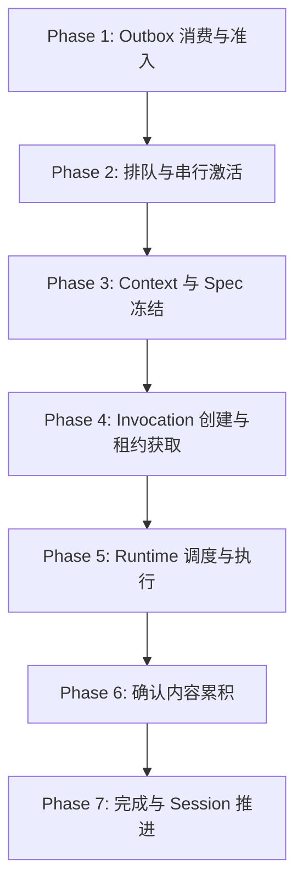
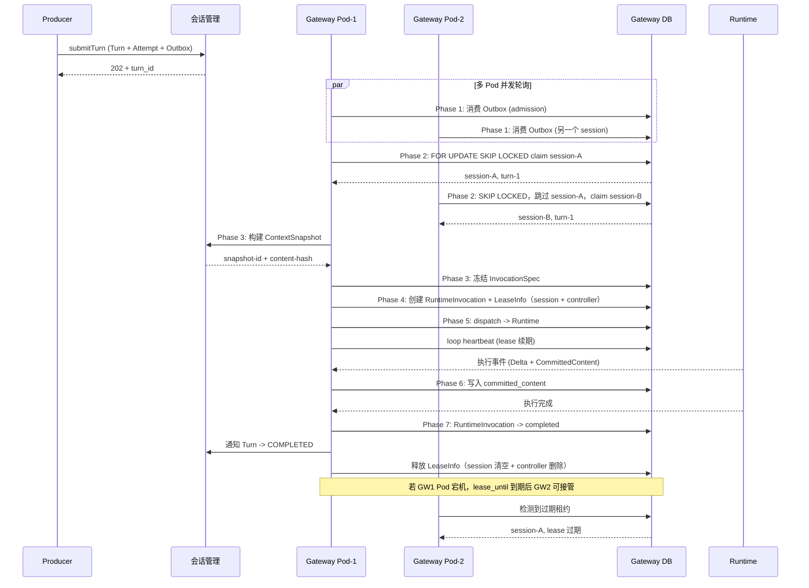

# TurnScheduler 分布式调度方案 v2

> 评审版本：v2.0
> 技术栈：Java 17+、Spring Boot、Spring JDBC/MyBatis、PostgreSQL
> 部署形态：Kubernetes 多 Pod 副本
> 对齐文档：统一 Agent Runtime 与 Runtime Driver 技术方案、专题 02：Session、Turn 与 Context

## 1. 目标与约束

### 1.1 目标

- 同一 Session 的 Turn 严格按 Turn ID 顺序执行，同一 Session 同时最多一个活动 Invocation。
- 不同 Session 可由不同 Gateway Pod 并行执行。
- 多个 Producer 可并发写入 Turn。
- 多个 Gateway Pod 可并发消费不同 Session，通过数据库行锁保证互斥。
- Gateway Pod 宕机后，租约过期，其他 Pod 自动接管未完成的 Invocation。
- 旧 Gateway Pod 不能控制当前 Invocation（通过 Controller Lease 隔离）。
- 旧 Invocation 不能写 Sandbox 或产生新副作用（通过 Fencing Token 隔离）。
- 调度状态可查询、可审计、可人工干预。

### 1.2 非目标

- 不在数据库事务中执行 Runtime 或远程 AI 调用。
- 不依赖 JVM 本地锁或本地队列保证分布式互斥。
- 不把消息队列的消费确认当作业务成功确认。
- 不恢复 Runtime 的 PID、内存、Socket、后台进程和依赖缓存。

### 1.3 核心执行语义

```text
Session
  +-- Turn (QUEUED -> RUNNING -> COMPLETED / INTERRUPTED)
       +-- Attempt (PENDING -> RUNNING -> SUCCESS / INTERRUPTED / FAILED)
            +-- RuntimeInvocation (CREATED -> DISPATCHED -> EXECUTING -> COMPLETING -> COMPLETED / FAILED)
                 +-- Runtime Execution (瞬时，Worker 执行实例)
```

- 一次用户输入产生一个 Turn，用户重试不创建新 Turn，而是在原 Turn 下创建新 Attempt。
- Gateway 为 Attempt 创建 RuntimeInvocation，冻结 InvocationSpec，调度 Runtime 执行。
- Gateway 故障接管接管原 Invocation，不创建新的 Attempt 或 Invocation。
- 推荐把调度粒度定义为 Session，把执行粒度定义为 RuntimeInvocation。

### 1.4 三个不可变对象

| 对象 | 回答的问题 | 特性 |
|---|---|---|
| ContextSnapshot | 这次 Attempt 实际看到了什么上下文 | 不可变，含消息水位和内容 Hash |
| InvocationSpec | 这次获准以什么版本、能力、资源和预算执行 | 不可变，由 Gateway 冻结 |
| RuntimeObservation（并入 runtime_invocation） | 实际在哪里、使用什么环境、执行到了哪里 | 单调推进，由 Runtime 上报，只用于观测不参与状态判定 |

### 1.5 架构不变量（与总纲第 8 节对齐）

1. Session 创建时固定 Agent Revision，不绑定 Runtime Replica。
2. 同一 Session 同一时间最多一个合法活动 Invocation。
3. Runtime 不拥有跨 Turn 的权威状态。
4. Gateway 不代理模型执行、大文件正文或 MCP 请求正文。
5. Sandbox 按需创建，可跨 Turn 复用文件现场。
6. 新 Attempt 不等于新 SandboxInstance；只有环境完整重建才创建新实例 ID。
7. Artifact 是用户交付版本，Checkpoint 是系统恢复点。
8. 所有可版本化定义使用精确 Revision 和 Hash。
9. InvocationSpec 不可变，运行事实不能改写执行计划。
10. 失败不能导致不安全的外部副作用重放。
11. Secret、Capability、临时 URL 和二进制正文不得进入 Prompt 或普通 Trace。
12. 每一种权威数据只有一个所有者。

## 2. 总体架构



### 2.1 K8s 部署拓扑

```text
Kubernetes Cluster
  +-- Gateway Deployment (N replicas)
  |     +-- Pod-1: TurnScheduler + RuntimeDispatcher
  |     +-- Pod-2: TurnScheduler + RuntimeDispatcher
  |     +-- Pod-N: TurnScheduler + RuntimeDispatcher
  +-- Session Management Deployment
  +-- Runtime Deployment (M replicas)
  +-- PostgreSQL (主从)
```

关键约束：
- 每个 Gateway Pod 运行独立的 TurnScheduler 轮询循环。
- 所有 Pod 共享同一个 Gateway PostgreSQL。
- 分布式互斥完全依赖数据库行锁（FOR UPDATE SKIP LOCKED），不依赖 Pod 本地状态。
- Pod 扩缩容不影响已 dispatch 的 Invocation，租约机制保证接管安全。

### 2.2 两侧数据库职责

| 数据库 | 持有的事实 | 所有者 |
|---|---|---|
| 会话管理 DB | Session、Turn、Attempt、Message、ContextSnapshot、确认输出、Artifact 引用、**turn_ready_outbox（OUTBOX，4.1.1）** | 会话管理服务 |
| Gateway DB | TurnAdmission（**INBOX** + 调度队列）、RuntimeInvocation（含观测水位）、InvocationSpec、LeaseInfo（统一租约，session/controller）、Committed Content | Gateway |

任何 Runtime Replica、Gateway Pod 或 Sandbox Pod 都可以被替换；权威状态不能依赖其本地磁盘。

### 2.3 四类数据流

- **控制流**：Gateway 驱动调度、资源、取消和完成。
- **模型与 Tool 执行流**：Runtime 运行 Agent Loop 并决定 Tool Call。
- **大文件数据流**：Sandbox、Connector、对象存储和文件管理直接传输。
- **权威状态流**：会话管理和 Gateway DB 保存可恢复事实。

它们不能被实现成一条由 Gateway 同步转发所有正文的 RPC 长链。

### 2.4 基础可用组件

TurnScheduler 依赖以下平台基础组件，均为部署环境保证可用的基础设施：

| 组件 | 在调度系统中的角色 | 核心用法 | 职责边界 |
|---|---|---|---|
| **Kubernetes** | 部署形态与副本管理 | Gateway/Runtime 以 Deployment 多副本运行；K8s 负责 Pod 编排、Liveness/Readiness 健康探测、滚动更新与优雅关闭（SIGTERM） | 不参与调度互斥；readiness/liveness 只决定流量分配与滚动更新节奏，不参与任务所有权判定（详见 15.6） |
| **PostgreSQL** | 权威状态 + 分布式互斥 | 调度队列、三类租约、RuntimeInvocation、InvocationSpec、CommittedContent 的唯一权威事实源；`FOR UPDATE SKIP LOCKED` 承担跨 Pod 互斥 | 单实例吞吐决定调度上限；全部 Pod 连接总数必须控制在 `max_connections` 的 60% 以内；故障恢复真相只以 PG 数据为准 |
| **Nacos** | 服务注册发现 + 健康感知 + 配置管理 | Gateway 与 Runtime 注册/摘除/发现；调度选 Runtime 时过滤不健康实例；运行时配置按精确 Revision 下发 | 心跳感知存在探测窗口（网络分区下可能误判），只能缩短"发现时间"，不能替代租约做"安全接管"判定 |
| **Redis** | 短时态与实时体验层 | `assistant_output_delta` 短期事件流（供前端实时展示，不进长期业务表）；可选：幂等快速路径缓存、Nacos 实例列表本地缓存 | 属于观测/体验数据，不是恢复真相；故障恢复一律以 PG 的 `committed_content` 为准 |

组件在调度流水线中的出现位置：

```text
待执行 Turn ──> [PG] admission / queue / 租约 / invocation   （权威状态流）
    │
    ├─> [Nacos] 发现健康 Runtime 实例，选择执行目标      （控制流）
    │
    └─> [Redis] Runtime 实时 Delta 事件流（仅体验）        （体验层）
    │
    └─> [K8s]  所有 Pod 的部署、探测、灰度与优雅关闭       （部署层）
```

## 3. 核心对象层级与职责边界

### 3.1 对象定义

| 对象 | 语义 | 权威所有者 | 关键约束 |
|---|---|---|---|
| Session | 用户与某个固定 Agent Revision 的连续业务会话 | 会话管理 | 创建时固定 agent_id + agent_revision |
| Turn | 一次用户输入及其回答过程 | 会话管理 | 用户重试不复制输入 |
| Attempt | 同一 Turn 的一次具体回答尝试 | 会话管理 | 输出互相隔离，selected_attempt_id 指向正式回答 |
| RuntimeInvocation | Gateway 为 Attempt 创建的执行工单 | Gateway | 一个 Attempt 对应一个 Invocation |
| Runtime Execution | Runtime 根据 Invocation 创建的 Worker 执行实例 | Runtime 瞬时持有 | Invocation 结束后可清理 |

### 3.2 调度侧与会话侧的状态分离

```text
会话管理侧                        Gateway 侧
-----------                       -----------
Turn: QUEUED -> RUNNING           TurnAdmission: QUEUED -> ACTIVATING
     -> COMPLETED / INTERRUPTED        -> ACTIVATED -> DISPATCHED
                                          -> COMPLETED / REJECTED / CANCELLED
                                          |
Attempt: PENDING -> RUNNING             |
     -> SUCCESS / INTERRUPTED     RuntimeInvocation: CREATED -> DISPATCHED
                                        -> EXECUTING -> COMPLETING
                                        -> COMPLETED / FAILED
```

两个视角独立演进，通过 Outbox/Inbox 和完成回调同步。

## 4. 数据模型

### 4.1 会话管理侧（参考，非本模块实现）

会话管理持有 Session、Turn、Attempt、Message、ToolCall/Result、ContextSnapshot 和确认输出。详细表结构见专题 02。

关键状态枚举：

```text
Turn 状态: QUEUED -> RUNNING -> COMPLETED / INTERRUPTED
Attempt 状态: PENDING -> RUNNING -> SUCCESS / INTERRUPTED / FAILED
```

#### 4.1.1 turn_ready_outbox（OUTBOX，位于会话管理库）

Turn 创建事务内与 Turn 同库同事务写入的 **TurnReady 事务消息表**，是"提交 Turn"这条可靠消息的物理落地点。表结构由会话管理模块创建，TurnScheduler 通过消费接口（见 6.2）读取，不直接持有建表权限。

```sql
create table turn_ready_outbox (
    id               bigserial primary key,
    session_id       varchar(128) not null,
    turn_id          bigint       not null,
    attempt_id       bigint       not null,          -- Attempt 粒度：重试产生新 Attempt = 新消息
    context_ref      varchar(128),                   -- ContextSnapshot 引用（可为空，冻结时构建）
    payload          jsonb        not null,          -- TurnReady 完整消息体（幂等重放依据）
    status           varchar(16)  not null default 'PENDING',  -- PENDING/CLAIMED/DONE/DEAD
    claimed_by       varchar(128),                   -- 领取的 TurnScheduler Pod
    claim_expire_at  timestamp with time zone,       -- claim 租约：超时未 ack 自动回 PENDING
    attempt_count    integer      not null default 0,
    created_at       timestamp with time zone not null default now(),
    updated_at       timestamp with time zone not null default now()
);

create index idx_outbox_pending     on turn_ready_outbox (id) where status = 'PENDING';
create index idx_outbox_claim_expiry on turn_ready_outbox (claim_expire_at) where status = 'CLAIMED';
```

- 幂等键：`(session_id, turn_id, attempt_id)` 由会话管理侧在写入阶段保证不重复插入；
- 消费语义：`PENDING -> CLAIMED -> DONE`，claim 租约默认 30s，超时未确认自动回 `PENDING` 由其他 Pod 重领；
- 只读消费者不得 UPDATE 本表，ack 也必须经过消费接口。

### 4.2 Gateway 侧（本模块核心）

#### 4.2.1 turn_admission（INBOX + 调度队列，Gateway 侧幂等准入）

TurnScheduler 接收 TurnReady Outbox 消息后的准入记录，**是 Inbox 模式的物理落地点，同时承担调度队列**：`Outbox` 的每一条消息在此以 `INSERT ... ON CONFLICT DO NOTHING` 幂等落账，重复投递被唯一键静默吸收；随后同一行通过状态机流转 `queued → activating → activated → dispatched → …`，被多个 Pod 以 `FOR UPDATE SKIP LOCKED` 竞争消费。

```sql
create table turn_admission (
    id                    bigint primary key,
    outbox_id             bigint,                -- Outbox 消息溯源（处理成功后回填）
    session_id            varchar(128) not null,
    turn_id               bigint not null,
    attempt_id            bigint not null,
    request_id            varchar(128) not null,
    client_app_id         varchar(128) not null,
    enqueue_seq           bigint not null,       -- 同 session 排队顺序（单调）
    activation_priority   integer not null default 0,
    status                varchar(16) not null default 'admitted',
    created_at            timestamp with time zone not null,
    updated_at            timestamp with time zone not null,

    constraint uk_turn_admission_idempotent unique (client_app_id, request_id),
    constraint uk_turn_admission_session_turn_attempt unique (session_id, turn_id, attempt_id),
    constraint ck_turn_admission_status check (status in ('admitted', 'queued', 'activating', 'activated', 'dispatched', 'completed', 'rejected', 'cancelled'))
);

create index idx_turn_admission_claim
    on turn_admission (status, activation_priority desc, enqueue_seq)
    where status in ('queued', 'activating');

create index idx_turn_admission_session
    on turn_admission (session_id, status);
```

状态机：

```text
queued（INBOX 幂等落账即入队，Phase 1）→ activating（SKIP LOCKED 竞争，Phase 2）
→ activated（租约获取成功，Phase 4）→ dispatched（下拨 Runtime，Phase 5）
→ completed / rejected / cancelled（终态）
```

> `admitted` 为预留态：若未来需要"先落账、后入队"两步分离（如 Outbox 能力远大于调度能力），可将 Phase 1 拆为 admitted → queued 两段，此时已准入但未入队的消息不会参与竞争。

幂等语义（与 8.1 对应）：

- `(client_app_id, request_id)`：用户提交幂等（同一提交不重复准入）；
- `(session_id, turn_id, attempt_id)`：Outbox 消息幂等（Attempt 粒度，重试产生新 Attempt = 新消息，不会被旧消息吞掉）。

#### 4.2.2 runtime_invocation（执行工单 + Runtime 观测）

Gateway 为 Attempt 创建的执行工单，是调度的最小单位；同时吸收原 `runtime_observed_state` 的观测字段（Runtime 上报的运行时事实，单调推进，不反向修改），避免 1:1 冗余表。

```sql
create table runtime_invocation (
    id                    bigint primary key,
    invocation_id         varchar(128) not null,
    session_id            varchar(128) not null,
    turn_id               bigint not null,
    attempt_id            bigint not null,
    admission_id          bigint not null,
    spec_hash             varchar(64) not null,
    sandbox_mode          varchar(16) not null default 'none',
    sandbox_instance_id   varchar(128),
    fencing_token         bigint not null default 0,
    status                varchar(16) not null default 'created',
    runtime_type          varchar(64),
    runtime_replica_id    varchar(128),
    worker_id             varchar(128),
    error_code            varchar(64),
    error_message         text,
    current_phase         varchar(32) not null default 'initializing',  -- 观测：Runtime 当前阶段
    event_sequence        bigint not null default 0,                    -- 观测：事件水位（单调）
    last_event_at         timestamp with time zone,                     -- 观测：最近事件时间
    model_request_sent    boolean not null default false,
    tool_calls_count      integer not null default 0,
    output_tokens         bigint not null default 0,
    created_at            timestamp with time zone not null,
    updated_at            timestamp with time zone not null,

    constraint uk_runtime_invocation_id unique (invocation_id),
    constraint uk_runtime_invocation_attempt unique (attempt_id),
    constraint ck_invocation_status check (status in ('created', 'dispatched', 'executing', 'completing', 'completed', 'failed'))
);

create index idx_invocation_session
    on runtime_invocation (session_id, status);

create index idx_invocation_status
    on runtime_invocation (status, created_at);
```

observation 语义：`current_phase / event_sequence / tool_calls_count / output_tokens` 等由 Runtime 事件驱动单调更新，只用于健康感知与观测（见 15.6），不参与状态机判定。

#### 4.2.3 invocation_spec

不可变的执行计划，随 RuntimeInvocation 创建后不再修改。

```sql
create table invocation_spec (
    invocation_id         varchar(128) primary key,
    session_id            varchar(128) not null,
    turn_id               bigint not null,
    attempt_id            bigint not null,
    agent_revision        varchar(128) not null,
    runtime_type          varchar(64) not null,
    model_policy          jsonb not null,
    skill_revisions       jsonb not null default '[]',
    tool_revisions        jsonb not null default '[]',
    config_refs           jsonb not null default '{}',
    sandbox_profile       jsonb,
    external_access       jsonb,
    security_templates    jsonb,
    execution_limits      jsonb not null default '{}',
    plan_hash             varchar(64) not null,
    context_snapshot_id   varchar(128) not null,
    created_at            timestamp with time zone not null
);

comment on table invocation_spec is '不可变执行计划，创建后永不修改';
```

#### 4.2.4 lease_info（统一租约：Session + Controller）

三类租约中，`session_lease`（Session 串行执行权）与 `controller_lease`（Invocation 控制权）结构雷同，合并为一张表以 `lease_type` 区分；Runtime 侧 fencing token 不落库，保持运行时内存语义（见 7.3）。

```sql
create table lease_info (
    id                    bigint primary key,
    lease_type            varchar(16) not null,    -- 'session' / 'controller'
    session_id            varchar(128) not null,
    invocation_id         varchar(128) not null,
    holder_pod            varchar(128) not null,
    controller_epoch      bigint not null default 0,  -- 仅 controller 类型使用，递增防旧 Pod
    lease_until           timestamp with time zone not null,
    heartbeat_at          timestamp with time zone not null,
    lease_version         bigint not null default 0,
    created_at            timestamp with time zone not null,
    updated_at            timestamp with time zone not null,

    constraint uk_lease_session unique (lease_type, session_id),
    constraint uk_lease_controller unique (lease_type, invocation_id)
);

create index idx_lease_recover
    on lease_info (lease_until)
    where lease_until < now();
```

类型语义：

- `lease_type='session'`：同一 Session 同时只有一个 Pod 持有有效租约（`uk_lease_session`）；
- `lease_type='controller'`：同一 Invocation 只有一个协调 Pod，通过 `controller_epoch` 递增防止旧 Pod 回写（`uk_lease_controller`）。

#### 4.2.5 committed_content

确认内容记录，是故障恢复的边界。Delta 丢失后从这里恢复。

```sql
create table committed_content (
    id                    bigint primary key,
    invocation_id         varchar(128) not null,
    attempt_id            bigint not null,
    committed_sequence    bigint not null,
    content_type          varchar(32) not null,
    content_ref           varchar(256) not null,
    content_hash          varchar(64),
    created_at            timestamp with time zone not null,

    constraint uk_committed_content unique (invocation_id, committed_sequence)
);

create index idx_committed_content_invocation
    on committed_content (invocation_id, committed_sequence);
```

## 5. 状态机

### 5.1 Turn 状态机（会话管理侧）



### 5.2 Attempt 状态机（会话管理侧）



### 5.3 RuntimeInvocation 状态机（Gateway 侧）



## 6. 调度流水线

整个调度过程分为 7 个阶段，在 K8s 多 Pod 场景下，每个阶段的分布式安全性由数据库行锁保证。

### 6.1 阶段总览



### 6.2 Phase 1: Outbox 消费与幂等准入

TurnScheduler 通过会话管理暴露的**消费接口**（RPC：`claimTurnReady` / `ackTurnReady`）分两段消费，同一张 `turn_ready_outbox` 由多个 Pod 并发领取，claim 租约保证宕机安全。

**步骤 0（外围，RPC 消费）：claim 领取一批消息**

```sql
-- 会话管理库内执行（消费接口内部逻辑）
update turn_ready_outbox o
set status = 'CLAIMED',
    claimed_by = :pod,
    claim_expire_at = now() + interval '30 seconds',
    attempt_count = attempt_count + 1,
    updated_at = now()
where o.id in (
    select id from turn_ready_outbox
    where status = 'PENDING'
    order by id
    for update skip locked
    limit :batch_size
)
returning o.id, o.session_id, o.turn_id, o.attempt_id, o.context_ref, o.payload;
```

- 无状态竞争：每个 Pod 都跑同样的 claim，`FOR UPDATE SKIP LOCKED` 保证每条消息只被一个 Pod 领走；
- claim 租约 30s：Pod 领取后崩溃，租约过期由后台任务扫回 `PENDING`（`claim_expire_at < now()`），其他 Pod 可重领；
- 重复投递的安全由步骤 1 的 Inbox 唯一键兜底。

**步骤 1（Gateway 侧，本地事务）：Inbox 幂等准入**

```sql
-- 事务 BEGIN，每个 claim 到的消息执行一次（幂等：已存在的 admission 跳过）

-- 1. 消费 Outbox 消息并同时入队（INBOX + queue 合一）
--    已存在的 admission 由任一唯一键静默吸收；新消息直接以 queued 状态落账
insert into turn_admission (
    id, outbox_id, session_id, turn_id, attempt_id, request_id, client_app_id,
    enqueue_seq, activation_priority, status, created_at, updated_at
) values (?, ?, ?, ?, ?, ?, ?, ?, ?, 'queued', now(), now())
on conflict do nothing;  -- 命中 (client_app_id, request_id) 或 (session_id, turn_id, attempt_id) 任一唯一键均跳过

-- 事务 COMMIT
```

> 注意：`on conflict` 返回插入失败有两种情形——(a) 同请求重复 (b) 同 Turn 同 Attempt 已准入。为区分，失败时按 `uk_turn_admission_session_turn_attempt` 反查；命中即"已准入"（静默跳过），未命中则为死数据（告警）。

**步骤 2（RPC 消费）：ack 确认落账**

```sql
-- 会话管理库内执行（消费接口内部逻辑），只清自己 claim 的
update turn_ready_outbox
set status = 'DONE', updated_at = now()
where id in (:claimed_ids) and claimed_by = :pod and status = 'CLAIMED';
```

**崩溃/重试语义：**

- claim 后处理成功 → ack → `DONE`；
- claim 后崩溃 → 租约过期回 `PENDING` → 重领 → 步骤 1 幂等跳过 → ack；
- 无论重试多少次，业务侧至多产生一条 `turn_admission`（Inbox 唯一键保证），即"至少一次投递 + 幂等消费"。
- 计费/审计的关注点：ack 必须以 Inbox 落账为前提，先落账后 ack，禁止先 ack 后落账。

### 6.3 Phase 2: 排队与串行激活（分布式竞争）

这是多 Pod 分布式竞争的核心阶段。多个 Gateway Pod 同时轮询，通过 FOR UPDATE SKIP LOCKED 确保同一 Session 只被一个 Pod 激活。

```sql
-- 步骤 1: 竞争获取一个可激活的 Session
-- 每个 Pod 轮询时执行，SKIP LOCKED 确保互斥
select id as admission_id, session_id, turn_id, attempt_id
from turn_admission
where status = 'queued'
order by activation_priority desc, enqueue_seq
for update skip locked
limit 1;

-- 步骤 2: 检查该 Session 当前是否有活动 Invocation
-- 通过 lease_info 判断，lease_until > now() 表示有 Pod 正在执行
select invocation_id
from lease_info
where lease_type = 'session'
  and session_id = ?
  and lease_until > now();

-- 如果有活动租约，跳过此 Session，等待下一轮

-- 步骤 3: 标记为 activating
update turn_admission
set status = 'activating', updated_at = now()
where id = ? and status = 'queued';
```

### 6.4 Phase 3: Context 与 Spec 冻结

激活后，Gateway 构建不可变快照：

1. **请求 ContextSnapshot**：调用会话管理构建上下文快照，包含消息水位、摘要、附件引用和内容 Hash。
2. **冻结 InvocationSpec**：解析 Agent Revision、Model Policy、Skill/Tool Revision、Config、Sandbox Profile、Security Policy 和执行预算，形成不可变执行计划。
3. **计算 plan_hash**：对 InvocationSpec 内容取 Hash，用于后续校验。

```sql
-- 写入 InvocationSpec（不可变，无 UPDATE 语句）
insert into invocation_spec (
    invocation_id, session_id, turn_id, attempt_id,
    agent_revision, runtime_type, model_policy, skill_revisions,
    tool_revisions, config_refs, sandbox_profile, external_access,
    security_templates, execution_limits, plan_hash, context_snapshot_id,
    created_at
) values (?, ?, ?, ?, ?, ?, ?, ?, ?, ?, ?, ?, ?, ?, ?, ?, now());
```

### 6.5 Phase 4: Invocation 创建与租约获取

在同一个事务中完成：

```sql
-- 事务 BEGIN

-- 1. 创建 RuntimeInvocation
insert into runtime_invocation (
    id, invocation_id, session_id, turn_id, attempt_id, admission_id,
    spec_hash, sandbox_mode, fencing_token, status, created_at, updated_at
) values (?, ?, ?, ?, ?, ?, ?, ?, ?, 'created', now(), now());

-- 2. 获取 Session Execution Lease（排他锁，lease_type='session'）
-- 如果已有有效租约，CAS 失败则放弃
insert into lease_info (
    id, lease_type, session_id, invocation_id, holder_pod, lease_until,
    heartbeat_at, lease_version, created_at, updated_at
) values (?, 'session', ?, ?, ?, now() + interval '120 seconds', now(), 1, now(), now())
on conflict (lease_type, session_id) do update
set invocation_id = excluded.invocation_id,
    holder_pod = excluded.holder_pod,
    lease_until = excluded.lease_until,
    heartbeat_at = excluded.heartbeat_at,
    lease_version = lease_info.lease_version + 1,
    updated_at = now()
where lease_info.lease_until < now()
   or lease_info.invocation_id = excluded.invocation_id;

-- 3. 获取 Controller Lease（lease_type='controller'，epoch 从 1 起）
insert into lease_info (
    id, lease_type, session_id, invocation_id, holder_pod, controller_epoch,
    lease_until, heartbeat_at, lease_version, created_at, updated_at
) values (?, 'controller', ?, ?, ?, 1, now() + interval '120 seconds', now(), 1, now(), now());

-- 4. 更新 turn_admission 状态为 activated（租约获取成功）
update turn_admission
set status = 'activated', updated_at = now()
where id = ? and status = 'activating';

-- 事务 COMMIT
```

### 6.6 Phase 5: Runtime 调度与执行

事务提交后（Lease 已持有），调用 Runtime：

```text
1. 更新 runtime_invocation.status = 'dispatched'
2. 从 Nacos 拉取健康 Runtime 实例列表
   - 过滤 Nacos 心跳超时 / K8s readiness=false 的实例
   - 按剩余 Worker 容量最大优先，无容量上报时 round-robin
3. 记录选中实例到 runtime_invocation.runtime_replica_id（绑定即事实）
4. 发送 RuntimeInvocation（含 InvocationSpec、ContextSnapshot 引用、fencing_token）
5. Runtime 校验 InvocationSpec 和 fencing_token
6. Runtime 开始执行 Agent Loop
7. 更新 runtime_invocation.status = 'executing'
```

执行期间的心跳：

```sql
-- Session Lease 心跳（每个 heartbeat_interval 执行）
update lease_info
set lease_until = now() + interval '120 seconds',
    heartbeat_at = now(),
    updated_at = now()
where lease_type = 'session'
  and session_id = ?
  and holder_pod = ?
  and lease_version = ?;

-- Controller Lease 心跳
update lease_info
set lease_until = now() + interval '120 seconds',
    heartbeat_at = now(),
    updated_at = now()
where lease_type = 'controller'
  and invocation_id = ?
  and holder_pod = ?
  and controller_epoch = ?;
```

### 6.7 Phase 6: 确认内容累积

Runtime 周期性发送已确认内容片段，Gateway 幂等写入 committed_content：

```sql
-- 幂等插入（重复 sequence 自动忽略）
insert into committed_content (
    id, invocation_id, attempt_id, committed_sequence,
    content_type, content_ref, content_hash, created_at
) values (?, ?, ?, ?, ?, ?, ?, now())
on conflict (invocation_id, committed_sequence) do nothing;
```

故障时只丢失未确认的 Delta，已确认内容从 committed_content 恢复。

### 6.8 Phase 7: 完成与 Session 推进

```sql
-- 事务 BEGIN

-- 1. 校验 Controller Lease 仍然有效
select controller_epoch from lease_info
where lease_type = 'controller'
  and invocation_id = ?
  and holder_pod = ?
  and lease_until > now();

-- 2. 标记 RuntimeInvocation 完成
update runtime_invocation
set status = 'completed', updated_at = now()
where invocation_id = ?
  and status in ('executing', 'completing');

-- 3. 通知会话管理：Turn -> COMPLETED, Attempt -> SUCCESS
--    （通过 RPC 或 Outbox，保证幂等）

-- 4. 释放 Session Lease（清空执行权）
update lease_info
set invocation_id = null,
    holder_pod = null,
    lease_until = now(),
    updated_at = now()
where lease_type = 'session'
  and session_id = ?
  and holder_pod = ?;

-- 5. 释放 Controller Lease（删除控制权）
delete from lease_info
where lease_type = 'controller'
  and invocation_id = ?;

-- 事务 COMMIT
```

### 6.9 完整时序图



## 7. 三类 Lease 模型

> 物理落点：Session 与 Controller 两类租约都存于 **`lease_info`（4.2.4）**，以 `lease_type` 区分；Runtime 侧 fencing token 为运行时内存语义，不落库。

### 7.1 Session Execution Lease（`lease_info`，lease_type='session'）

| 属性 | 说明 |
|---|---|
| 保证 | 同一 Session 同时最多一个活动 Invocation |
| 持有者 | Gateway Pod（claim session 时获取） |
| 续期 | heartbeat_interval 定时续期 |
| 过期后果 | 当前 Pod 失去执行权，其他 Pod 可接管 |
| 防护 | 防止多个 Pod 同时执行同一 Session 的 Turn |
| 唯一键 | uk_lease_session (lease_type='session', session_id) |

### 7.2 Controller Lease（`lease_info`，lease_type='controller'）

| 属性 | 说明 |
|---|---|
| 保证 | 同一 Invocation 只有一个 Gateway Pod 协调 |
| 持有者 | Gateway Pod（创建 Invocation 时获取） |
| 续期 | heartbeat_interval 定时续期 |
| 过期后果 | 旧 Pod 不能推进 Invocation 状态，新 Pod 通过递增 controller_epoch 接管 |
| 防护 | 防止旧 Gateway Pod 回写已完成的 Invocation |
| 唯一键 | uk_lease_controller (lease_type='controller', invocation_id) |

### 7.3 Runtime Execution Lease（Fencing Token）

| 属性 | 说明 |
|---|---|
| 保证 | Runtime Worker 只在有效期内运行 |
| 持有者 | Runtime Worker（dispatch 时获得 fencing_token） |
| 续期 | Runtime 内部管理 |
| 过期后果 | Runtime 停止 Agent Loop 和新 Tool Call，Sandbox 拒绝旧 token 的写入 |
| 防护 | 防止旧 Invocation 的 Worker 继续写 Sandbox 或产生副作用 |

### 7.4 时间关系

```text
heartbeat_interval < lease_duration / 3

推荐配置:
  lease_duration:      120s
  heartbeat_interval:  30s
  poll_interval:       200ms
  max_retry_attempts:  3
```

## 8. Admission 与幂等

### 8.1 Outbox/Inbox 模式

会话管理在 Turn 创建事务中写入 `turn_ready_outbox`（OUTBOX，4.1.1）。TurnScheduler 通过消费接口 claim，经 `turn_admission`（INBOX，4.2.1）幂等准入：

| 概念 | 物理落地点 | 身份 |
|---|---|---|
| OUTBOX | `turn_ready_outbox`（会话管理库，4.1.1） | 可靠消息源：与 Turn 同事务写入 |
| INBOX | `turn_admission`（Gateway 库，4.2.1） | 幂等消费台账：`on conflict do nothing` 吸收重复投递 |

完整链路（对应 6.2 的步骤 0/1/2）：

1. 会话管理事务内写 Turn + `turn_ready_outbox`（同库同事务，二者原子）；
2. TurnScheduler 任意 Pod 轮询消费接口，`claim` 一批消息（SKIP LOCKED + 30s 租约）；
3. 每条消息在 Gateway 侧 `INSERT turn_admission ... ON CONFLICT DO NOTHING` 幂等落账（INBOX）；
4. 落账成功才 `ack` 该消息为 `DONE`；崩溃/租约超时自动回 `PENDING` 重投；
5. 消费失败可安全重试，不丢任务。

幂等键设计：

- `(client_app_id, request_id)` 保证用户提交幂等；
- `(session_id, turn_id, attempt_id)` 保证同一 Attempt 不被重复准入（Attempt 粒度——用户重试产生新 Attempt = 新消息，不会被旧消息吞掉）；
- 两步走（先落账后 ack）保证"至少一次投递 + 幂等消费"。

### 8.2 幂等键体系

| 键 | 作用 | 去重位置 |
|---|---|---|
| (client_app_id, request_id) | 用户提交幂等 | turn_admission |
| (session_id, turn_id, attempt_id) | Outbox 消息幂等（Attempt 粒度） | turn_ready_outbox(会话管理侧), turn_admission |
| (invocation_id, committed_sequence) | 确认内容去重 | committed_content |
| (attempt_id) | Invocation 与 Attempt 一对一 | runtime_invocation |

## 9. ContextSnapshot 与 InvocationSpec

### 9.1 ContextSnapshot 构建

Gateway 请求会话管理构建快照，快照至少包含：

| 字段 | 说明 |
|---|---|
| context_snapshot_id | 不可变快照标识 |
| through_message_seq | 覆盖到的消息水位 |
| selected_messages | 原文保留的消息和 Tool 事件 |
| summary_blocks | 对早期历史的结构化摘要 |
| omitted_message_ranges | 被省略的范围和原因 |
| attachment/artifact_refs | 当前上下文使用的稳定文件引用 |
| context_policy_revision | 选择、摘要和预算策略版本 |
| content_hash | 整份快照 Hash |

Runtime 只能使用 Gateway 传入的快照，不得自行查询完整历史或静默裁剪。

### 9.2 InvocationSpec 冻结

Gateway 解析所有输入后冻结执行计划，包含：

```text
InvocationSpec
  identity       invocation/session/turn/attempt/trace
  caller         principal/delegation/client app
  agent          agent revision/runtime type/driver protocol
  context        context snapshot/input/attachment/artifact refs
  model          model policy/budget
  skills         active and candidate skills
  tools          resolved tools
  configuration  exact config refs and hashes
  resources      sandbox requirement/profile/restore intent
  external       external access policy and target scopes
  security       capability templates
  limits         deadline/tool/output limits
  integrity      schema version and plan hash
```

InvocationSpec 不包含动态 Runtime Replica、真实 Secret、临时 URL、可写本地路径和实际 SandboxInstance ID。

## 10. Sandbox 编排

### 10.1 三种模式

```text
NONE      已知不需要或不允许 Sandbox
OPTIONAL  启动时不创建，运行中可能请求
REQUIRED  Runtime 启动前必须 Ready
```

### 10.2 模式选择

| 场景 | 建议结果 |
|---|---|
| "你好"或纯文本问答 | NONE |
| 必须处理原始附件 | REQUIRED |
| 用户明确继续编辑 Workspace 文件 | REQUIRED |
| 已激活资源型 Skill | REQUIRED |
| 只有可选 Sandbox Tool 或自动候选资源 Skill | OPTIONAL |

### 10.3 OPTIONAL 模式流程

```text
1. Runtime 以无 Sandbox 方式启动
2. 运行中 Runtime 发送 ResourceRequired 事件
3. Gateway 暂停当前 Invocation（Lease 保持有效）
4. Gateway 请求 Sandbox Service 创建 SandboxInstance
5. Sandbox Ready 后，Gateway 发送 ResourceReady 恢复 Invocation
6. 不创建新 Attempt 或 Invocation
```

## 11. 流式内容与确认模型

### 11.1 Delta 与 Committed Content

```text
Runtime 持续发送:
  assistant_output_delta     -> 实时体验，写入 Redis 短期事件流，不进长期表
  assistant_content_committed -> 确认内容，幂等写入 committed_content（PG）
```

三层职责各归其位：

| 层 | 存储 | 角色 | 丢失容忍 |
|---|---|---|---|
| 实时 Delta | Redis Stream（TTL 建议 10 分钟） | 体验层，断线补水位 | 可丢（未确认） |
| 确认内容 | PG `committed_content` | 权威，故障恢复边界 | 永不丢 |
| 终态结果 | PG turn/attempt | 恢复真相 | 永不丢 |

### 11.2 多 Pod 流式链路（Redis Stream 作为事件总线）

多 Pod 部署下，**事件产生的 Pod 与用户 SSE 连接的 Pod 不一定相同**，必须满足两点：

1. 事件统一落地 Redis Stream，不保存在产生它的 Pod 本地。
2. SSE 连接在哪个 Pod，就由哪个 Pod 负责从 Stream 消费并推送。

```text
Runtime --SSE--> 产生事件的 Gateway Pod
                    |
                    v 统一写（不本地持有）
        Redis Stream: turn_events:<session_id>
        XADD 每条事件带单调 sequence，事件带完整上下文
            { session_id, turn_id, attempt_id, sequence, type, payload }
        （TTL 10 分钟，持续写通过 maxlen 裁剪）
                    |
       +------------+---------------+
       |                            |
   持有连接的 Pod              其他 Pod（可读，不推送）
   按客户端水位消费              （接管/重连时也能从 Stream 续读）
       |
       v
   用户 session 级 SSE（推送内容见 11.3）
```

关键点：

- **不要用 Redis Pub/Sub 广播**：Pub/Sub 不持久，Pod 重启或断连窗口期事件丢失；Stream 天然支持按 ID 断点续读（`XRANGE turn_events:7 <watermark> +`）。
- 推送 Pod 崩溃：客户端断线重连到其他 Pod，从 Watermark 续读，无感知。
- Redis 中没有的事件不代表丢失——权威在 PG `committed_content`，短期流只补体验缺口。

### 11.3 前端屏蔽 Attempt：推送契约

设计原则：

> **Attempt 是 Gateway 与 Runtime 之间的执行语义；对用户和前端，Turn 是唯一可见对象。实时流按活跃 Attempt 过滤推送，查询层按 `selected_attempt_id` 呈现正式回答。**

对象级 API 暴露范围：

| API | 暴露内容 | Attempt 可见性 |
|---|---|---|
| `submitTurn` | 返回 turn_id | 屏蔽 |
| `subscribeTurnEvents` | 仅推"当前活跃 Attempt"的事件（attempt_id 剥离） | 屏蔽 |
| `retryTurn` | 语义为"重新回答"（后端创建新 Attempt） | 屏蔽 |
| `getTurn` | Turn、Attempts、选中回答、文件引用 | 保留（审计/回看） |

实现要点：

**① 过滤发生在 Gateway 推送方，不在前端**——Gateway 维护"当前 session 的活跃 attempt"，推送时只发该 attempt 的事件；Redis Stream 内部仍保留 attempt_id 用于水位隔离。

**② Attempt 切换必须有流控制信号**（否则前端会把新旧回答拼在一起）：

```text
用户提交 retryTurn
    -> 新 Attempt 开始，Gateway 在 session 流上推控制事件:
       { type: "stream_reset", turn_id, from_sequence: <新attempt水位> }
    -> 前端收到后清空渲染缓冲，开始接收新回答
```

**③ 断线重连按"活跃 Attempt 水位"续读**：

```text
客户端重连
  -> 先拉权威状态（PG：当前 turn 的活跃 attempt + 已确认内容）
  -> 若 attempt 已切换：丢弃旧 attempt 残留事件，从新 attempt 水位起始
  -> 用 Redis Stream 水位补齐未完成的实时展示
前端永不收到旧 Attempt 的残余 Delta，也不会把不同 Attempt 内容拼接。
```

### 11.4 故障恢复语义

- 保留已经确认的内容（committed_content）。
- 丢弃未确认 Delta。
- Attempt 标记 INTERRUPTED。
- 前端展示"已中断，可重试"，不能将部分内容标记为完成。
- 用户重试创建新 Attempt，旧 Attempt 仍可审计（查询层可见）。

## 12. 故障恢复

### 12.1 Gateway Pod 宕机

```text
1. Pod 持有的 Session Lease 和 Controller Lease 过期
2. 其他 Pod 的轮询检测到过期租约
3. 新 Pod 通过递增 controller_epoch 接管 Invocation
4. 重新构建 Runtime 连接（如果 Runtime 仍在运行）
5. 继续从 committed_content 水位恢复
```

恢复耗时取决于故障类型，采用分层恢复策略：

| 层级 | 触发条件 | 恢复耗时 | 安全性 |
|---|---|---|---|
| **L0** | Pod 优雅关闭（SIGTERM），主动释放自身全部租约 | 秒级（下一轮 poll 即接管） | 最安全：Pod 自我声明退出，不再写入 |
| **L1** | Nacos 心跳超时 + K8s 节点级证据（Pod 被驱逐 / 节点 NotReady）→ 允许提前接管 | 10~30s | 需 fencing 兜底：新 controller_epoch + 新 fencing token 使旧 Pod 写入全部失效 |
| **L2** | 数据库租约自然过期（最恶劣网络分区下的兜底） | 租约剩余时长（≤120s） | 最保守：宁可慢，不可双活 |

接管铁律：**任何提前接管都必须保证旧 Controller 的写入已被物理拒绝（新 controller_epoch + 新 fencing token）。** Nacos/K8s 的感知只能缩短"发现时间"，不能作为唯一接管依据——网络分区下 Nacos 可能误判健康 Pod 下线，此时若直接接管会造成双活和外部副作用重放。

接管 SQL：

```sql
-- 检测并接管过期的 Session Lease（lease_type='session'）
select l.session_id, l.invocation_id, l.lease_version
from lease_info l
where l.lease_type = 'session'
  and l.holder_pod != ?
  and l.lease_until < now()
  and exists (
      select 1 from runtime_invocation ri
      where ri.invocation_id = l.invocation_id
        and ri.status in ('dispatched', 'executing')
  );

-- 递增 controller_epoch 接管（lease_type='controller'）
update lease_info
set holder_pod = ?,
    controller_epoch = controller_epoch + 1,
    lease_until = now() + interval '120 seconds',
    heartbeat_at = now(),
    updated_at = now()
where lease_type = 'controller'
  and invocation_id = ?
  and (lease_until < now() or holder_pod = ?);
```

### 12.2 Runtime Pod 宕机

```text
1. Runtime Worker 停止发送心跳
2. Gateway 检测到 Runtime 无响应
3. 当前 Attempt 标记 INTERRUPTED
4. 已确认内容保留在 committed_content
5. 未确认 Delta 丢失
6. 用户重试时创建新 Attempt
7. 新 Attempt 继续使用当前 SandboxInstance（如果仍存活）
```

### 12.3 幂等重试

- 排队或 Runtime 无槽：基础设施重试，不增加 Attempt。
- Runtime 已开始执行后发生不可恢复故障：当前 Attempt 中断，用户重试时创建新 Attempt。
- 外部副作用结果未知：不自动重放，Attempt 中断或交给用户决策。

## 13. 幂等与一致性

### 13.1 至少一次执行

该方案默认是"至少一次执行"而不是"恰好一次执行"：

- Gateway 在 Runtime 已成功后宕机，任务可能被重新执行。
- Runtime 或业务处理必须支持幂等。
- 使用 `session_id + turn_id` 作为业务幂等键。
- 外部副作用必须带幂等请求号。
- 完成接口必须使用 `controller_epoch` 条件更新。

### 13.2 双写窗口

不能仅依赖数据库状态宣称 exactly-once，因为数据库提交和外部 Runtime 成功之间存在天然的双写窗口。

## 14. Spring Boot 实现分层

### 14.1 组件结构

```text
controller / producer
    -> TurnProducerService
        -> OutboxWriter.writeTurnReady()

scheduler
    -> TurnScheduler.poll()
        -> AdmissionConsumer.consume()
            -> TurnAdmissionRepository.insertIfAbsent()
        -> ActivationService.activateNext()
            -> TurnAdmissionRepository.claimNext()
            -> LeaseInfoRepository.checkAndAcquire('session')
        -> InvocationService.create()
            -> ContextSnapshotClient.build()
            -> InvocationSpecFreezer.freeze()
            -> RuntimeInvocationRepository.create()
            -> LeaseInfoRepository.acquire('session')
            -> LeaseInfoRepository.create('controller')

executor
    -> RuntimeDispatcher.dispatch()
    -> LeaseHeartbeatService.heartbeat()
    -> CommittedContentService.ingest()

completion
    -> TurnCompletionService.complete()
        -> RuntimeInvocationRepository.markCompleted()
        -> LeaseInfoRepository.release('session')
        -> LeaseInfoRepository.release('controller')
        -> SessionManagementClient.notifyCompleted()

recovery
    -> ExpiredLeaseRecovery.recover()
    -> StaleInvocationRecovery.recover()
```

### 14.2 关键接口

```java
public interface AdmissionConsumer {
    Optional<ClaimedTurn> consume(String gatewayPodId);
}

public interface ActivationService {
    Optional<ActivatedTurn> activateNext(String gatewayPodId);
}

public interface InvocationService {
    RuntimeInvocation create(ActivatedTurn turn, ContextSnapshot snapshot, InvocationSpec spec);
}

public interface TurnCompletionService {
    boolean markSuccess(RuntimeInvocation invocation);
    boolean markFailure(RuntimeInvocation invocation, Throwable error);
}

public interface LeaseHeartbeatService {
    void heartbeatSession(String sessionId, String podId, long leaseVersion);
    void heartbeatController(String invocationId, String podId, long epoch);
}
```

### 14.3 调度循环

```java
@Scheduled(fixedDelayString = "${turn-scheduler.poll-interval:200ms}")
public void poll() {
    while (activationService.hasCapacity()) {
        // Phase 1-2: 消费 Admission 并激活
        Optional<ActivatedTurn> activated = activationService.activateNext(gatewayPodId);
        if (activated.isEmpty()) {
            return;
        }
        // Phase 3-4: 构建 Context + Spec，创建 Invocation + Lease
        RuntimeInvocation invocation = invocationService.create(
            activated.get(),
            contextClient.build(activated.get()),
            specFreezer.freeze(activated.get())
        );
        // Phase 5: 调度 Runtime
        runtimeDispatcher.dispatch(invocation);
    }
}
```

### 14.4 心跳循环

```java
@Scheduled(fixedDelayString = "${turn-scheduler.heartbeat-interval:30s}")
public void heartbeat() {
    leaseHeartbeatService.heartbeatAllActiveLeases(gatewayPodId);
}
```

## 15. K8s 分布式部署专项

### 15.1 Pod 间竞争模型

```text
多个 Gateway Pod 同时执行 poll():
  1. 每个 Pod 扫描 turn_admission WHERE status = 'queued'
  2. FOR UPDATE SKIP LOCKED 确保同一行只被一个 Pod 锁住
  3. 未锁到行的 Pod 在下一轮 poll 重新扫描
  4. 锁到行的 Pod 进入激活流程
```

关键点：
- SKIP LOCKED 只跳过被其他事务锁住的行，不跳过逻辑上已处理的行。
- 状态从 'queued' -> 'activating' -> 'activated' 保证同一 Turn 只被一个 Pod 激活。
- 多个 Pod 竞争同一 Session 时，只有一个能获取 Session Lease（lease_info 中 lease_type='session'）。

### 15.2 Pod 扩缩容安全

| 场景 | 处理方式 |
|---|---|
| Pod 扩容 | 新 Pod 加入 poll 循环，自然参与竞争 |
| Pod 缩容 | 优雅关闭：停止 poll，等待 in-flight Invocation 完成或超时 |
| Pod 崩溃 | 租约过期，其他 Pod 自动接管 |
| 滚动更新 | 先停止旧 Pod poll，等待租约过期，新 Pod 启动后接管 |

### 15.3 优雅关闭流程

```text
1. 接收 SIGTERM
2. 停止 poll 循环（不再 claim 新 Turn）
3. 等待 in-flight Invocation 完成（设置 deadline）
4. 如果超时未完成，主动释放 Controller Lease（lease_info 中 lease_type='controller'）
5. 更新 lease_info 中 session 租约的 holder_pod 为 null（如果该 Pod 是唯一持有者）
6. 等待数据库连接关闭
7. Pod 终止
```

### 15.4 数据库连接池配置

```yaml
spring:
  datasource:
    hikari:
      # 每个 Pod 的连接池大小
      maximum-pool-size: 20
      # 所有 Pod 总连接数不超过 PostgreSQL max_connections 的 80%
      # 例如: PostgreSQL max_connections=200, 10 个 Pod -> 每 Pod 16 个
      minimum-idle: 5
      connection-timeout: 5000
      idle-timeout: 30000
      max-lifetime: 600000
```

### 15.5 锁竞争监控

```sql
-- 监控 SKIP LOCKED 竞争率
-- 如果 skip_rate 持续高，考虑增加 Pod 数或优化 poll 间隔
select
    count(*) filter (where status = 'queued') as queued_count,
    count(*) filter (where status = 'activating') as activating_count,
    count(*) filter (where status = 'activated') as activated_count
from turn_admission;
```

### 15.6 任务级健康感知与卡死检测

#### 15.6.1 三层健康感知模型

| 感知层 | 工具 | 回答的问题 | 是否参与调度决策 |
|---|---|---|---|
| **Pod 级** | Nacos 心跳 + K8s readiness/liveness 探针 | Pod 活着吗？能接新任务吗？ | 只影响"是否向该 Pod 分配新任务" |
| **任务级** | PG：`lease_info.heartbeat_at`（session/controller 两行）、`runtime_invocation.event_sequence` | 该 Invocation 还在推进吗？（权威） | 是：任务接管与卡死判定的依据 |
| **Worker 级** | Runtime 事件流（Delta / committed 水位） | 实际执行到哪一步了？ | 间接：通过事件上报推高 `runtime_invocation` 观测字段（current_phase / event_sequence） |

设计原则：

> **Pod 健康感知（Nacos/K8s 探针）只决定"是否停止向该 Pod 分配新任务"；任务所有权判定一律以 PG 租约与事件水位为准。**
>
> 不依赖"询问当事 Pod"获取任务状态——目标 Pod 网络分区时，问它自身得到的回答会失真甚至超时，而查 PG 永远可查。

#### 15.6.2 Gateway 探针接口（K8s 使用，非调度使用）

```text
/actuator/health/liveness    进程级存活：JVM 堆、线程池正常   -> K8s livenessProbe
/actuator/health/readiness   任务接收就绪：连接池可用、poll 循环正常
                             -> K8s readinessProbe
                             注意：readiness=false 只让 K8s 摘除新流量，
                             调度接管仍等租约过期（安全授权）
/debug/active-invocations    运维排查：返回当前 Pod 持有的 lease/invocation 列表
                             调试专用，调度逻辑永不引用
```

优雅关闭时序（探针在滚动更新/缩容中的真正价值）：

```text
SIGTERM
  -> readiness 置 false（K8s 停止新流量）
  -> 停止 poll 循环（不再 claim 新 Turn）
  -> preStop 等待 in-flight Invocation 收尾（deadline 内）
  -> 主动释放自身全部 Session Lease + Controller Lease（L0 秒级恢复的关键）
  -> 退出
```

#### 15.6.3 任务卡死检测

Invocation 卡死判据（任一命中即视为卡死）：

```sql
-- 判据 1：Controller 心跳停滞（Gateway 侧协作者死亡）
select l.session_id, l.invocation_id, l.holder_pod
from lease_info l
where l.lease_type = 'controller'
  and l.lease_until < now() - interval '1 minute'
  and exists (
      select 1 from runtime_invocation ri
      where ri.invocation_id = l.invocation_id
        and ri.status in ('dispatched', 'executing')
  );

-- 判据 2：Runtime 事件水位长期停滞（Runtime 侧卡死）
select ri.invocation_id,
       ri.event_sequence,
       ri.updated_at
from runtime_invocation ri
where ri.updated_at < now() - interval '5 minutes'
  and ri.status in ('dispatched', 'executing');
```

处理动作：

- 判据 1 命中：走 Session Lease 接管流程（见 12.1），接管者递增 `controller_epoch` 并刷新 fencing token。
- 判据 2 命中：当前 Attempt 标记 INTERRUPTED，已确认内容保留在 `committed_content`，通知前端"已中断可重试"；用户重试时创建新 Attempt。

## 16. 容量规划与演进路线

### 16.1 设计容量假设（以部门 745 人为基准）

| 参数 | 值 | 说明 |
|---|---|---|
| 部门人数 | 745 | 活跃 Session 上限 |
| 每 Session 同时活跃 Invocation | 1 | 架构不变量：同 Session 单活 |
| 平均 Turn 执行时长（含 Agent Loop） | 10~20s | LLM 调用 + Tool 往返 |
| 每人提交间隔（活跃期） | 30~60s | 阅读 + 思考时间 |
| **峰值并发 Invocation** | **≤ 745** | 受 Runtime 池容量约束 |

### 16.2 吞吐测算（公式 + 敏感性）

调度吞吐取决于"每个 Session 完成一个 Turn 的周期"，不是单纯 745 相除：

```text
稳态调度吞吐 = 活跃 Session 数 / (平均执行时长 + 平均提交间隔)
极端峰值     = 活跃 Session 数 / 平均执行时长      （全员同时连续提交）
```

| 场景 | 执行时长 | 提交间隔 | 吞吐需求 |
|---|---|---|---|
| 正常使用 | 10s | 40s | ~19 turns/s |
| 偏忙碌 | 10s | 20s | ~37 turns/s |
| 高压（快速问答） | 5s | 10s | ~50 turns/s |
| 极端峰值（全员同时提） | 5s | 0 | ~149 turns/s |

**结论：稳态需求 20~50 turns/s，极端峰值 <150 turns/s。**

### 16.3 单实例能力与瓶颈（分表 ≠ 分库）

关键澄清——**单表行数和单实例吞吐是两个不同的瓶颈**：

| 瓶颈类型 | 表现 | 解法 |
|---|---|---|
| 单表行数膨胀 | 索引退化、vacuum 压力、表膨胀 | **分区表**（同实例内按 hash(session_id) 拆物理分区） |
| 单实例吞吐 | CPU/IO 打满、连接耗尽、锁竞争加剧 | **分库**（拆到多个 PG 实例） |

单 PG 实例优化后的能力（合并 CTE claim、去中间态、批量心跳）：

| 指标 | 值 |
|---|---|
| 完整 Turn 吞吐 | 峰值 150~200 turns/s，稳态安全 80~100 |
| Claim 吞吐 | 500~1000 claims/s（不同 session 并行） |
| 连接 | 全部 Pod 总数 ≤ max_connections 的 60% |

对照 16.2 的需求测算：

- **稳态（20~50 turns/s）**：单实例完全够。
- **极端峰值（~150）**：紧贴单实例上限——745 人全员同时连续提交时接近临界。
- 心跳写放大：每实例每 30s 心跳写 = 活跃 Invocation × 2 行（同一 lease_info 表的 session/controller 两行，单 UPDATE）/ 30，即使 745 全部活跃 ≈ 50 写/s，健康。

### 16.4 分片设计（v1 就绪，可先 N=1）

分片键：**session_id**（v2 所有 Gateway 表以 session_id 为第一维度，天然可分片）。

```text
Router: shard_id = hash(session_id) % N
        同 Session 的 admission/queue/invocation/lease 全部路由到同一 shard
        无跨 shard 事务（同 session 的所有读写天然同库）
```

实现方式：Spring `AbstractRoutingDataSource` 或 MyBatis 多数据源按 session_id 选择，JdbcTemplate 无感知。

| 部署阶段 | 分片数 N | 每 shard 承载 | 说明 |
|---|---|---|---|
| v1 上线 | **1**（单实例 + 分区表） | 745 session 全量 | 稳态 20~50 绰绰有余 |
| 触发扩容 | **2** | ~373 session | 每 shard 稳态 10~25、极端 ~75，从容 |
| 远期增长 | **4** | ~186 session | 舒适区，可承载 3~5 倍业务增长 |

v1 建议：**Router 组件与分片逻辑从第一天就实现**，部署时 N=1（单实例 + 分区表）。将来扩 N 只需要加实例 + 迁移数据，调度代码零改动——这是"设计可分片、v1 不分"的落地点。

### 16.5 资源规模（745 峰值）

| 资源 | 估算 | 依据 |
|---|---|---|
| Gateway Pod | 15~25 个 | 每 Pod 承载 30~50 并发 Invocation |
| 每 Pod 每实例连接池 | 8~12 | 25 Pod × 10 = 250 连接/实例 |
| PG max_connections | 400~500 | 留 60% 余量 |
| **Runtime Pod** | **~95 个** | 745 ÷ 每 Pod 8 Worker 并发——真正的大头 |
| 模型 API 配额 | 745 并发 LLM 调用 | RPM/TPM 是最容易先触顶的天花板 |

> 调度器不是容量瓶颈：745 并发的成本大头在 Runtime 池规模和模型 API 配额，二者任一不足都会先于调度器成为瓶颈。

### 16.6 演进触发条件

| 阶段 | 形态 | 触发条件（达到即执行下一阶段） | 动作 |
|---|---|---|---|
| 1 | 单实例 + 分区表 | 上线初期 | 无 |
| 2 | 2 实例分库 | 稳态吞吐持续 >80 turns/s，或单实例 CPU 持续 >70%，或连接池 >60% | Router N=2，按 session_id 迁移 |
| 3 | 4 实例 | 阶段 2 同一指标超限 | Router N=4 |
| 4 | Kafka 承载传输 | 万级 turns/s（远超 745 场景） | DB 只留权威状态，链路重构 |

监控先行：以上阈值依赖 16.2 的指标持续观测，**不要靠预估扩容，靠监控数据触发**。

### 16.7 压测验收

上线前压测至少覆盖：100 Producer、25 Gateway Pod、745 并发 Session、150 turns/s 峰值、lease 过期接管、单 Session 高并发写入、Runtime 执行超时、连接池水位。

## 17. 监控与告警

### 17.1 指标

| 指标 | 说明 |
|---|---|
| turn_admission_total | 准入总数（按 status 分） |
| turn_activation_total | 激活总数（按 Pod 分） |
| turn_activation_conflict_total | 激活冲突数（SKIP LOCKED 跳过） |
| invocation_dispatch_total | 调度总数 |
| invocation_execution_duration_seconds | 执行耗时 |
| invocation_pending_age_seconds | 等待激活的年龄 |
| lease_expired_total | 租约过期数（按 lease_type 分） |
| lease_takeover_total | 租约接管次数（controller_epoch 递增） |
| committed_content_lag_seconds | 确认内容延迟 |
| invocation_retry_total | 重试次数 |
| invocation_stuck_total | 卡住的 Invocation 数 |
| database_connection_pool_usage | 连接池使用率 |
| poll_cycle_duration_ms | 单次 poll 循环耗时 |

### 17.2 告警

- pending 最老任务超过阈值。
- Session 租约过期数量持续增长。
- Controller 接管次数异常增多。
- claim 成功率下降或事务耗时上升。
- committed_content lag 持续增长。
- 数据库连接池长期接近上限。
- 单 Pod 独占率过高（其他 Pod 长期空闲）。

## 18. 评审决策项

1. 数据库选 PostgreSQL 还是 MySQL 8（推荐 PostgreSQL，SKIP LOCKED 语义更清晰）。
2. turn_id 由谁生成，以及如何保证 session 内唯一递增。
3. failed 是否终态，还是允许自动重试。
4. 最大重试次数和退避策略。
5. Runtime 是否支持幂等执行。
6. lease 时长、heartbeat 周期和最长执行时间。
7. 单 Gateway Pod 最大 Runtime 并发数。
8. Session 是否允许长时间 blocked。
9. 是否需要全局公平，还是只保证 Session 内顺序。
10. 预计峰值：Producer 数、Gateway Pod 数、active Session 数、turn/s、平均执行时长。
11. Pod 优雅关闭的 in-flight Invocation 等待超时时间。
12. 数据库连接池总大小与 Pod 数量的比例。
