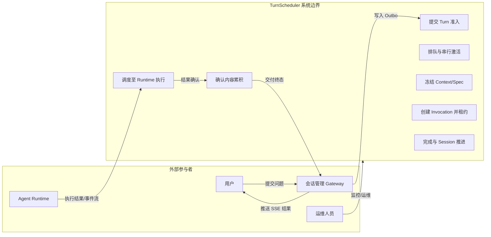
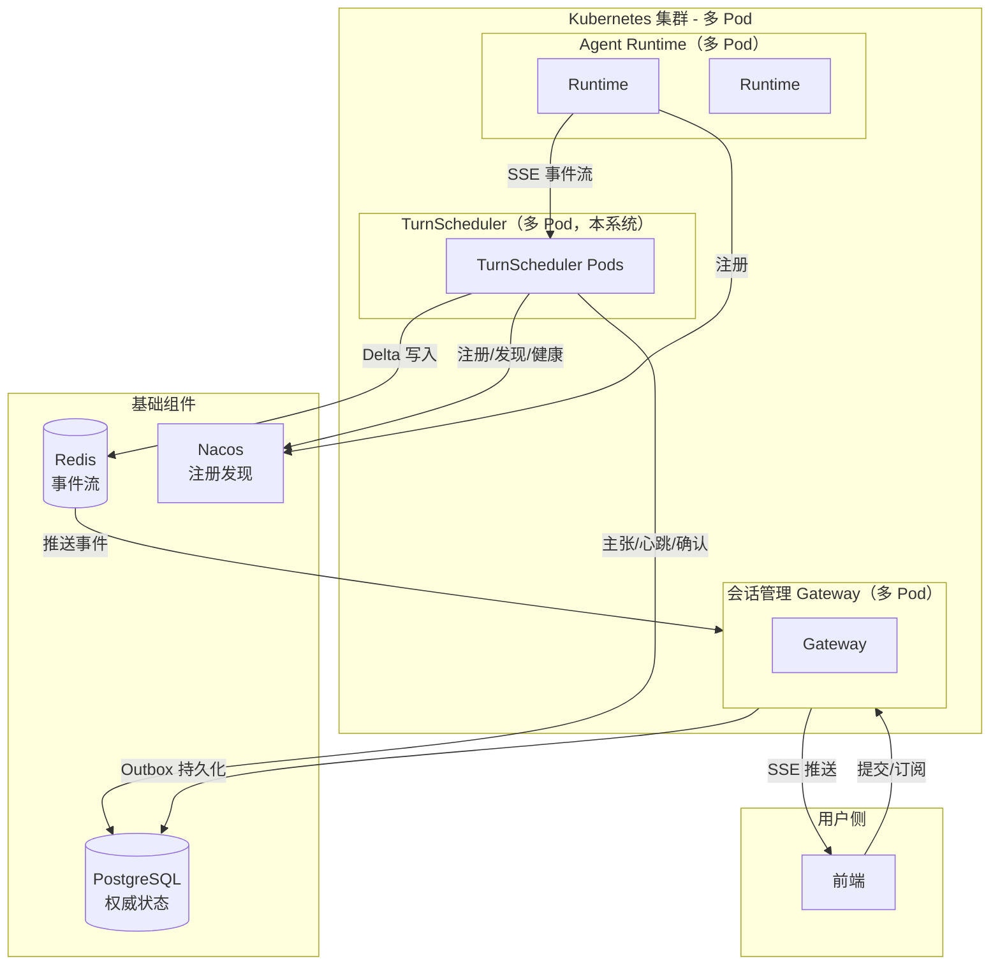
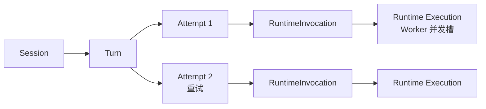
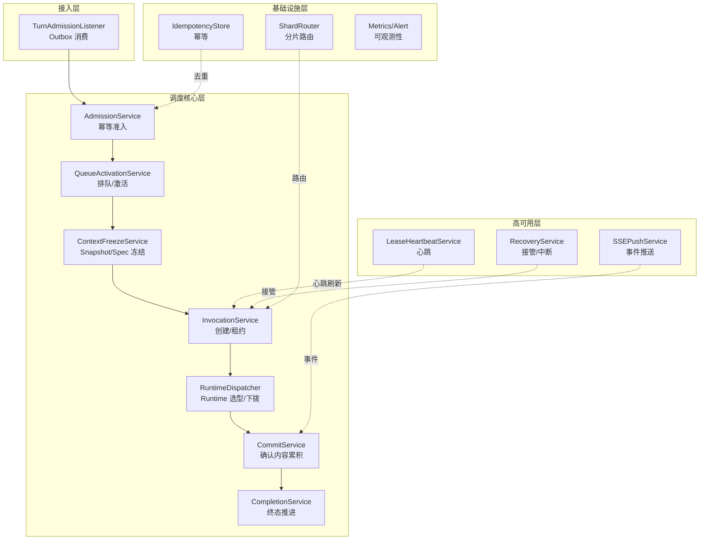
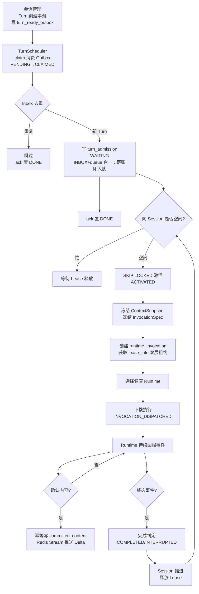
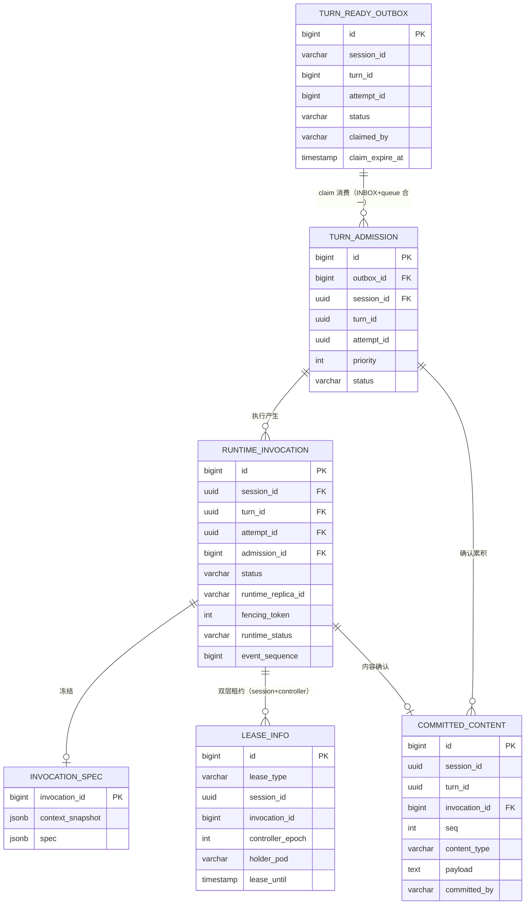
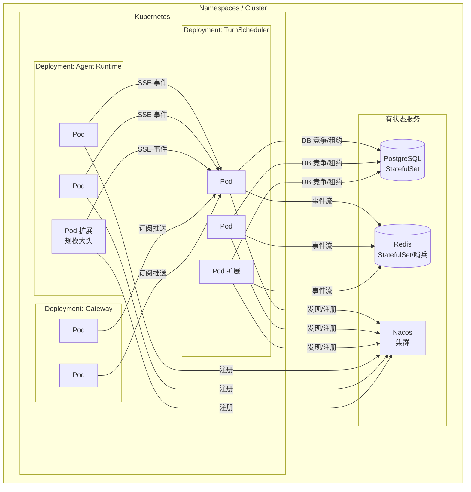

# TurnScheduler 概要设计说明书（HLD）

> 版本：v1.0 ｜ 阶段：概要设计 ｜ 关联技术方案：`turn-scheduler-design.md`（v2 完整设计）
> 本文档面向系统架构评审与立项批准；详细设计见后续 LLD 文档。

---

## 1. 引言

### 1.1 编写目的

本文档描述 **TurnScheduler（Turn 调度器）** 系统的概要设计，作为概要设计阶段的交付物，用于：

- 明确系统的总体架构、模块划分、接口关系与部署形态；
- 作为详细设计（LLD）与编码实施的依据；
- 作为系统评审、方案验证、容量规划的基础。

### 1.2 项目背景

在 Agent 平台中，用户的自然语言请求抽象为 **Turn**，由 Gateway（会话管理侧）与 TurnScheduler（调度侧）协作完成：

- Gateway 负责 Session、Turn、Attempt 的领域建模与用户交互；
- TurnScheduler 负责将 Attempt 调度到 Runtime 执行，并保证多 Pod 分布式环境下的安全、有序、可恢复执行。

> **Gateway 是用户唯一入口（架构不变量）**：用户的一切交互（提交、SSE 订阅、retryTurn、查询）都终止于 Gateway，会话管理作为 Gateway 的内部职能对用户不可见；TurnScheduler 与 Agent Runtime 均不直接面对用户。

TurnScheduler 是平台从"单机内嵌调度"走向"K8s 多 Pod 分布式调度"的独立服务，也是本设计的核心范围。

### 1.3 术语与缩略语

| 术语 | 说明 |
|---|---|
| Session | 对话会话，用户交互的顶级容器 |
| Turn | 一轮问答，提交给 Agent 的一个完整请求 |
| Attempt | 对同一 Turn 的一次执行尝试（重试产生新 Attempt） |
| RuntimeInvocation | 调度器侧的一次可调度执行单元（对应一次 Attempt 执行） |
| Runtime Execution | Runtime 侧的一次实际执行（Worker），由 SchedulingContext 承载 |
| Agent Runtime | 执行 Agent 逻辑的运行时（独立服务） |
| Gateway | 用户唯一入口，内含会话管理职能（本模块的上游消费者/下游输出对象），用户不直接接触会话管理 |
| Lease | 分布式租约（Session/Controller/Runtime 三类） |
| Fencing Token | 防呆令牌，拒绝陈旧控制者的写入 |
| SKIP LOCKED | PostgreSQL 行级跳过锁机制，用于分布式竞争 |
| SSE | Server-Sent Events，服务端推送事件流 |
| Outbox | 发件箱模式，Gateway 侧事务消息持久化 |
| Inbox | 收件箱模式，调度侧消费幂等去重 |

### 1.4 参考资料

| 编号 | 资料 |
|---|---|
| [1] | 统一 Agent Runtime 与 Runtime Driver 技术方案（架构总纲） |
| [2] | 专题 02：Session、Turn 与 Context |
| [3] | turn-scheduler-design.md（v2 调度器完整设计） |

---

## 2. 需求概要

### 2.1 功能需求概述

**功能清单（U0 级）：**

| 编号 | 功能 | 说明 |
|---|---|---|
| F1 | Turn 准入 | claim 消费会话管理 Outbox（turn_ready_outbox），Inbox 幂等接收 Turn 提交 |
| F2 | 排队与激活 | 同 Session 串行，跨 Session 并行，分布式竞争安全 |
| F3 | 调度执行 | 选择健康 Runtime，按 Worker 容量分派执行 |
| F4 | 结果确认 | 幂等累积确认内容（Committed Content） |
| F5 | 完成推进 | Turn 终态回写，Session 推进至下一 Turn |
| F6 | 故障恢复 | Pod 宕机/Runtime 宕机/锁竞争下的安全恢复 |
| F7 | 流式推送 | Delta 实时事件经 Redis Stream 推送用户 |
| F8 | 容量伸缩 | 多 Pod 水平扩展，DB 分片就绪（v1 N=1） |

### 2.2 性能与容量需求

| 指标 | 需求 | 依据 |
|---|---|---|
| 并发 Session | ≥ 745（部门规模） | 每 Session 单活 Invocation |
| 稳态调度吞吐 | 20~50 turns/s | 745 ÷ (执行时长 + 提交间隔) |
| 极端峰值吞吐 | ≤ 150 turns/s | 全员同时连续提交 |
| 故障恢复时间 | L0 秒级 / L1 10~30s / L2 ≤120s | 分层恢复策略 |
| 流式事件延迟 | P95 < 500ms（Runtime 产出 → 用户可见） | 体验要求 |

### 2.3 质量属性

| 属性 | 要求 |
|---|---|
| 可靠性 | 不丢确认内容；单 Pod 宕机不影响其他 Session |
| 一致性 | 至少一次执行、幂等确认；同一 Session 串行不交错 |
| 可扩展性 | Gateway 无状态水平扩展；DB 分片就绪（N=1 起步） |
| 可观测性 | 调度指标、租约指标、锁竞争指标、告警体系 |

---

## 3. 运行环境

### 3.1 部署环境

- 应用形态：Spring Boot 服务，以 **K8s Deployment** 多副本部署；
- 副本策略：多 Pod 无状态（有状态状态全部外置到 DB / Redis / Nacos）；
- 网络：Pod 间通过 Service/内部 DNS 通信；Runtime 注册于 Nacos。

### 3.2 基础组件角色分工

| 组件 | 角色 | 关键用法 | 职责边界 |
|---|---|---|---|
| PostgreSQL | 权威状态 + 分布式互斥 | SKIP LOCKED 竞争、Lease、Committed Content | 故障恢复真相唯一来源 |
| Redis | 短时态 + 实时体验 | Redis Stream 承载 Delta 事件流（TTL） | 体验层，可丢不丢内容 |
| Nacos | 注册发现 + 健康感知 + 配置 | Runtime/Gateway 注册与发现、配置下发 | 缩短故障发现时间，不替代租约 |
| Kubernetes | 部署编排 + 探针 | Deployment HPA、liveness/readiness、滚动更新 | 只决定流量分配，不参与所有权判定 |

---

## 4. 总体设计

### 4.1 设计目标与约束

**目标：**

1. 分布式安全：任何时刻一个 Invocation 最多一个执行者（租约 + fencing）。
2. 有序性：同 Session 的 Turn 严格串行执行。
3. 可恢复：任何组件宕机后系统自愈，确认内容不丢。
4. 多 Pod 友好：全部状态外置，Pod 天然可水平扩展。

**约束：**

- 数据库竞争以 **PostgreSQL SKIP LOCKED** 为事实源，不引入额外分布式锁中间件；
- 不依赖单机内存队列做调度状态（仅做本地 cache）；
- 对前端屏蔽 Attempt 概念（Turn 为可见对象，见 11.3 契约）；
- 所有 Gateway 侧表的 Session 维度必须满足可分片（v1 单实例 + 分区表就绪）。

### 4.2 总体架构

**架构要点：**

- TurnScheduler 与 Gateway 同为 Spring Boot 服务，**共享同一 PG 的不同 Schema 域**（会话管理侧 / 调度侧分库或分 Schema）；
- Gateway 通过 Outbox 持久化 Turn 提交，TurnScheduler 通过 Inbox 幂等消费；
- TurnScheduler 与 Runtime 之间是调度关系：下拨即委托，以租约收拢执行权；
- 用户订阅的 SSE 由 Gateway 提供，事件源来自 Redis Stream（由 TurnScheduler 写入）。

### 4.3 核心对象模型

**对象层级规则（架构不变量）：**

1. Turn 是用户可见的最小单位；Attempt 对前端屏蔽（实时流只推活跃 Attempt）；
2. Attempt 与 RuntimeInvocation **一一对应**（Invocation 是调度侧持久化形态）；
3. RuntimeInvocation 与 Runtime Execution **1:1 或 1:N**（动态并行 1:N）；
4. 一个 Session 同时至多一个活跃 Invocation（串行执行）。

### 4.4 模块划分与职责

**模块职责表：**

| 模块 | 职责 | 关键 DB 交互 |
|---|---|---|
| AdmissionService | Inbox 去重、幂等准入 | turn_admission（INSERT ON CONFLICT） |
| QueueActivationService | 排队唤醒、SKIP LOCKED 竞争 | turn_admission（status='WAITING' 竞争） |
| ContextFreezeService | 冻结 ContextSnapshot / InvocationSpec | invocation_spec |
| InvocationService | 创建 Invocation、获取 Session Lease 与 Controller Lease | runtime_invocation、lease_info |
| RuntimeDispatcher | Nacos 健康实例过滤 + Worker 容量选型 + 下拨 | runtime_invocation（状态置 dispatched） |
| CommitService | 幂等累积触发确认、增量合并 | committed_content、runtime_invocation（观测字段） |
| CompletionService | Turn 终态判定、Session 推进 | runtime_invocation（终态）、admission（终态） |
| LeaseHeartbeatService | 周期刷新三类租约 | lease_info（lease_type 区分） |
| RecoveryService | 过期租约接管、Runtime 失联中断、卡死检测 | 租约表 + 状态表扫描 |
| SSEPushService | Delta 写 Redis Stream、按活跃 Attempt 过滤推送 | Redis Stream |

### 4.5 关键处理流程（Level 0）

**整体调度主流程：**

### 4.6 一致性设计概述（三类 Lease）

| Lease | 持有者 | 保护对象 | 过期释放 |
|---|---|---|---|
| Session Execution Lease | 调度 Pod（Controller） | 同 Session 串行执行权 | 30s，心跳刷新 |
| Controller Lease | 调度 Pod（Controller） | Invocation 控制权（写权限） | 60s，心跳刷新 |
| Runtime Execution Lease（Fencing Token） | Runtime | 执行权防呆 | 30s，Runtime 心跳 |

三层关系：Session Lease 管"串行"、Controller Lease 管"谁控制"、Fencing Token 管"谁在写"，任一过期都触发接管/中断流程。**恢复规则：新控制者必须带新 controller_epoch + 新 fencing token，旧控制者的写入被物理拒绝。**

---

## 5. 接口设计

### 5.1 外部接口

**E1：会话管理 → TurnScheduler（Turn 提交）**

| 项 | 说明 |
|---|---|
| 方式 | Outbox/Inbox 模式（异步持久化）：会话管理写 `turn_ready_outbox`（OUTBOX，与 Turn 同事务），TurnScheduler 经消费接口 claim 拉取 |
| 数据 | session_id、turn_id、attempt_id、context_ref、payload（TurnReady 完整消息体） |
| 消费接口 | `claimTurnReady(batchSize, podId)` → 命中消息列表；`ackTurnReady(messageIds, podId)` → 确认落账 |
| claim 语义 | 消息状态 `PENDING → CLAIMED → DONE`；claim 租约 30s，崩溃超时自动回 `PENDING` |
| 幂等 | 以 `(session_id, turn_id, attempt_id)` 为 Inbox（turn_admission）幂等键，重复投递被静默吸收 |
| 落账顺序 | 先 Inbox 落账（ON CONFLICT DO NOTHING）后 ack，禁止先 ack 后落账 |

**E2：TurnScheduler → Runtime（调拨下拨）**

| 项 | 说明 |
|---|---|
| 方式 | 调度接口下拨 + 事件流回报 |
| 下拨数据 | SchedulingContext（含 InvocationSpec、执行必需的全部冻结数据） |
| 回报 | SSE 事件流：Delta / Committed / Tool / 终态事件 |
| 身份 | 下拨时携带 fencing token；重启连接需重发 |

**E3：TurnScheduler → Redis（Delta 事件流）**

| 项 | 说明 |
|---|---|
| 结构 | Redis Stream：`turn_events:<session_id>`，事件带单调 sequence |
| 写入 | 每条 { session_id, turn_id, attempt_id, sequence, type, payload } |
| TTL/裁剪 | TTL 10 分钟 + maxlen 裁剪，可丢不丢内容 |
| 消费 | 持有 SSE 连接者，按水位 `XRANGE +` 续读 |

**E4：TurnScheduler → Nacos（注册发现）**

| 项 | 说明 |
|---|---|
| 功能 | 自身注册、Runtime 实例发现、健康感知 |
| 用法 | 调度选型时过滤心跳超时 / readiness=false 实例 |
| 注意 | 只缩短发现时间，不替代租约做安全接管 |

**E5：TurnScheduler → PostgreSQL（权威存储）**

| 项 | 说明 |
|---|---|
| 访问 | JdbcTemplate，连接池化，SKIP LOCKED 竞争 |
| 事务 | 单语句 / 短事务，长事务严格禁止 |
| 分片 | ShardRouter 按 hash(session_id)%N 路由（v1 N=1） |

### 5.2 内部接口（模块间）

| 编号 | 调用方 → 被调方 | 语义 |
|---|---|---|
| I1 | M0 → M1 | 消费的 Outbox 消息送入准入 |
| I2 | M1 → M2 | 准入通过后入队 |
| I3 | M2 → M3 | 激活后冻结上下文 |
| I4 | M3 → M4 | 冻结完成，创建 Invocation |
| I5 | M4 → M5 | 获取租约成功，可调度 |
| I6 | M5 → M6 | Runtime 回报事件路由 |
| I7 | M6 → M7 | 确认内容达到终态条件 |
| I8 | M9 → M4 | 接管：递增 epoch 重获控制权 |
| I9 | M8 → M4 | 心跳刷新租约 |
| I10 | M10 → M6 | Delta 事件写入 Redis Stream |

---

## 6. 数据结构设计（概要）

### 6.1 逻辑结构（E-R 图）

### 6.2 表清单

**Gateway 侧（调度模块拥有，5 张）：**

| 表 | 用途 | 数据量级 | 生命周期 |
|---|---|---|---|
| turn_admission | Turn 提交准入与排队（**INBOX + 调度队列合一**，吸收原 pending_turn_queue 的队列语义） | 中长期 | 全生命周期 |
| runtime_invocation | 可调度执行单元 + Runtime 观测水位（吸收原 runtime_observed_state） | 中长期 | 长期保留（审计） |
| invocation_spec | 冻结的 Context/Spec | 中长期 | 随 Invocation |
| lease_info | 双层租约：session 串行执行权 + controller 控制权（以 lease_type 区分） | 短期 | 活跃期 |
| committed_content | 确认内容（权威） | 长期 | 永久保留 |

**会话管理库（OUTBOX，接口约定表）：**

| 表 | 用途 | 数据量级 | 生命周期 |
|---|---|---|---|
| turn_ready_outbox | TurnReady 事务消息（**OUTBOX**，与 Turn 同事务写入，4.1.1 参考 DDL） | 中短期 | PENDING 消费后清理 |

> 注：会话管理侧（Turn/Attempt/Session/Context）由 Gateway 侧维护，本模块只引用 `session_id / turn_id / attempt_id / context_ref`，不建元数据表。`turn_ready_outbox` 是唯一的跨库接口表，调度模块通过消费接口（E1）读写，不直接持有其建表权限。

---

## 7. 出错处理设计

### 7.1 出错分类与补救

| 类别 | 场景 | 补救措施 |
|---|---|---|
| 基础设施故障 | Gateway Pod 宕机 | L0 主动释放 / L1 Nacos+节点证据提前接管 / L2 租约过期兜底 |
| 调度侧故障 | TurnScheduler Pod 崩溃 | 心跳停更 → 其他 Pod 接管（controller_epoch 递增） |
| 执行侧故障 | Runtime 失联/崩溃 | 租约过期 → Attempt 标记 INTERRUPTED，已确认内容保留 |
| 数据竞争 | 双 Pod 同时 claim | SKIP LOCKED 保证唯一性，败者重试 |
| 重复投递 | Outbox/事件重复 | Inbox 幂等键 + Committed 幂等键（seq） |
| 内容丢失 | Delta 未达 Redis | 不丢内容：权威在 committed_content，Delta 可重建 |

### 7.2 兜底原则

1. **宁可慢，不可双活**：提前接管必须以 fencing 授权为前提；
2. **未知状态按失败恢复**：无法判定的事件采保守策略（中途中止为重，不清空已确认内容）；
3. **死信隔离**：连续失败的队列项转入死信，避免阻塞同 Session。

---

## 8. 安全保密设计

| 层面 | 设计 |
|---|---|
| 数据隔离 | 多租户 Session 维度隔离（session_id 贯穿全部表） |
| 身份与能力 | 调度侧 ↔ Runtime 间凭令牌（fencing token）授权，防呆防冒充 |
| 配置安全 | API Key / 凭据经 K8s Secret 注入，不入日志不入库 |
| 输入防护 | InvocationSpec 冻结时校验上下文引用合法性，防注入 |
| 审计 | Invocation 全生命周期可审计，Attempt 历史保留 |
| Redis 边界 | 只存体验层 Delta（TTL），不含凭据 |

---

## 9. 性能设计

### 9.1 容量结论（详见 v2 第 16 章）

- 稳态需求 20~50 turns/s，极端峰值 <150 turns/s；
- 单 PG 优化后可承载峰值 150~200 turns/s，稳态安全 80~100；
- **瓶颈在大头在 Runtime 池规模（~95 Pod）与模型 API 配额，不在调度器**。

### 9.2 分片演进

| 阶段 | 形态 | 触发条件 |
|---|---|---|
| v1 | 单实例 + 分区表（Router 就绪 N=1） | 上线初期 |
| v2 | 2 实例分库（N=2） | 稳态 >80 turns/s / CPU >70% / 连接 >60% |
| v3 | 4 实例（N=4） | 阶段 2 指标超限 |
| v4 | Kafka 承载传输 | 万级 turns/s（超越 745 场景） |

---

## 10. 部署设计

### 10.1 K8s 部署拓扑

### 10.2 扩缩容与优雅关闭

| 场景 | 行为 |
|---|---|
| 水平扩容 | 新 Pod 注册，启动后参与竞争（无状态，无需预热协调） |
| 优雅关闭 | SIGTERM → readiness=false → 停 poll → preStop 收尾 → 主动释放全部租约 |
| 滚动更新 | 分批替换，readiness 门控新流量，租约过度自然过渡 |
| 缩容 | 缩容触发优雅关闭流程，被摘 Pod 的在途 Invocation 由其他 Pod 接管 |

---

## 11. 系统维护设计

### 11.1 可观测性

| 维度 | 埋点 |
|---|---|
| 调度指标 | 吞吐 turns/s、激活率、锁竞争率（SKIP LOCKED 冲突） |
| 租约指标 | Lease 持有时长、续约成功/失败率、接管次数、接管耗时 |
| 执行指标 | Invocation 各状态停留时长、完成率、中断率 |
| 队列指标 | pending 队列深度、等待时长分布 |
| 流式指标 | Delta 延迟 P95、Stream 积压量 |
| 组件健康 | PG 连接池、Redis 连接、Nacos 心跳 |

### 11.2 告警

| 告警 | 阈值示例 |
|---|---|
| 接管风暴 | 接管次数/分钟 > N |
| 锁竞争异常 | skip 冲突率持续 > X% |
| 中断率过高 | 中断率 > Y% |
| 队列积压 | 等待时长 P95 > Zs |
| Lease 双活（违规） | 同 Invocation 双 holder（理论不发生，触发则 P0） |

### 11.3 审计与数据保留

- Invocation / Committed / Turn 全量长期保留（审计与追溯）；
- 短期表（queue / lease / observed_state）按状态清理（运维定时任务）；
- 死信记录独立保留，人工介入通道。

---

*—— 概要设计正文结束 ——*

### 附：概要设计评审要点

1. 对象层级（Session→Turn→Attempt→Invocation→Execution）与架构总纲是否一致；
2. 三类 Lease 边界与接管规则是否满足"安全接管、绝不双活"；
3. 多 Pod 流式链路（Redis Stream）是否满足断点续传与 Attempt 屏蔽契约；
4. 数据分布与分片演进（N=1 就绪）是否符合当下与远期容量；
5. 部署形态（K8s 多 Pod、无状态、探针门控）是否可落地；
6. 性能瓶颈判断（Runtime 池 / 模型配额，非 PG）是否被接受。