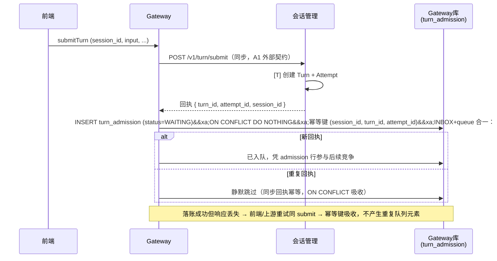
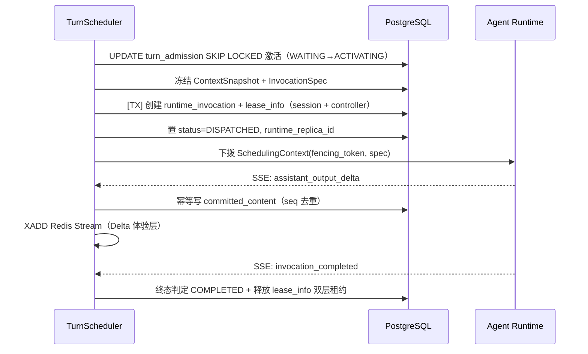
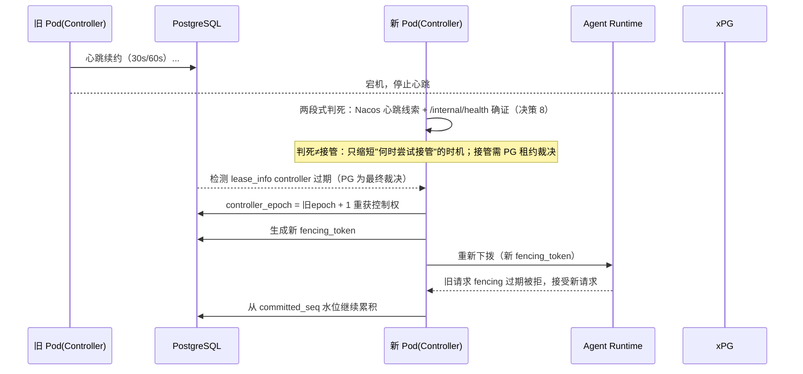
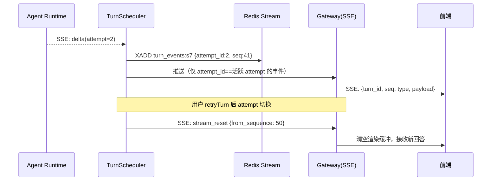
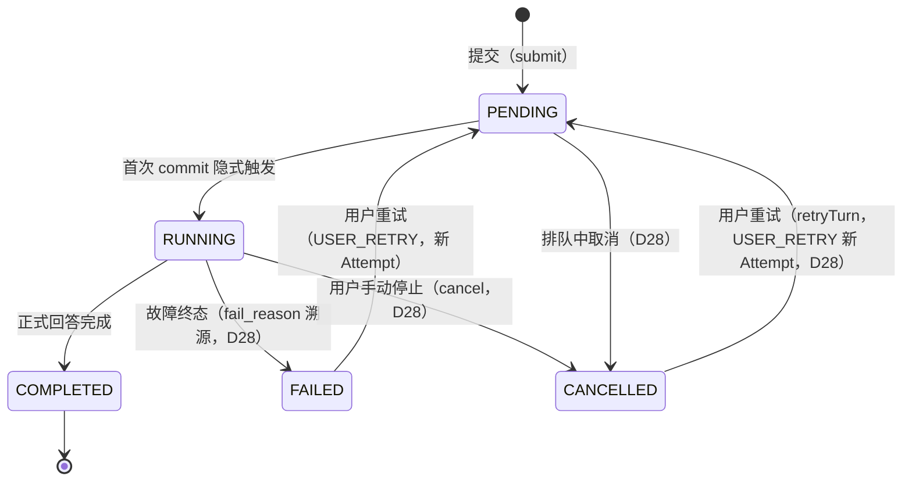
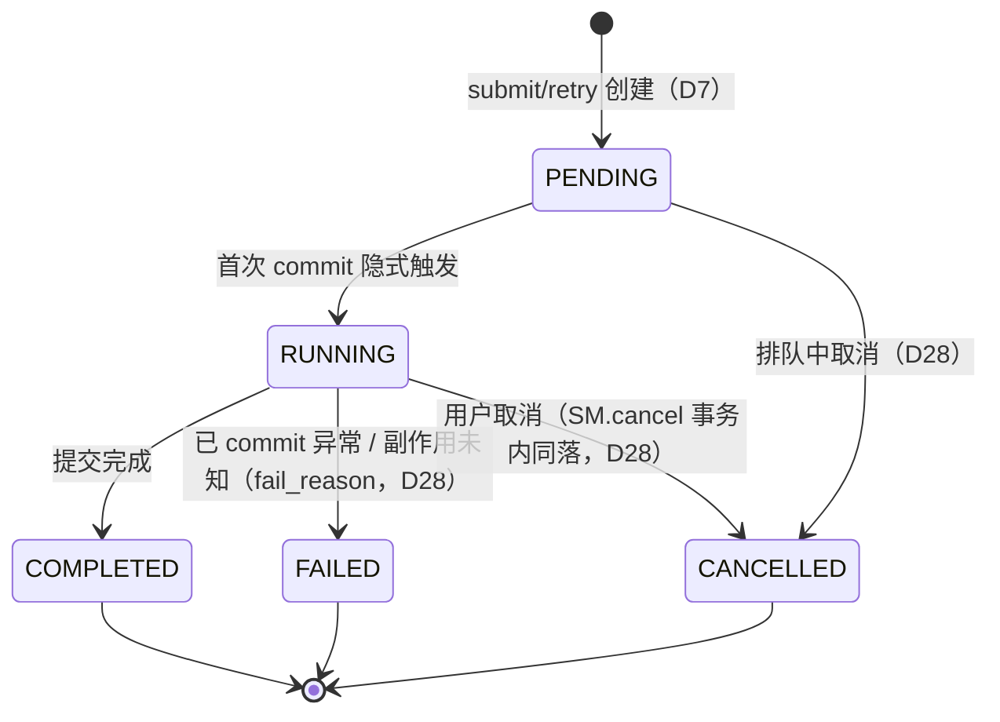
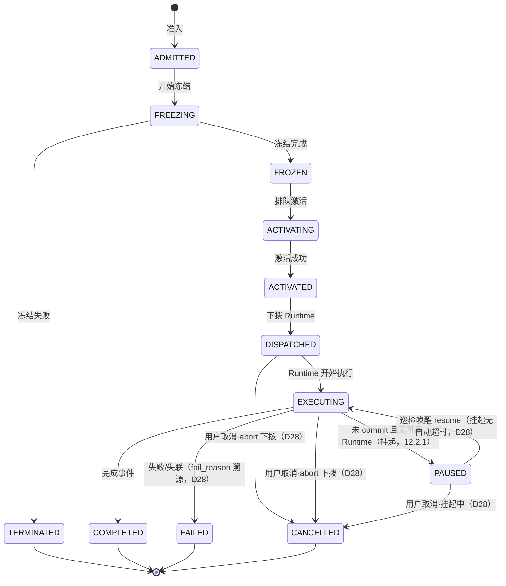
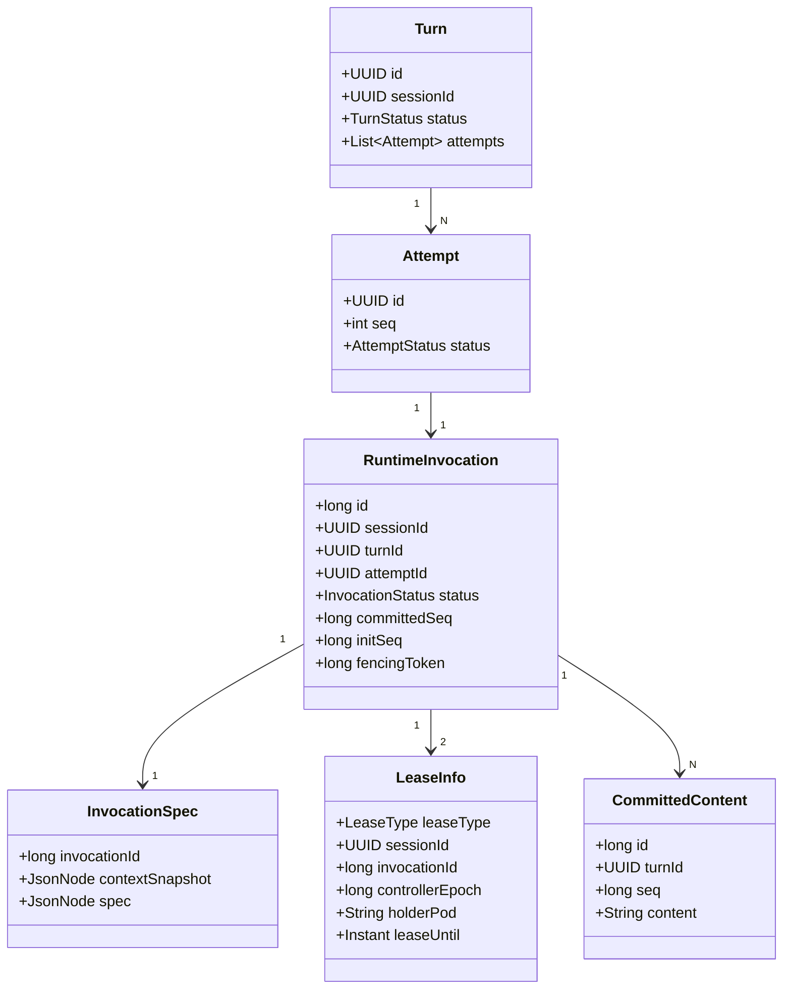
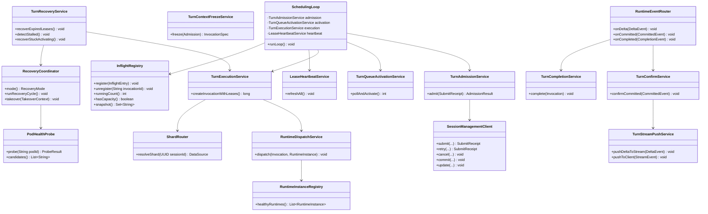

# TurnScheduler 详细设计说明书（LLD）

> 版本：v1.0 ｜ 阶段：详细设计 ｜ 上游文档：`turn-scheduler-hld.md`（概要设计）
> 本文档面向编码实施与单元/集成测试；与 HLD 配套，内容以可实现的精度描述各模块处理、数据库 DDL、关键 SQL、时序、状态机与类设计。

---

## 1. 引言

### 1.1 编写目的

在概要设计（HLD）批准的基础上，将 TurnScheduler 的每个功能模块细化到可编码程度：

- 模块级处理流程、输入输出、异常处理；
- 数据库完整 DDL、索引、事务边界、关键竞争 SQL；
- 核心流程时序、状态机转换、并发与一致性机制；
- 类与接口定义、测试要点、监控埋点。

### 1.2 范围

实现范围：TurnScheduler 调度侧服务（Spring Boot），含 5 张 Gateway 侧表、三类 Lease、7 阶段调度流水线、流式 Delta 推送、故障恢复。不含 Gateway 会话管理侧实现（仅接口对接）。**同步提交通道（决策 D1/D15，废弃 outbox）**：Gateway 同步调会话管理 `submit` 拿回执（A1 外部契约），回执幂等落账 `turn_admission`（INBOX 即调度队列）；`Attempt` 业务记录只由会话管理创建（D7），本模块只消费 `attempt_id` 建 Invocation。本模块经同步接口（A1~A12 外部契约）调用，不再存在跨库 OUTBOX 消费。

### 1.3 引用文档

| 编号 | 文档 |
|---|---|
| [1] | turn-scheduler-hld.md（概要设计） |
| [2] | turn-scheduler-design.md（v2 技术方案） |
| [3] | 统一 Agent Runtime 与 Runtime Driver 技术方案 |
| [4] | 专题 02：Session、Turn 与 Context |

### 1.4 模块清单（对应 HLD 4.4）

| 模块 | 类名（Java） | 职责 |
|---|---|---|
| M0 实时事件路由 | RuntimeEventRouter | 消费 Runtime SSE 事件流并路由到 Confirm/Complete |
| M1 准入 | TurnAdmissionService | Inbox 幂等准入 |
| M2 排队激活 | TurnQueueActivationService | SKIP LOCKED 竞争串行激活 |
| M3 冻结 | TurnContextFreezeService | 冻结 ContextSnapshot 与 InvocationSpec |
| M4 创建/租约 | TurnExecutionService | 创建 Invocation、获取 Session/Controller Lease |
| M5 调度 | RuntimeDispatchService | Nacos 选型 + Worker 容量路由 + 下拨 |
| M6 确认 | TurnConfirmService | Committed 幂等累积 + Delta 推送 |
| M7 完成 | TurnCompletionService | 终态判定、Session 推进 |
| M8 心跳 | LeaseHeartbeatService | 三类租约周期续约 |
| M9 恢复 | TurnRecoveryService | 接管、中断、卡死检测 |
| M10 推送 | TurnStreamPushService | Redis Stream 写入 + 活跃 Attempt 过滤 |
| M11 路由 | ShardRouter | session_id 分片选择（v1 N=1） |

---

## 2. 模块详细设计

### 2.1 调度主循环（SchedulingLoop）

所有 Pod 独立运行，无选举，靠 DB 竞争。

```text
while (running) {
    // 0. 容量门控（决策 10）：本 Pod 内存计数已达上限则整轮暂停
    if (!inflightRegistry.hasCapacity()) {
        metrics.inc("inflight_gate_hit");
        sleep(poll_interval);
        continue;
    }

    // 1. 同步回执落账（决策 D1/D15，替代原 Outbox 消费）：
    //    Gateway 对外 API 接收 submitTurn 时同步调会话管理 submit 拿回执
    //    （A1 外部契约），回执幂等落账 turn_admission 即完成准入——不在 poll 循环内消费跨库队列
    //    回执落账幂等键 = (session_id, turn_id, attempt_id)，重复 submit 由 ON CONFLICT 吸收

    // 2. 激活排队
    TurnQueueActivationService.pollAndActivate()

    // 3. 处理可调度 Invocation
    TurnExecutionService.processNextInvocation()

    // 4. 心跳
    LeaseHeartbeatService.refreshAll()

    sleep(poll_interval + jitter())   // poll jitter：多 Pod 错峰竞争（均衡手段之一）
}
```

| 配置项 | 默认值 |
|---|---|
| poll_interval | 200ms |
| activation_batch_size | 10 |
| dispatch_batch_size | 10 |
| max_running_turns_per_pod | 30~50（Nacos 动态配置 `turn-scheduler.max-running-turns.per-pod`，热生效） |
| redispatch_max_attempts | 5 |
| redispatch_backoff | 1s / 2s / 4s / 8s / 16s |

### 2.2 TurnAdmissionService（M1）

**消息定义（同步回执，对应会话管理 `submit` 返回，跨服务契约 A1）：**

```java
public record SubmitReceipt(
    String  sessionId,
    String  turnId,
    String  attemptId,     // Attempt#1（submit）/ Attempt#N（retry，D7：Attempt 业务记录只由会话管理创建）
    String  contextRef,    // 可空：冻结阶段再构建
    String  receiptBody    // 回执完整消息体（幂等落账用）
) {}
```

**处理流程（Gateway 对外 API submitTurn → 同步通道，决策 D1/D15）：**

```text
1. Gateway 接收 submitTurn（前端 API，11.3）
2. 同步调会话管理 submit：POST /v1/turn/submit（A1）
   -> 会话管理事务内创建 Turn + Attempt#1（PENDING），返回回执 { turn_id, attempt_id, session_id }
3. 回执幂等落账（同步，本地事务）：
   a. inbox 幂等键 = (session_id, turn_id, attempt_id)
   b. INSERT INTO turn_admission (..., status='WAITING') ... ON CONFLICT DO NOTHING
      // INBOX + queue 合一：落账即入队，不再二次写 pending_turn_queue（替代原 turn_ready_outbox 消费）
   c. 若插入成功（新 Attempt）：已入队（WAITING），凭 admission 行参与 SKIP LOCKED 竞争
   d. 若冲突（重复回执）：静默跳过，视为已准入（用户防重放已前移 Gateway 对外 API）
```

**输入输出：**

| 方向 | 数据 | 说明 |
|---|---|---|
| 入 | SubmitReceipt { session_id, turn_id, attempt_id, context_ref, receipt_body } | 会话管理 submit 同步回执（A1 外部契约） |
| 出 | admission_id（admission 行即队列元素） | 后续流程凭 admission_id 追踪 |

**异常处理：**

| 异常 | 处理 |
|---|---|
| submit 调用失败（RPC 超时/不可用） | 对外返回失败，前端可重试；无半落库风险（会话管理事务未提交则无回执，Gateway 无落账） |
| 落账失败（本地事务异常） | 本地事务回滚，不产生残缺 admission 行；重试由用户/上游重发，幂等键吸收 |
| 入队冲突 | ON CONFLICT 静默跳过，视为已准入 |
| 落账成功但响应丢失 | 回执幂等重放：重发同 submit 时 ON CONFLICT 吸收，不产生重复队列元素 |

### 2.3 TurnQueueActivationService（M2）

**核心竞争 SQL（串行激活，INBOX+queue 合一后直接竞争 admission 行）：**

```sql
-- 决策 12 优化版：一步排除有活动 session 租约的 Session（LEFT JOIN lease_info）
-- 安全不变：Session Lease 唯一键 + CAS（见 2.5）仍是最终兜底
update turn_admission a
set status = 'ACTIVATING',
    activated_at = now(),
    activated_pod = :pod
where a.id = (
    select a2.id
    from turn_admission a2
    left join lease_info l
           on l.lease_type = 'session'
          and l.session_id  = a2.session_id
          and l.lease_until > now()          -- 忙碌 session 的租约未过期
    where a2.status = 'WAITING'
      and l.id is null                       -- 仅竞争空闲 Session 的排队行
    order by a2.priority, a2.created_at
    limit 1
    for update skip locked
)
returning a.*;
```

**要点：**

- 「同 Session 无活跃 Invocation」是激活前提（会话级串行）；
- `FOR UPDATE SKIP LOCKED` 保证并发 Pod 各取各的行，不互相阻塞；
- 激活后状态 ACTIVATING，短暂过渡 → ACTIVATED（状态机见第 6 章）。

### 2.4 TurnContextFreezeService（M3）

**处理流程：**

```text
对 ACTIVATED 的 admission:
  1. 加载会话上下文（从 Gateway 侧上下文引用，冻结快照）
  2. 冻结 InvocationSpec（尽量拷贝，杜绝可变外部引用）
  3. 写入 invocation_spec（context_snapshot jsonb + spec jsonb）
  4. 将 admission 置 FREEZING -> FROZEN
```

**防篡改原则：** ContextSnapshot 与 Spec 一经生成不可修改；异常时整条路径回滚至当前 Attempt。

### 2.5 TurnExecutionService（M4）

**创建 Invocation 并获取双层租约（单事务脚本，租约统一写入 lease_info）：**

```sql
begin;

insert into runtime_invocation (session_id, turn_id, attempt_id, admission_id,
                                status, priority, committed_seq, init_seq, spec_rev)
values (:session_id, :turn_id, :attempt_id, :admission_id,
        'ADMITTED', :priority, 0, 0, :spec_rev);

-- Session Execution Lease（串行执行权，lease_type='session'）
insert into lease_info (lease_type, session_id, invocation_id, holder_pod, lease_until)
values ('session', :session_id, :invocation_id, :pod, now() + interval '30 second');

-- Controller Lease（控制权，lease_type='controller'）
insert into lease_info (lease_type, session_id, invocation_id, controller_epoch, holder_pod, lease_until)
values ('controller', :session_id, :invocation_id, 1, :pod, now() + interval '60 second');

commit;
```

**租约刷新（M8 心跳，两语句）：**

```sql
update lease_info set lease_until = now() + interval '30 second'
where lease_type = 'session' and session_id = :s and invocation_id = :i and holder_pod = :pod;

update lease_info set lease_until = now() + interval '60 second'
where lease_type = 'controller' and session_id = :s and invocation_id = :i and controller_epoch = :epoch and holder_pod = :pod;
```

> 心跳用 `holder_pod + controller_epoch` 双重匹配，保证只续自己的、只续当前代。

### 2.6 RuntimeDispatchService（M5）

**选型流程：**

```text
1. 从 Nacos 拉取 Runtime 实例列表（健康实例：心跳不过期 + readiness=true）
2. 按剩余 Worker 容量排序（实例上报的 capacity + running_count）
3. 无容量上报时 round-robin
4. 选择实例，下拨执行
5. 更新 runtime_invocation: status=INVOCATION_DISPATCHED, runtime_replica_id=:replica
6. 游程开始（fencing_token 继承）

下拨失败 / Runtime 失联自动重派（决策 6）：
  同一 Attempt 重派 ≤ 5 次，退避 1s/2s/4s/8s/16s（参数见 2.1）
  每次重派重新执行步骤 1~5（重新选实例 + 签发新 fencing_token）
  5 次仍失败且无可用 Runtime -> invocation 置 PAUSED 挂起（巡检唤醒，12.2.1）
     始终无可用 Runtime / INFRA_RETRY 超限 -> admission 置 FAILED
     fail_reason='RETRY_EXCEEDED'、Attempt 判 FAILED、Turn FAILED 等 USER_RETRY（D28）
```

**下拨数据（SchedulingContext）：**

```text
{
  invocation_id,
  fencing_token,
  context_snapshot（冻结的会话上下文）,
  spec（冻结的 InvocationSpec）,
  event_target（SSE 回调地址）,
  session_id, turn_id, attempt_id
}
```

### 2.7 RuntimeEventRouter（M0）+ TurnConfirmService（M6）

**事件路由：**

| 事件类型 | 路由目标 | 处理 |
|---|---|---|
| assistant_output_delta | TurnStreamPushService | 写 Redis Stream（体验层） |
| assistant_content_committed | TurnConfirmService | 幂等写 committed_content |
| runtime_event（tool 等） | 记录 + 推送 | runtime_invocation 观测字段推进（event_sequence / progress_note） |
| invocation_completed | TurnCompletionService | 终态判定 |
| invocation_failed | TurnCompletionService | FAILED（fail_reason 溯源，D28） |

**幂等确认 SQL（关键）：**

```sql
insert into committed_content (session_id, turn_id, invocation_id, seq,
                               content_type, payload, committed_by, created_at)
values (:session_id, :turn_id, :invocation_id, :seq, :content_type, :payload, :by, now())
on conflict (invocation_id, seq) do nothing;
```

**水位推进：**

```sql
update runtime_invocation ri
set committed_seq = :new_seq
where ri.invocation_id = :id and ri.committed_seq = :old_seq;
```

> 乐观锁：期望旧水位匹配才推进，防止重复/乱序确认把水位回拨。

### 2.8 TurnCompletionService（M7）

**终态条件：**

```text
确认内容追平 init_seq + 收到 invocation_completed
  -> status = COMPLETED，写会话侧终态事件，释放租约
或：失败判定（已 commit 异常 / 副作用结果未知）
  -> status = FAILED（fail_reason 溯源），保留已确认内容，Turn 走 INFRA_RETRY（超限等 USER_RETRY，D28）
或：用户取消（cancelTurn -> abort）
  -> status = CANCELLED，保留已确认内容（D28）
```

**完成 SQL：**

```sql
update runtime_invocation set status = 'COMPLETED', completed_at = now()
where invocation_id = :id and status in ('DISPATCHED','EXECUTING','PAUSED');

delete from lease_info where lease_type = 'session' and invocation_id = :id;
delete from lease_info where lease_type = 'controller' and invocation_id = :id;
```

### 2.9 TurnRecoveryService（M9）

**接管（Gateway Pod 崩溃场景）：**

```text
扫描 lease_info 中 lease_type='controller' 且超期（lease_until < now()）的行
  -> 重新执行创建/租约流程（同 2.5），但 controller_epoch = 旧 + 1
  -> 新 fencing token 下发 Runtime
  -> Runtime 侧旧请求因 fencing 过期被拒
```

**失联处置（Runtime 事件停滞，D28）：**

```text
扫描 executing 但 runtime_invocation.updated_at 停滞（观测字段不再推进）+ Runtime 心跳超时
  -> 按 commit 分界（12.2）：
     未 commit -> 同一 Attempt 内自动重派（2.6）/ 无可用 Runtime 置 PAUSED 挂起
     已 commit -> Attempt 判 FAILED（fail_reason 溯源），Turn 自动 INFRA_RETRY 新 Attempt
  -> 不拼接：新 Attempt 新租约新 Watermark
```

**卡死检测 SQL（判据）：**

```sql
-- Controller 心跳停滞（lease_type='controller'）
select session_id, invocation_id, holder_pod
from lease_info
where lease_type = 'controller'
  and lease_until < now() - interval '1 minute'
  and exists (select 1 from runtime_invocation ri
              where ri.invocation_id = lease_info.invocation_id
                and ri.status in ('DISPATCHED','EXECUTING'));

-- Runtime 事件水位停滞（观测字段并入 runtime_invocation）
select ri.invocation_id, ri.event_sequence, ri.updated_at
from runtime_invocation ri
where ri.updated_at < now() - interval '5 minutes'
  and ri.status in ('DISPATCHED','EXECUTING');

-- 判据 3：activating 卡死（激活中途协调者死亡，决策 3）
-- 10s 巡检节奏、60s 阈值；回收 = FOR UPDATE SKIP LOCKED + CAS 回退 WAITING
select a.id as admission_id, a.session_id, a.updated_at
from turn_admission a
where a.status = 'ACTIVATING'
  and a.updated_at < now() - interval '60 seconds';
```

**执行入口（决策 7）：统一收敛到 RecoveryCoordinator，全员巡检 + 模式开关：**

```java
public interface RecoveryCoordinator {
    RecoveryMode mode();                            // leaderless（默认，v1） | leader（预留，v2）
    void onHealthProbeResult(PodHealthProbe.Result r);
    void runRecoveryCycle();                        // 回收过期租约 + 卡死判定（含判据 3）
    void takeover(TakeoverContext ctx);             // 经 PG 租约 + epoch 递增 + 新 fencing token
}
```

**两段式判死（决策 8/9，独立于接管，只产观测结论）：**

```text
第一段 线索（Nacos）:  心跳超时 -> 候选死亡 Pod（30s 节流缓存，不落库）
第二段 确证（探测）:   GET /internal/health，2s 超时；lastPollAt 距当前 <30s 视为新鲜
                     连续失败 -> 疑似死亡（仅记日志 + 指标 pod_health_event_total）
红线: 判死 ≠ 接管 —— 接管永远走 lease_info 租约 + epoch + fencing（下方 4.3）
```

```json
// /internal/health 契约（Gateway 内部接口，独立于 K8s 探针）
{ "podId": "gateway-7f9c2d", "status": "ACTIVE",
  "lastPollAt": "2026-09-13T10:00:00Z",
  "lastHeartbeatAt": "2026-09-13T10:00:00Z" }
```

### 2.10 TurnStreamPushService（M10）

**写入：**

```text
XADD turn_events:<session_id> * event_json
  事件 = { session_id, turn_id, attempt_id, sequence, type, payload }
TTL: EXPIRE turn_events:<session_id> 600
```

**推送（活跃 Attempt 过滤）：**

```text
持有 SSE 连接者，按 client_watermark 消费:
  XRANGE turn_events:<session_id> <watermark+1> +
过滤: attempt_id == 当前活跃 attempt 才推送
控制事件: attempt 切换时推 stream_reset（见 11.3 契约）
断连重连（决策 5）: SSE 传输层断连 ≠ 死亡；客户端自动重连（1s→30s 指数退避 + jitter，
  4min 窗口）后按 event_seq 续读；4min < 判据 2 的 5min 阈值，重连窗口落在官方恢复时序内
```

### 2.11 ShardRouter（M11）

```text
shard_id = Math.floorMod(session_id.hashCode(), N)   // N 配置化，v1 = 1
数据源选择：AbstractRoutingDataSource 按 shard_id 切换
约束：同 Session 同 shard；无跨 shard 事务
```

---

## 3. 数据库详细设计

### 3.1 表结构与 DDL

**gateway 侧（调度模块拥有，5 张）。** 会话管理侧表（Turn/Attempt/Session/Context）由会话管理维护，本模块经同步接口（A1~A12）交互；**不再存在跨库 OUTBOX 接口表**（决策 D1/D15，废弃 outbox）。

#### 3.1.1 turn_admission（同步回执落账 + 调度队列，Gateway 侧幂等准入）

> **同步提交通道（决策 D1/D15，替代原 turn_ready_outbox + pending_turn_queue）**：Gateway 同步调会话管理 submit 拿回执，回执幂等落账即为准入——INBOX 落账与入队合一，`priority` 与排队语义由 admission 行自身承载；消息出表（原 turn_ready_outbox）不再存在，无 claim/ack/租约回收概念。

> **表合并说明（方案A）：** 原 `pending_turn_queue` 并入本表——INBOX 幂等落账（admitted）与入队（waiting）合一，`priority` 与排队语义由 admission 行自身承载，消除双写窗口；Phase 2 SKIP LOCKED 直接竞争本表 `status='WAITING'` 的行。

```sql
create table turn_admission (
    id            bigserial primary key,            -- 调度侧主键
    session_id    uuid      not null,               -- 会话（分片键）
    turn_id       uuid      not null,
    attempt_id    uuid      not null,
    context_ref   uuid      not null,               -- 冻结上下文引用
    status        varchar   not null default 'WAITING',  -- 状态机：WAITING(入队即准入) -> FREEZING -> FROZEN -> ACTIVATING -> ACTIVATED -> COMPLETED / FAILED / DEAD / CANCELLED
    failed_from   varchar,                          -- 终态溯源：进入 FAILED 前的最后状态（决策 11）
    fail_reason   varchar,                          -- COORDINATOR_DEAD / RUNTIME_STALLED / RETRY_EXCEEDED / DISPATCH_REJECTED
    failed_at     timestamptz,
    cancelled_from varchar,                         -- 终态溯源：进入 CANCELLED 前的最后状态
    cancel_reason varchar,                          -- 终态溯源：用户取消（D28：系统故障一律走 failed + fail_reason）
    priority      int       not null default 0,     -- 调度优先级（原 queue 语义）
    admitted_at   timestamptz,
    frozen_at     timestamptz,
    activated_at  timestamptz,
    activated_pod varchar,                          -- 激活者（SKIP LOCKED 竞争获胜的 Pod）
    completed_at  timestamptz,
    created_at    timestamptz not null default now(),
    updated_at    timestamptz not null default now(),
    unique (session_id, turn_id, attempt_id)        -- 同步回执幂等键（决策 D15，用户防重放前移 Gateway 对外 API）
);
```

#### 3.1.2 runtime_invocation（执行工单 + Runtime 观测）

> **表合并说明（方案A）：** 原 `runtime_observed_state` 并入本表（1:1 冗余）——`runtime_status / event_sequence / progress_note` 观测字段由 Runtime 事件单调推进，只用于健康感知与卡死判定，不参与状态机。

```sql
create table runtime_invocation (
    id                bigserial primary key,
    session_id        uuid      not null,
    turn_id           uuid      not null,
    attempt_id        uuid      not null,
    admission_id      bigint    not null references turn_admission(id),
    status            varchar   not null,   -- ADMITTED/FREEZING/FROZEN/ACTIVATING/ACTIVATED/DISPATCHED/EXECUTING/PAUSED/COMPLETED/TERMINATED/FAILED/CANCELLED（D28：无 INTERRUPTED，用户取消=CANCELLED）
    priority          int       not null default 0,
    committed_seq     bigint    not null default 0,
    init_seq          bigint    not null default 0,
    spec_rev          bigint    not null default 1,
    runtime_replica_id varchar,
    fencing_token     bigint,
    runtime_status    varchar,                    -- 观测：Runtime 侧执行状态
    event_sequence    bigint    not null default 0, -- 观测：事件水位（单调）
    progress_note     varchar,                    -- 观测：最近进度说明
    started_at        timestamptz,
    completed_at      timestamptz,
    created_at        timestamptz not null default now(),
    updated_at        timestamptz not null default now(),
    unique (session_id, attempt_id)
);

create index idx_invocation_session  on runtime_invocation (session_id, created_at desc);
create index idx_invocation_status   on runtime_invocation (status) where status in ('ACTIVATING','ACTIVATED','DISPATCHED','EXECUTING');
create index idx_invocation_pending  on runtime_invocation (priority, id) where status in ('FREEZING','FROZEN','ACTIVATING','ACTIVATED');
create index idx_invocation_stuck    on runtime_invocation (updated_at) where status in ('DISPATCHED','EXECUTING') and event_sequence >= 0;
```

#### 3.1.3 invocation_spec

```sql
create table invocation_spec (
    invocation_id     bigint primary key references runtime_invocation(id),
    context_snapshot  jsonb not null,
    spec              jsonb not null,
    created_at        timestamptz not null default now(),
    rev               bigint not null default 1
);
```

#### 3.1.4 lease_info（统一租约：Session + Controller）

> **表合并说明（方案A）：** 原 `session_lease` 与 `controller_lease` 合并为一张表，以 `lease_type` 区分；Runtime 侧 fencing token 为运行时内存语义（见 6.2），不在此落库。

```sql
create table lease_info (
    id                bigserial primary key,
    lease_type        varchar   not null,           -- 'session' / 'controller'
    session_id        uuid      not null,
    invocation_id     bigint    not null references runtime_invocation(id),
    controller_epoch  bigint    not null default 1, -- 仅 controller 类型使用，接管时 +1
    holder_pod        varchar   not null,
    lease_until       timestamptz not null,
    updated_at        timestamptz not null default now(),
    unique (lease_type, session_id),                -- session 型：同 Session 串行唯一
    unique (lease_type, invocation_id)              -- controller 型：单控制者
);
create index idx_lease_expiry on lease_info (lease_until) where lease_until < now();
```

#### 3.1.5 committed_content

```sql
create table committed_content (
    id             bigserial primary key,
    session_id     uuid      not null,
    turn_id        uuid      not null,
    invocation_id  bigint    not null references runtime_invocation(id),
    seq            bigint    not null,
    content_type   varchar   not null,               -- text/delta/file_ref/tool_event
    payload        text      not null,
    committed_by   varchar   not null default 'runtime',
    created_at     timestamptz not null default now(),
    unique (invocation_id, seq)
);
create index idx_committed_turn on committed_content (turn_id, seq);
create index idx_committed_session on committed_content (session_id, created_at desc);
```

### 3.2 索引设计总结

| 表 | 关键索引 | 目的 |
|---|---|---|
| turn_admission | unique(session_id,turn_id,attempt_id)；idx_admission_claim (priority,created_at) where WAITING/ACTIVATING | 同步回执幂等 + SKIP LOCKED 竞争扫描 |
| runtime_invocation | (status,q) partial；idx_invocation_stuck (updated_at) where DISPATCHED/EXECUTING | 调度待办扫描 + 卡死检测 |
| lease_info | unique(lease_type,session_id)、unique(lease_type,invocation_id)、(lease_until) where < now() | 串行约束 + 单控制者 + 租约回收 |
| committed_content | unique(invocation_id,seq) | 幂等确认 |
| 全部分片表 | session_id 前缀 | 分片/分区路由 |

### 3.3 事务边界规则

| 规则 | 说明 |
|---|---|
| 长事务禁止 | 任何 SQL 不跨越网络调用（Runtime 下拨在事务外）；同步 submit 为外部 RPC，回执落账单独本地事务（决策 D1） |
| 竞争单语句 | Phase 2 激活 / 过期租约回收使用 CTE + UPDATE ... RETURNING 原子完成 |
| 事务内只写 PG | 不混 Redis/Nacos 写 |
| 隔离级别 | READ COMMITTED（SKIP LOCKED 已足够） |

### 3.4 分区分片

- v1：Router N=1 + 分区表按 hash(session_id) 分区（解决行数膨胀）；
- 演进：N=2/4（见 HLD 9.2），路由只改配置与数据迁移，代码不变；
- 分片唯一约束：唯一键必须含 session_id（已满足所有表设计）。

## 4. 核心流程时序图

### 4.1 提交与准入



### 4.2 调度与执行



### 4.3 故障接管（Pod 崩溃）



### 4.4 流式推送（Attempt 屏蔽）



---

## 5. 状态机详细设计

### 5.1 Turn 状态（会话管理侧，对齐 design.md 5.1 / D5 / D28）



### 5.2 Attempt 状态（会话管理侧）



### 5.3 RuntimeInvocation 状态（调度侧）



### 5.4 状态转换防护

| 禁止转换 | 防护手段 |
|---|---|
| 非 own 状态推进 | 所有 UPDATE 带 `status in (...)` 条件 + `holder_pod/controller_epoch` 匹配 |
| COMPLETED 后仍写内容 | 确认写入以 commit_seq 乐观锁推进，终态后写不生效 |
| 旧控制器接管 | controller_epoch 单调递增，低 epoch 写入被拒 |
| 双活 in-flight | SKIP LOCKED 队列激活 + session 唯一租约 + Runtime fencing |

---

## 6. 并发与一致性详细设计

### 6.1 分布式互斥（SKIP LOCKED）

- 队列激活与状态推进全部单语句原子完成；
- `FOR UPDATE SKIP LOCKED`：每个 Pod 拿到属于自己的行，失败/竞争不阻塞；
- 结果校验：`UPDATE ... RETURNING` 返回空 = 未竞争成功，下一轮再试。

### 6.2 三类 Lease 语义矩阵

| Lease | 用途 | 时长 | 刷新者 | 过期后果 |
|---|---|---|---|---|
| lease_info（lease_type='session'） | 同 Session 串行唯一 | 30s | 未来执行该 Session 的 Pod | 其他 Pod 可开启新 Invocation |
| lease_info（lease_type='controller'） | Invocation 控制权（写权限） | 60s | 持控制权 Pod | 其他 Pod 接管（epoch+1） |
| runtime fencing_token | 执行权防呆 | 30s（Runtime 侧） | Runtime | Runtime 拒绝陈旧下拨 |

### 6.3 Fencing Token 机制

- 每次下拨携带当前 controller_epoch 对应的 token；
- 接管后 token 变更；Runtime 收到 token 不匹配的重复请求直接拒绝；
- 旧 Pod 即使网络恢复，也因 token 失配无法再写入 Runtime 与 PG（epoch 校验）。

### 6.4 幂等设计

| 层面 | 幂等键 | 机制 |
|---|---|---|
| Admission | (session_id, turn_id, attempt_id) | UNIQUE + ON CONFLICT DO NOTHING（同步回执幂等，决策 D15，吸收重复 submit） |
| Committed | (invocation_id, seq) | UNIQUE + ON CONFLICT DO NOTHING |
| 水位推进 | committed_seq 乐观锁 | 期望旧值匹配才更新 |
| Lease 获取 | 写入前检查占用 | unique(lease_type,session_id) / unique(lease_type,invocation_id) |

### 6.5 双写窗口

- 场景：确认内容写入后 Pod 崩溃，尚未回执 Runtime；
- 结论：内容已入 committed_content（权威），Runtime 重发仅被幂等吸收；终态事件重复到达以状态条件过滤。

---

## 7. 类设计

### 7.1 领域模型类图



### 7.2 服务层类图



### 7.3 关键接口签名（Java）

```java
public interface TurnSchedulerPorts {
    // 准入（M1）+ 同步回执落账（决策 D1/D15）
    AdmissionResult admit(SubmitReceipt receipt);

    // 激活（M2）
    int pollAndActivate();

    // 创建与租约（M4）
    long createInvocationWithLeases(UUID sessionId, UUID turnId, UUID attemptId, int priority);

    // 调度（M5）
    void dispatch(long invocationId, RuntimeInstance target);

    // 确认（M6）
    void confirmCommitted(CommittedEvent evt);

    // 完成（M7）
    void complete(long invocationId, CompletionReason reason);

    // 心跳（M8）
    void refreshAllLeases();

    // 恢复（M9）
    int recoverExpired();     // 返回接管数
    int detectStalled();      // 返回中断数
```

**恢复与容量相关接口（决策 7/10）：**

```java
public interface RecoveryCoordinator {
    RecoveryMode mode();                         // leaderless（默认，v1）| leader（预留，v2）
    void onHealthProbeResult(PodHealthProbe.Result r); // 观测结论：日志 + 指标（判死≠接管）
    void runRecoveryCycle();                     // 过期租约回收 + 卡死判定（判据 1/2/3）
    void takeover(TakeoverContext ctx);          // PG 租约 + epoch 递增 + 新 fencing token
}

public interface PodHealthProbe {
    Result probe(String podId);                  // GET /internal/health，2s 超时，30s 节流
    List<String> candidates();                   // Nacos 心跳超时的候选 Pod
}

public class InflightRegistry {                  // Pod 本地内存注册表（非权威）
    void register(InflightEntry e);
    void unregister(String invocationId);
    int  runningCount();                          // 未过期 controller lease 条目数
    boolean hasCapacity();                        // runningCount() < max_running
    Set<String> snapshot();                       // Nacos 观测上报（纯观测）
}

    // 推送（M10）
    void pushDelta(DeltaEvent evt);
}
```

---

## 8. 异常处理设计

### 8.1 异常分类与策略

| 类别 | 代表异常 | 策略 |
|---|---|---|
| 重试可恢复 | DB 连接抖动、Nacos 暂不可用 | 指数退避重试（3 次，上限 10s） |
| 竞争未胜 | SKIP LOCKED 空结果 | 静默，下一轮重试 |
| 数据一致性 | 乐观锁冲突 | 重新读取，按新状态决策（接管/放弃） |
| 不可恢复 | Spec 冻结失败、死信 | 记录 + 置死信 + 告警，人工介入 |
| Runtime 异常 | 下拨失败、执行超时 | 按事故分级：租约回收 → 中断 Attempt → 通知前端重试 |

### 8.2 重试矩阵

| 操作 | 重试次数 | 退避 | 上限时长 |
|---|---|---|---|
| 同步 submit 回执落账 | 无限（幂等） | 幂等键吸收重放 | - |
| 激活竞争 | 无限（循环） | 下一轮 | - |
| Spec 冻结 | 3 | 指数 100ms/1s/10s | 30s 内 |
| Runtime 下拨/重派 | 5 | 1s/2s/4s/8s/16s | 换实例重派；超限 Attempt 中断（决策 6，fail_reason='RETRY_EXCEEDED'） |

### 8.3 死信处理

- 死信条件：Admission 持续冻结失败 / Queue 行损坏无法激活；
- 处理：状态置 DEAD + 死信表记录 + 告警；不阻塞同 Session（同 Session 只卡受影响 Turn）。

---

## 9. 安全设计

| 项 | 设计 |
|---|---|
| Runtime 双向认证 | 下拨令牌校验 + fencing token（防重放/防陈旧） |
| Nacos 访问 | 命名空间隔离 + 鉴权 |
| Secret 管理 | K8s Secret 注入 API Key，日志脱敏（不可打印密钥） |
| SQL 注入 | 全部参数化（JdbcTemplate ? 占位符 / MyBatis #{}） |
| Redis | 独立 namespace，仅存 Delta 体验数据（TTL 自洁） |
| 审计 | Invocation 全生命周期 + 终态原因字段，可追溯 |

---

## 10. 测试设计要点

| 层 | 用例 |
|---|---|
| 单元 | 状态机转换、幂等键、乐观锁推进、ShardRouter 哈希 |
| 并发 | 100 Producer × 25 Pod × 745 Session 竞争激活；SKIP LOCKED 无死锁 |
| 故障 | Pod 宕机接管、Runtime 失联中断、lease 过期兜底、双活不可能性 |
| 流式 | attempt 切换 stream_reset、断线续读水位、旧 attempt 事件不串流 |
| 集成 | Gateway submit（同步）→ 调度 → Runtime → 确认 → 完成全链路 |
| 压测 | 稳态 50 turns/s、峰值 150、Redis 积压、PG 连接水位 |
| 分片 | N=1/2 切换路由一致性、session 同 shard 约束 |

---

## 11. 监控埋点详细设计

### 11.1 指标埋点

| 指标 | 类型 | 标签 |
|---|---|---|
| ts_turns_total | Counter | outcome={admitted,completed,interrupted} |
| ts_turns_per_second | Gauge | - |
| ts_lock_contention_rate | Gauge | queue / invocation |
| ts_lease_duration_seconds | Histogram | lease=session/controller |
| ts_takeover_total | Counter | reason={l0,l1,l2} |
| ts_takeover_attempt_total | Counter | source_pod / outcome={ok,conflict,denied} |
| ts_takeover_conflict_total | Counter | epoch CAS 失败次数 |
| ts_pod_health_event_total | Counter | outcome={confirmed,alive} |
| ts_inflight_running | Gauge | 本 Pod InflightRegistry 运行数 |
| ts_inflight_gate_hit_total | Counter | 容量门控命中（running_count >= max_running） |
| ts_queue_depth | Gauge | status=waiting |
| ts_delta_latency_ms | Histogram | p50/p95/p99 |
| ts_stream_backlog | Gauge | session 维度聚合 |

### 11.2 告警规则

| 告警 | 表达式示例 | 级别 |
|---|---|---|
| 接管风暴 | rate(ts_takeover_total[5m]) > 10 | P1 |
| 锁竞争异常 | ts_lock_contention_rate > 0.5 持续 5m | P2 |
| 失败率过高 | rate(failed)/rate(completed) > 0.1 | P1 |
| 队列积压 | ts_queue_depth > 1000 | P2 |
| Delta 延迟 | p95 > 500ms | P2 |

### 11.3 日志规范

- 每条 Invocation 生命周期打点（创建/下拨/确认/完成/中断，含 session_id、invocation_id）；
- 接管与恢复操作打 INFO+ 原因字段（l0/l1/l2）；
- 任何「理论不发生」的异常（双活、epoch 回退）打 ERROR 并触发 P0。

---

*—— 详细设计正文结束 ——*