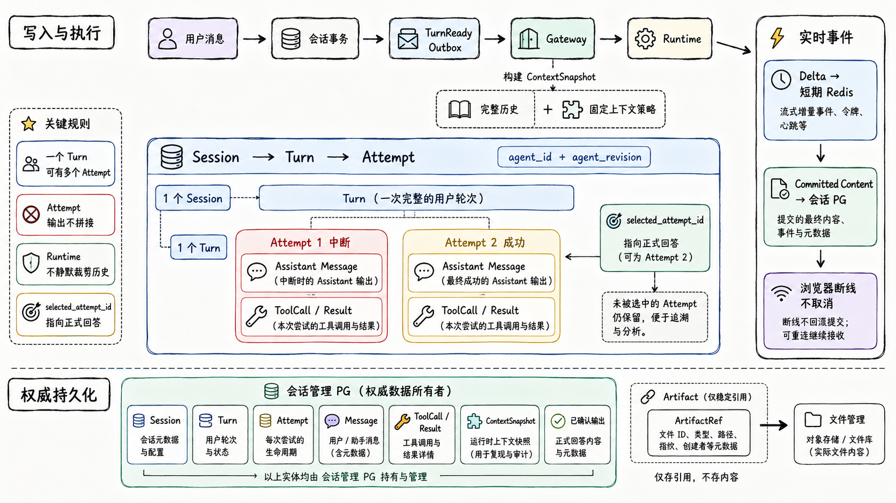

# 专题 02：Session、Turn 与 Context

主责：统一会话管理

共同评审：Agent Runtime Gateway、前端、CimiCode Runtime

总纲：[统一 Agent Runtime 与 Runtime Driver 技术方案](https://qcnlvgcw3j61.feishu.cn/wiki/DULPwNIfMisX3CkFdhKchMGon4c)

# 1\. 目标与边界

统一会话管理是对话业务事实的唯一权威来源。它保存 Session、Turn、Attempt、消息、结构化 Tool Call/Result、已确认输出和 ContextSnapshot，但不调度 Runtime、不操作 Sandbox、不保存文件二进制、S3 地址或高频 Token Delta。

# 2\. 专题总览图

讲这张图时先说明 Session 是长期会话容器，Turn 是一次用户意图，Attempt 是这次意图的具体执行尝试。一次 Turn 可以因为中断产生多个 Attempt，但它们的回答和 Tool 事件不能拼接，最终由 `selected_attempt_id` 选出正式回答。上半部分是可靠写入与执行链：用户消息、Turn 和 Outbox 在同一事务中产生，Gateway 构建 ContextSnapshot 后启动 Runtime；下半部分是权威持久化，所有可审计业务内容回到会话 PG。侧边实时事件说明 Delta 只服务体验，确认内容才是故障恢复边界。

负责人需要特别确认：消息水位与 ContextSnapshot Hash 是否可复现、乱序确认片段如何处理、浏览器断线为什么不会改变 Turn 生命周期，以及同一 Turn 多 Attempt 在查询 API 中如何呈现。

# 3\. 核心对象

|对象|语义|关键约束|
|---|---|---|
|Session|连续业务会话|创建时固定 `agent_id + agent_revision`|
|Turn|一次用户输入及回答过程|用户重试不复制输入|
|Attempt|同一 Turn 的一次执行尝试|输出互相隔离，成功项可被选中|
|Message|用户、Assistant 或系统可审计内容|单调 message sequence|
|ToolCall/Result|Runtime 的结构化工具事件|按 `tool_call_id` 关联|
|ContextSnapshot|某 Attempt 实际看到的上下文|不可变、带消息水位和 Hash|

Session 不保存 Runtime Replica 或 Sandbox Kubernetes 信息。可以保存 Artifact 稳定引用，但 Artifact 元数据和对象内容属于文件管理。

# 4\. Session 生命周期

创建 Session 时写入 `client_app_id/entrypoint/channel/created_by/agent_id/agent_revision`，不创建 Sandbox。Agent 新 Revision 只用于新 Session；安全禁用可以阻止已有 Session 的新 Turn，但不修改 Session 绑定版本。

软删除后禁止新 Turn，中断活动 Attempt，并通知 Gateway 启动 Sandbox 最终 Checkpoint 和销毁。个人网盘中用户主动保存的正式文件不随 Session 删除。

# 5\. Turn 与 Attempt 状态

一个 Turn 可有多个 Attempt，`selected_attempt_id` 指向正式回答。Attempt 产生的 Assistant Message、Tool 事件和确认输出不能与其他 Attempt 拼接。基础设施在模型执行前失败可保持原 Attempt；一旦产生确认内容或可能产生副作用，重试必须创建新 Attempt。

# 6\. Turn 创建事务

同一数据库事务必须完成：

1. 校验 Session 可写和请求幂等键。

2. 创建用户 Message。

3. 创建 `Turn=PENDING` 和第一个 Attempt 业务记录。

4. 写入 `TurnReady` Outbox。

5. 提交后立即返回 `202 + turn_id`。

Gateway 通过 Inbox 幂等消费 `TurnReady`。建议唯一键为 `(client_app_id, request_id)` 和 `turn_id`，防止前端重试产生重复 Turn。

# 7\. ContextSnapshot

完整历史必须长期保存在会话管理，用于审计、重新生成摘要、模型升级验证和用户回看；这不意味着每次把完整历史放进模型窗口。

Gateway 按固定 `context_policy_revision` 请求或生成 ContextSnapshot，快照至少包含：

|字段|说明|
|---|---|
|`context_snapshot_id`|不可变快照标识|
|`session_id/attempt_id`|所属会话和执行尝试|
|`through_message_seq`|覆盖到的消息水位|
|`selected_messages`|原文保留的消息和 Tool 事件|
|`summary_blocks`|对早期历史的结构化摘要|
|`omitted_message_ranges`|被省略的范围和原因|
|`attachment/artifact_refs`|当前上下文使用的稳定文件引用|
|`context_policy_revision`|选择、摘要和预算策略版本|
|`content_hash`|整份快照 Hash|

Runtime 只能使用 Gateway 传入的快照，不得自行查询完整历史或静默裁剪。仍超出模型窗口时返回 `CONTEXT_REDUCTION_REQUIRED`，由 Gateway 生成新快照并记录变更原因。

# 8\. 流式内容和持久化

`assistant_output_delta` 用于实时体验，写入短期事件流或 Redis，不进入长期业务表。Runtime 周期性发送 `assistant_content_committed`；Gateway 按 `(attempt_id, sequence)` 幂等提交确认片段。

发生 Runtime 故障时：

- 保留已经确认的内容；

- 丢弃未确认 Delta；

- Attempt 标记 INTERRUPTED；

- 前端展示“已中断，可重试”，不能将部分内容标记为完成；

- 用户重试创建新 Attempt，旧 Attempt 仍可审计。

# 9\. Tool 和 Artifact 引用

Tool Call 和 Tool Result 以结构化记录保存，至少包含 Tool Revision、参数摘要、执行目标、状态、开始/结束时间、结果引用和错误。大结果只保存文件管理的 `result_object_id` 与摘要，不复制二进制。

Assistant 最终消息保存结构化 `artifact_refs`，指向 ArtifactVersion 稳定 ID；不保存长期 S3 URL。Artifact 是否 AVAILABLE 由文件管理负责，消息可以在版本 UPLOADING 时先完成，但 UI 必须展示正确状态。

# 10\. 前端查询与事件

|接口|作用|
|---|---|
|`createSession`|创建固定 Agent Revision 的会话|
|`submitTurn`|幂等创建消息、Turn 和 Outbox|
|`getTurn`|返回 Turn、Attempts、选中回答和文件引用|
|`subscribeTurnEvents`|从指定 sequence 继续订阅|
|`cancelTurn`|记录取消意图并通知 Gateway|
|`retryTurn`|在原 Turn 下创建新 Attempt|

浏览器断线不取消 Turn。重连先读取权威 Turn/确认输出，再从短期事件水位补齐未完成的实时展示。

# 11\. 一致性和唯一键

- `UNIQUE(client_app_id, request_id)`：提交幂等。

- `UNIQUE(session_id, message_sequence)`：消息顺序。

- `UNIQUE(turn_id, attempt_number)`：Attempt 顺序。

- `UNIQUE(attempt_id, tool_call_id)`：Tool 关联。

- `UNIQUE(attempt_id, committed_sequence)`：确认内容去重。

- `UNIQUE(turn_id, attempt_id)`：最终提交幂等。

同一 Session 的 Turn 排他执行由 Gateway Lease 保证，会话管理仍应拒绝明显越序或已软删除 Session 的写入。

# 12\. 故障处理

|场景|处理|
|---|---|
|消息写入成功、Outbox 未投递|Outbox 重试|
|Gateway 重复消费|Inbox/Turn 唯一键去重|
|确认片段乱序|按 sequence 缓冲或拒绝缺口|
|最终提交重复|返回已提交结果|
|会话管理不可用|不启动新 Turn；运行结果持续重试提交|
|Context 过大|显式生成新快照，不让 Runtime 静默处理|

# 13\. 指标与验收

指标包括 Session/Turn 创建成功率、Outbox lag、Context 构建耗时、快照大小、确认内容提交延迟、Attempt 中断率和重试率。

验收至少覆盖：重复提交、乱序事件、Gateway 故障、Runtime 中断、部分输出、同一 Turn 多 Attempt、软删除恢复、超大历史摘要重建和 Artifact 状态变化。

# 14\. 对其他模块的要求

- Gateway 必须先取得 Session Lease 才能执行 Attempt。

- Runtime 必须发送结构化 Tool 事件和确认内容水位。

- 文件管理只通过稳定 ID 与会话关联。

- 前端不得以连接状态推断 Turn 终态。

# 15\. 负责人实施拆分

|工作包|最小交付物|完成标准|
|---|---|---|
|Session/Turn Schema|Session、Turn、Attempt、Message 表和状态约束|迁移、唯一键和软删测试通过|
|Transaction Outbox|TurnReady 事务写入、投递和重放|模拟宕机不存在丢任务窗口|
|ContextSnapshot|Policy 输入、摘要、消息水位和 Hash|相同输入产生可复现快照|
|Committed Output|确认片段幂等写、乱序和缺口处理|Runtime 中断只丢未确认 Delta|
|Query/Subscription|Turn 查询、多 Attempt 展示、重连水位|前端断线后状态一致|
|Retention/Audit|软删除、恢复、清理和审计导出|文件引用与会话状态不悬挂|

会话负责人应与 Gateway 共同冻结 TurnReady、AttemptResult 和 CommittedContent 三类写入契约，并给前端提供一张业务状态到 UI 文案的映射表。

