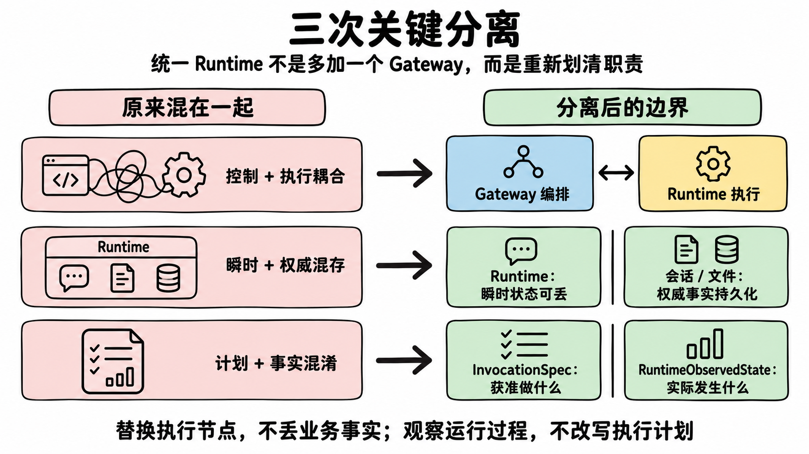
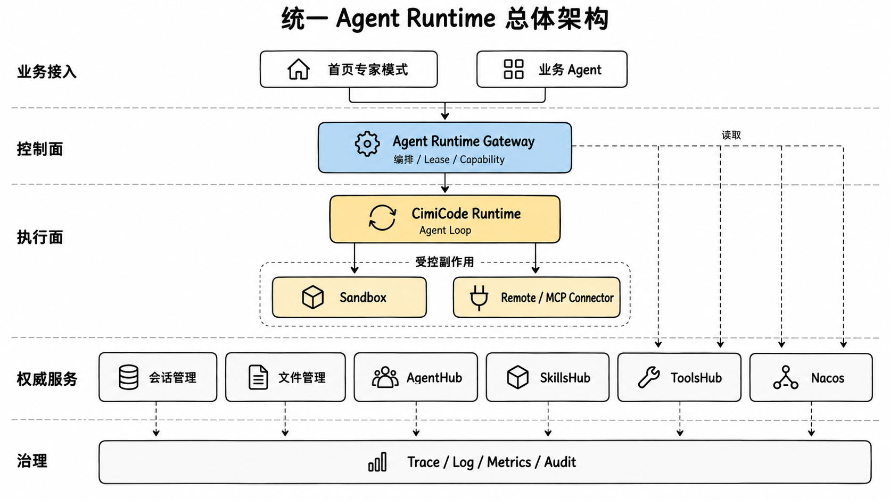
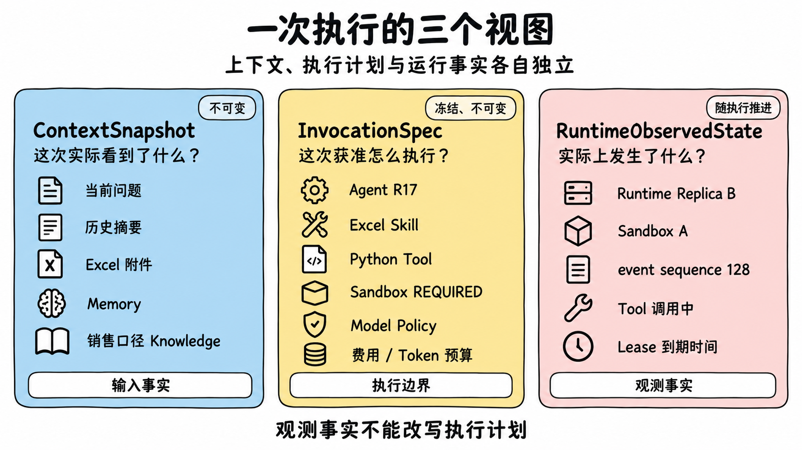
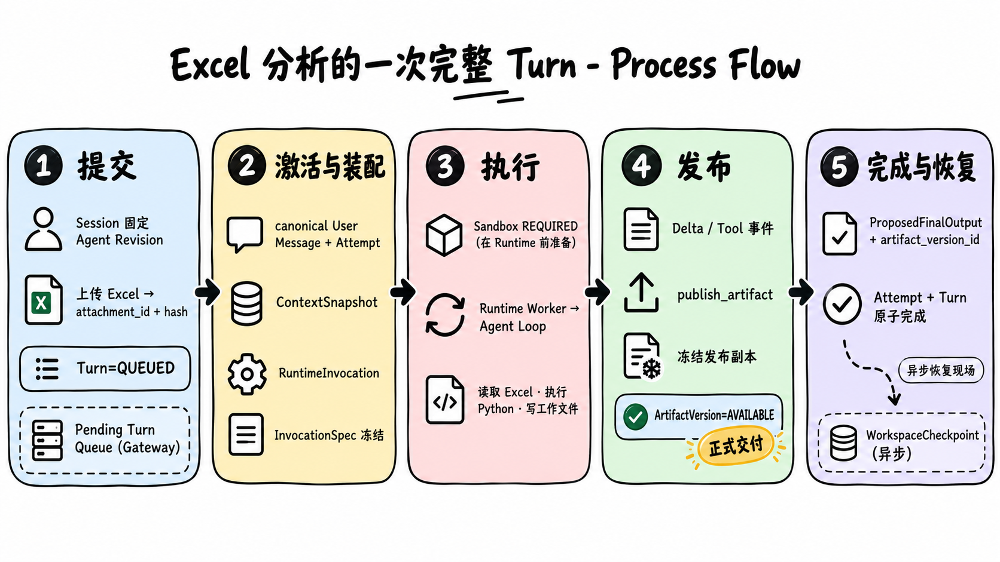
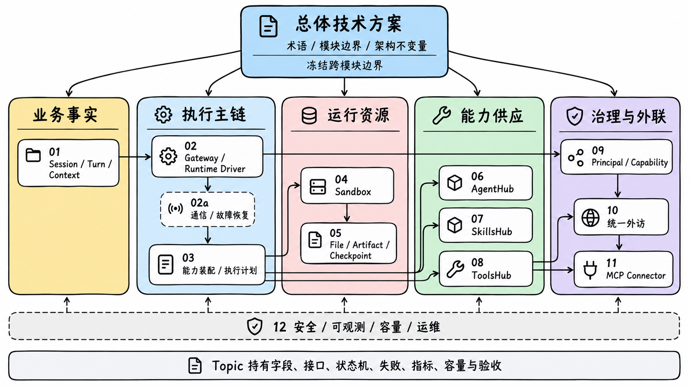
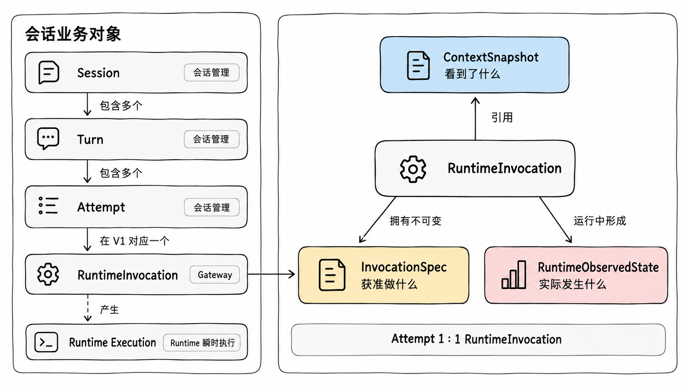
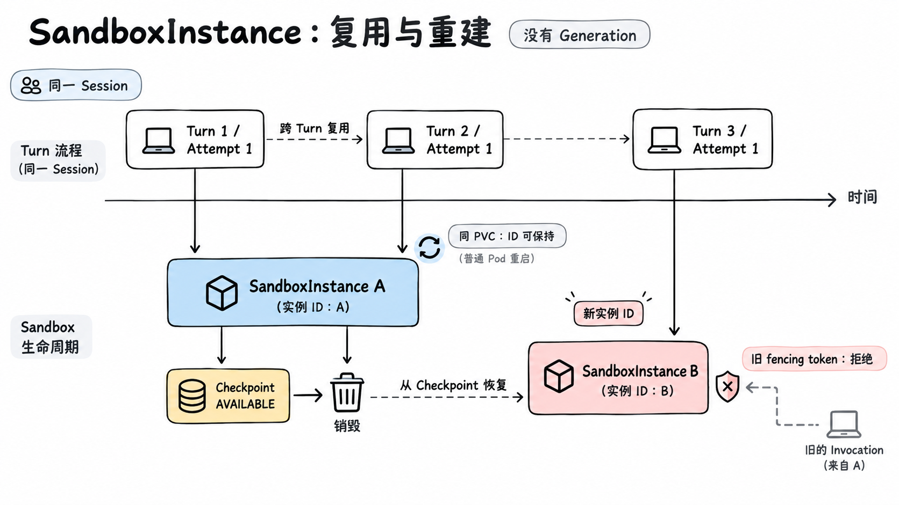
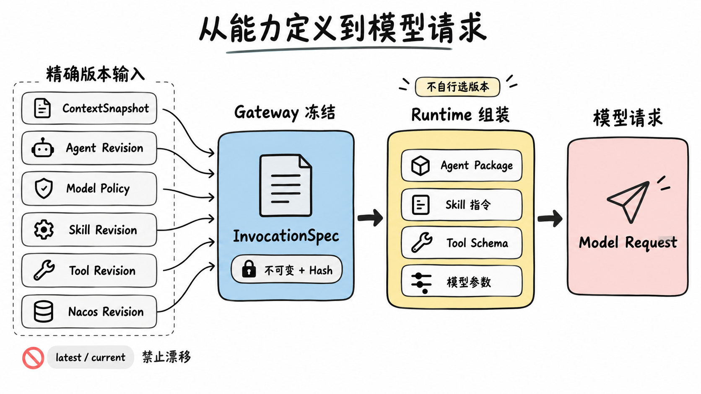
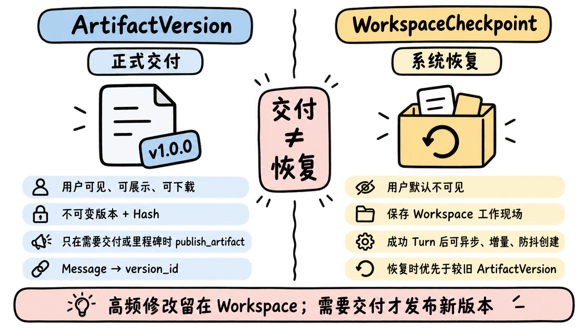
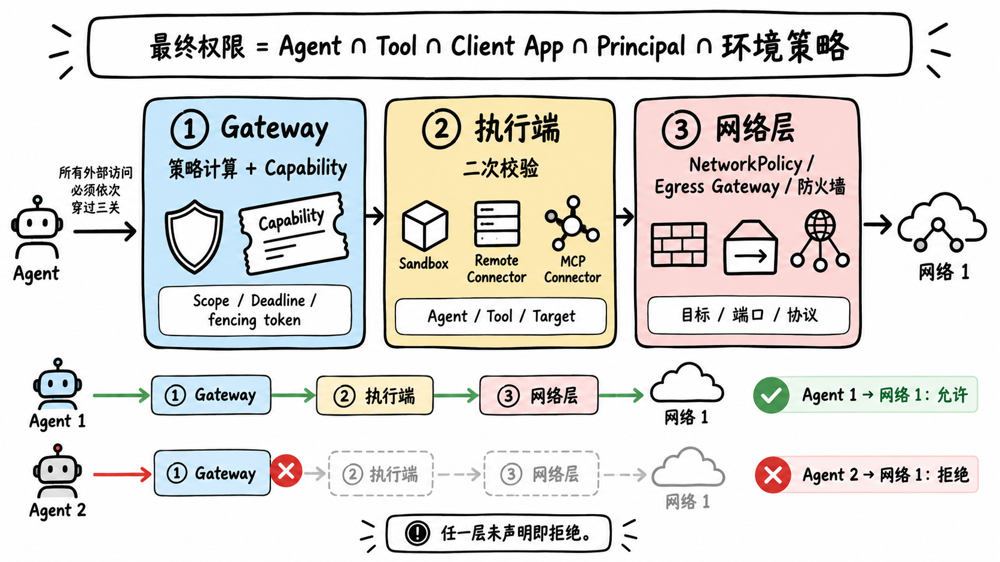

# 统一 Agent Runtime 与 Runtime Driver 技术方案

# 统一 Agent Runtime 与 Runtime Driver 技术方案

> 状态：总体技术方案重构稿，核心讲解与工程参考已合并，部分领域决策待专题确认
> 
> 日期：2026\-09\-10
> 
> 首个场景：首页问答专家模式改造及 CimiCode 状态外移
> 
> 会议讲解：统一 Agent Runtime 会议讲解导航
> 
> 详细设计：专题文档索引
> 
> 

## 1\. 文档定位

本文是统一 Agent Runtime 的架构总纲，负责说明：为什么要把状态从 CimiCode Runtime 中移出；Gateway、Runtime、Sandbox、会话、文件和能力服务如何协作；一次 Turn 如何从用户请求走到正式回答；哪些数据是权威事实；所有实现必须遵守哪些架构不变量和失败边界。

本文不重复维护完整表结构、协议 IDL、状态转换表、容量参数和故障注入用例。这些内容由对应 Topic 持有，详见专题文档索引。

文档权威规则：

1. 全局术语、模块边界和跨模块不变量以本文及根目录 `CONTEXT.md` 为准。

2. 数据字段、接口和内部状态机以该对象权威所有者的 Topic 为准。

3. Topic 不得改变本文中的核心对象语义；需要改变时先修改总纲。

4. 观测数据不是业务恢复真相，运行缓存也不是权威状态。

## 第一部分：总体方案讲解

### 2\. 为什么需要统一 Agent Runtime

#### 2\.1 要解决的问题

原有 CimiCode 更接近单实例、有状态的 Agent 应用：会话、上下文、执行状态和工作文件容易与具体 Runtime 进程绑定。平台化以后会产生四类问题：

- Session 需要粘性路由到原实例，难以横向扩展；

- Runtime Pod 故障可能同时影响执行和长期状态；

- Agent、Skill、Tool、配置与文件版本难以完整追溯；

- 权限、网络、审计、配额和故障恢复无法在平台层统一执行。

#### 2\.2 三次关键分离

这套设计的核心不是“增加一个 Gateway”，而是完成三次分离：

1. **控制面与执行面分离**：Gateway 编排，Runtime 执行。

2. **执行状态与业务状态分离**：Runtime 的瞬时状态可丢，Session、文件和执行事实外部持久化。

3. **执行决策与实际事实分离**：InvocationSpec 描述获准执行什么，RuntimeObservedState 记录实际上发生什么。



#### 2\.3 Agent Runtime 的组成

Agent Runtime 是平台级逻辑产品和治理边界，不是某个 Pod、Sandbox 或 Session。V1 包含两个核心主服务：

- **Agent Runtime Gateway**：统一业务入口和控制面。

- **CimiCode Runtime**：统一 Runtime Driver 的第一个执行实现。

Sandbox Service 是受控执行环境服务；Remote/MCP Connector 是外部能力执行服务。它们服务于 Runtime，但不拥有 Agent 的业务运行生命周期。

#### 2\.4 “Runtime 无状态”的准确含义

Runtime 无状态，是指 Runtime 不拥有跨 Turn 的权威状态。一次 Runtime Execution 内仍然可以有 Agent Loop 内存、模型请求上下文、Worker 临时 SQLite、流式事件缓冲和 Tool 调用中的瞬时状态。

这些状态只服务当前 Invocation。Invocation 结束后可以清理；下一个 Turn 不依赖原 Worker 或原 Runtime Replica。

#### 2\.5 V1 边界

- 首个 Runtime 类型为 `cimicode`，其他类型在真正接入并实现 Driver 契约时再定义。

- Session 创建时不创建 Sandbox，纯文本 Turn 可以全程无 Sandbox。

- V1 不恢复 PID、内存、Socket、后台进程、安装依赖和缓存。

- V1 不承诺回滚 Shell 或远程 Tool 已产生的外部副作用。

- MCP 首期只覆盖 Tool Discovery、Call、Result、Cancellation 和 Trace。

- Skill Package 首期固定使用对象存储，不建设 Community Skills 包生态。

- 首期只支持单地域、单 Kubernetes 逻辑集群内的多副本和故障接管。

### 3\. 用一句话讲清总体架构

> Gateway 决定一次 Agent 请求如何执行，Runtime 负责运行 Agent Loop，Sandbox 和 Connector 承担受控副作用，权威服务保存不能丢失的事实。
> 
> 



围绕这句话，可以把系统分成五层：

|层次|模块|对外讲解重点|
|---|---|---|
|业务接入|首页专家模式、其他业务 Agent|统一从 Agent Runtime Gateway 发起执行|
|控制面|Agent Runtime Gateway|鉴权、排队、装配、调度、Lease、Capability 和完成提交|
|执行面|CimiCode Runtime|组装模型请求，运行 Agent Loop，决定 Skill 激活和 Tool Call|
|受控副作用|Sandbox、Remote Connector、MCP Connector|执行代码、读写工作文件、访问外部系统|
|权威服务|会话、文件、AgentHub、SkillsHub、ToolsHub、Nacos|保存长期事实和不可变 Revision|

Trace、Log、Metrics、Audit、Metering 和告警横切所有层次，但观测数据不能代替业务权威状态。

### 4\. 各模块到底负责什么

#### 4\.1 Agent Runtime Gateway

Gateway 是控制面，不是模型代理或大文件代理。

它负责接收请求、鉴权、准入和幂等；按 Session 对 Turn 排队；请求 ContextSnapshot；冻结 InvocationSpec；调度 Runtime；编排 Sandbox；签发 Capability；把正式结果提交到权威会话记录。

它不执行模型和 Shell，也不保存完整文件内容。

#### 4\.2 CimiCode Runtime

Runtime 是执行面。它拿到 Gateway 已经冻结的执行要求后，创建 Invocation Worker，把 ContextSnapshot、Agent Package、Skill 指令、Tool Schema 和 Model Policy 组装成模型请求，并运行 Agent Loop。

Runtime 可以决定调用哪个已经获准的 Tool，但不能自行增加能力、读取完整会话历史，或者把精确 Revision 换成 `latest`。

#### 4\.3 Sandbox 与 Connector

Sandbox 用于执行不可信代码、读写工作文件和运行 Shell。它跨 Turn 可以复用文件现场，但不保证后台进程、PID、内存或 Socket 继续存活。

Remote Connector 和 MCP Connector 用于受控访问外部系统。真正产生副作用的执行端必须再次校验 Capability，不能只相信 Gateway 已经检查过。

#### 4\.4 权威服务与能力 Hub

|模块|保存或提供的核心内容|
|---|---|
|统一会话管理|Session、Turn、Attempt、Message、ContextSnapshot、确认输出、Artifact 引用|
|统一文件管理|InputAttachment、ArtifactVersion、WorkspaceCheckpoint 和对象内容|
|AgentHub|Agent Definition、不可变 Agent Revision 和能力绑定|
|SkillsHub|Skill Revision、指令、资源 Manifest 和不可变 Package|
|ToolsHub|Tool Schema、执行目标、权限、副作用和重试契约|
|Nacos|不含密钥的精确版本 Runtime 配置|
|Secret 管理|模型、业务连接和 MCP 的真实凭据|

### 5\. 先统一核心名词

```text
Session
└── Turn
    └── Attempt
        └── RuntimeInvocation
            └── Runtime Execution
```

|对象|最容易理解的解释|
|---|---|
|Session|用户与某个固定 Agent Revision 的连续对话|
|Turn|一次用户输入及其回答过程|
|Attempt|同一个 Turn 的一次具体回答尝试|
|RuntimeInvocation|Gateway 为 Attempt 创建的执行工单|
|Runtime Execution|Runtime 根据工单真正启动的 Worker 执行实例|

V1 中一个 Attempt 对应一个 RuntimeInvocation。用户重试产生新 Attempt 和新 Invocation；Gateway Replica 接管仍接管原 Invocation。

另外三个对象分别回答三个不同问题：

|对象|回答的问题|销售分析示例|
|---|---|---|
|ContextSnapshot|这次实际看到了什么|当前问题、历史摘要、Excel、Memory 和销售口径 Knowledge|
|InvocationSpec|这次获准怎么执行|R17 Agent、Excel Skill、Python Tool、Sandbox、模型与费用预算|
|RuntimeObservedState|实际发生了什么|运行在哪个 Replica、用了哪个 Sandbox、事件推进到哪里|



ContextSnapshot 与 InvocationSpec 都不可变。RuntimeObservedState 可以随着执行推进，但不能反向修改执行要求。

### 6\. 用一个完整 Turn 串起所有模块

假设用户上传 Excel，并要求生成销售分析报告：

1. Client App 请求 Gateway 创建 Session，会话管理固定 Agent Revision。

2. 用户把 Excel 上传到文件管理，得到稳定的 `attachment_id + hash`。

3. 用户提交 Turn；Gateway 创建 Admission，会话管理创建 `Turn=QUEUED`，Gateway 将其写入自己的 Pending Turn Queue。

4. 轮到执行时，会话管理创建 canonical User Message 和首个 Attempt，并把 Turn 置为 RUNNING。

5. Gateway 提供精确 Context Policy、模型预算和获准引用，会话管理构建 ContextSnapshot。

6. Gateway 解析 Agent、模型、Skill、Tool、配置和安全策略，创建 RuntimeInvocation 并冻结 InvocationSpec。

7. 本例必须读取 Excel，因此 Gateway 在 Runtime 启动前准备 SandboxInstance。

8. Runtime 创建 Worker，组装模型请求并运行 Agent Loop。

9. Runtime 通过 Sandbox 读取 Excel、执行代码并写工作文件。

10. Runtime 持续发送 Delta、CommittedContent 和结构化 Tool 事件。

11. 需要正式交付报告时，Runtime 调用 `publish_artifact`。

12. 文件管理从冻结发布副本创建不可变 ArtifactVersion，校验完成后进入 AVAILABLE。

13. Runtime 提交 ProposedFinalOutput 和确切 `artifact_version_id`。

14. Gateway 校验结果，会话管理原子完成 Attempt 和 Turn。

15. 成功完成后可以异步创建 WorkspaceCheckpoint，用于未来恢复工作现场。



这条链路中最重要的理解是：业务请求、执行工单、实际执行、正式文件交付和工作现场恢复是五类不同对象。

### 7\. 几个容易被追问的设计点

#### 7\.1 为什么 Session 创建时不直接创建 Sandbox

很多 Turn 只是“你好”或纯文本问答。Sandbox 分为 `NONE`、`OPTIONAL` 和 `REQUIRED`；只有确实需要代码、文件或资源型 Skill 时才准备，避免昂贵资源与每个 Session 一一绑定。

#### 7\.2 为什么 SandboxInstance 可以复用，却不恢复进程

跨 Turn 真正需要延续的是工作文件。恢复 PID、内存、Socket、后台进程和依赖缓存成本高、边界不稳定，也会把 Session 再次绑定到底层环境。

#### 7\.3 为什么会话管理保存 Artifact 引用

会话管理保存 Message 与确切 ArtifactVersion 的语义关系，才能在正确回答下展示文件，并让“继续修改刚才的报告”解析到明确版本。文件正文和对象位置仍由文件管理持有。

#### 7\.4 为什么不是每个 Turn 都发布 Artifact

高频修改留在 Workspace，通过 Checkpoint 保证可恢复。只有需要展示、下载、正式交付或保存里程碑时，才发布新的 ArtifactVersion。

#### 7\.5 网络隔离为什么不能只靠 Gateway

Gateway 负责策略计算和签发 Capability；Sandbox 或 Connector 负责再次校验；NetworkPolicy、Egress Gateway 和防火墙负责物理强制。任一层未明确允许就拒绝。

### 8\. 必须反复强调的架构不变量

1. Session 固定 Agent Revision，但不绑定 Runtime Replica。

2. 同一 Session 同时最多一个活动 Invocation。

3. Runtime 不拥有跨 Turn 的权威状态。

4. Gateway 不代理模型执行、大文件正文或 MCP 请求正文。

5. Sandbox 按需创建，可以跨 Turn 复用文件现场。

6. 环境完整重建产生新的 SandboxInstance ID，不使用 Sandbox Generation。

7. ArtifactVersion 用于正式交付，WorkspaceCheckpoint 用于工作现场恢复。

8. 可版本化输入必须使用精确 Revision 或 Hash。

9. InvocationSpec 不可变，运行事实不能改写执行计划。

10. Capability 必须由真正执行副作用的组件再次校验。

11. Secret 不进入 Prompt、日志或 InvocationSpec。

12. 每类权威数据只有一个所有者。

### 9\. 12 个 Topic 如何承接总体方案

总纲回答“系统为什么这样拆、完整流程如何运转、哪些原则不能破坏”。12 个 Topic 分别补齐模块的数据结构、接口、状态机、幂等、失败语义、指标、容量和验收。

Topic 采用同一评审方式：先讲现有模型，用具体场景挑战，一次确认一个关键决定，再更新领域词汇、总纲和受影响文档。



## 第二部分：总体架构工程参考

### 10\. 核心领域语言

#### 10\.1 从 Session 到 Runtime Execution

```text
Session
  └── Turn
       └── Attempt
            └── RuntimeInvocation
                 └── Runtime Execution
```

|对象|含义|权威所有者|
|---|---|---|
|Session|用户与某个固定 Agent Revision 的连续业务会话|统一会话管理|
|Turn|一次用户输入及其回答过程|统一会话管理|
|Attempt|同一 Turn 的一次具体回答尝试|统一会话管理持有业务状态|
|RuntimeInvocation|Gateway 为某次 Attempt 创建的执行工单|Agent Runtime Gateway|
|Runtime Execution|Runtime 根据 Invocation 创建的实际 Worker 执行实例|Runtime 瞬时持有，Gateway 记录关键事实|

V1 中，一个 Attempt 对应一个 RuntimeInvocation。Session 创建时固定不可变 Agent Revision，升级或回滚通过新建 Session 生效。用户重试不会创建新 Turn，而是复用同一用户消息并创建新的 Attempt 和 RuntimeInvocation。

Gateway 故障接管不会创建新 Attempt 或 Invocation；新的 Gateway Replica 接管原 Invocation。Runtime 已开始执行后发生不可安全恢复的故障，则当前 Attempt 中断，用户重试时才创建下一 Attempt。

#### 10\.2 三个容易混淆的对象

|对象|回答的问题|特性|
|---|---|---|
|ContextSnapshot|这次 Attempt 实际看到了什么上下文|不可变，正文由会话管理保存|
|InvocationSpec|这次获准以什么版本、能力、资源和预算执行|不可变，由 Gateway 冻结|
|RuntimeObservedState|实际在哪里、使用什么环境、执行到了哪里|单调推进，由 Runtime 上报、Gateway 持久化|

`InvocationSnapshot`、`RuntimeExecutionSnapshot` 和 `ExecutionSnapshot` 不再作为正式领域名称。

RuntimeInvocation 也不等于 ContextSnapshot 与 InvocationSpec 的简单相加：

```text
RuntimeInvocation
  ├── 引用 ContextSnapshot
  ├── 拥有一个不可变 InvocationSpec
  ├── 调度后产生 Runtime Execution
  └── 运行中形成 RuntimeObservedState
```



#### 10\.3 权威会话记录

权威会话记录（canonical conversation）是平台正式承认、可用于历史查询、上下文构建、恢复和异步后处理的会话事实。它包含用户消息、被确认的 Assistant 内容、结构化 Tool 事件和正式 Artifact 引用，不等于 Runtime 产生的全部 Token Delta。

同一 Turn 存在多个 Attempt 时，会话管理保留各次尝试，并以 `selected_attempt_id` 指向正式采用的回答。

#### 10\.4 SandboxInstance

SandboxInstance 是为某个 Session 创建的一次具体 Sandbox 执行环境：

- 同一 PVC 上的 Pod 重启可保持原 `sandbox_instance_id`；

- 环境销毁后从 Checkpoint 完整重建，必须创建新的 `sandbox_instance_id`；

- Session 可跨 Turn 复用仍存活的 SandboxInstance；

- 新 Attempt 通常继续使用当前 SandboxInstance，不因重试而重建；

- Session 的长期连续性由会话状态与 Checkpoint 保证，不由 Sandbox ID 永久不变保证。

本方案不再使用 Sandbox Generation。旧 Invocation 的写入由执行 Lease、Capability 和 fencing token 拒绝；旧 Sandbox 生命周期事件通过不同的 `sandbox_instance_id` 隔离。



### 11\. 总体架构与模块边界

#### 11\.1 业务入口

首页专家模式和其他业务 Agent 都以 Client App 身份接入同一套 Gateway API。业务应用负责交互与场景规则，Gateway 负责通用的 Session、Turn、调度、执行和治理语义。

领域流程上先创建 Session，再提交 Turn：

```text
createSession
→ 上传并确认附件（可选）
→ submitTurn
→ 查询或订阅 Turn 事件
```

产品 API 可以提供“首次发消息时隐式创建 Session”的便捷封装，但不能混淆 Session 与 Turn 的领域身份。

#### 11\.2 Agent Runtime Gateway

Gateway 是控制面。它负责请求鉴权、准入、幂等和配额；预分配 turn\_id 并维护 TurnAdmission；调用会话管理创建 QUEUED Turn；按 Session 持久排队并串行激活；向会话管理请求并引用 ContextSnapshot。

Turn 激活后，Gateway 解析 Session 固定的 Agent Revision 以及模型、Skill、Tool、配置、Sandbox 和安全策略；创建 RuntimeInvocation 并冻结 InvocationSpec；选择 Runtime Replica；编排 SandboxInstance；签发 Capability；维护 Lease；接收 Runtime 事件；将正式结果提交到权威会话记录。

Gateway 不执行模型和 Shell，不保存完整文件内容，也不转发大文件或 MCP 请求正文。

#### 11\.3 CimiCode Runtime

CimiCode Runtime 是 `runtime_type=cimicode` 的 Runtime Driver 实现。Runtime Pod 作为 Supervisor 管理多个隔离的 Invocation Worker。Worker 负责：

- 校验 InvocationSpec 和 Driver 协议；

- 读取精确版本的 Runtime 配置并校验 Hash；

- 将确定的上下文、Prompt、Skill 指令和 Tool Schema 组装成模型请求；

- 运行 Agent Loop 和模型调用；

- 决定 Skill 激活和 Tool Call；

- 缺少 Sandbox 时请求资源并挂起当前 Invocation；

- 发送带连续 sequence 的输出、Tool、资源和终态事件；

- 响应取消、Lease 撤销和 Gateway 重连。

Runtime 不决定历史消息选择，不直接读取会话管理、AgentHub、SkillsHub 或 ToolsHub，也不持有 Sandbox 管理员权限。

#### 11\.4 Sandbox Service

Sandbox Service 创建和管理实际 Pod、PVC、运行用户、资源限制、进程组、文件物化和网络策略。它提供受控的 Execute、Read、Write、Snapshot 和 Materialize 能力，并在每次操作时校验 Capability、当前 Invocation 和 fencing token。

Sandbox 复用的是文件现场，不是后台进程。Turn 完成、中断、取消或执行权撤销后，该 Invocation 的进程必须被清理。

#### 11\.5 权威服务与能力服务

|服务|核心职责|明确不负责|
|---|---|---|
|统一会话管理|Session、Turn、Attempt、消息、ContextSnapshot、确认输出和 Artifact 引用|Runtime 调度、文件正文、Sandbox 基础设施|
|统一文件管理|InputAttachment、Artifact、ArtifactVersion、WorkspaceCheckpoint 和对象引用|Agent Loop、对话正文|
|AgentHub|Agent 定义、不可变 Revision 及其能力绑定|执行 Agent、保存调用结果|
|SkillsHub|Skill Revision、指令、资源 Manifest 和 Package 引用|决定候选 Skill 是否在本 Turn 激活|
|ToolsHub|Tool Catalog、Schema、执行目标、权限、副作用和重试契约|保存某次 Tool Call 结果和真实 Secret|
|Nacos|不含密钥的精确版本 Runtime 配置|Session 状态和 Secret|
|Secret 管理|模型、业务连接和 MCP 凭据|把 Secret 注入 Prompt、日志或执行计划|

#### 11\.6 治理面

安全、审计、Trace、日志、指标、计量、限流和告警横切整个执行链路。治理系统可以消费运行事实，但不能取代会话、文件和 Gateway 数据库成为恢复真相。

### 12\. 权威状态与数据流

#### 12\.1 权威状态归属

|权威所有者|持有的事实|
|---|---|
|统一会话管理|Session、QUEUED Turn 及其不可变输入、Attempt、Message、Tool Call/Result、ContextSnapshot、确认输出、Message 与 ArtifactVersion 的语义关联|
|Gateway PostgreSQL|TurnAdmission、Pending Turn Queue、RuntimeInvocation、InvocationSpec、RuntimeObservedState、Lease、事件 Inbox、Session 当前 SandboxInstance 指针|
|统一文件管理与对象存储|InputAttachment、Artifact、ArtifactVersion、WorkspaceCheckpoint、Manifest 和对象内容|
|AgentHub|Agent Definition、Agent Revision 和能力绑定引用|
|SkillsHub|Skill Revision、指令、资源 Manifest、审核状态和 Package 引用|
|ToolsHub|纳管 Tool 的 Revision、Schema、执行目标、权限和重试语义|
|Nacos / Secret|精确配置 Revision 和真实凭据|

任何 Runtime Replica、Gateway 进程或 Sandbox Pod 都可以被替换；权威状态不能依赖其本地磁盘。

#### 12\.2 四类数据流

- **控制流**：Gateway 驱动调度、资源、取消和完成；

- **模型与 Tool 执行流**：Runtime 运行 Agent Loop 并决定 Tool Call；

- **大文件数据流**：Sandbox、Connector、对象存储和文件管理直接传输；

- **权威状态流**：会话管理和 Gateway DB 保存可恢复事实。

它们不能被实现成一条由 Gateway 同步转发所有正文的 RPC 长链。

### 13\. Agent 能力装配与模型请求

#### 13\.1 装配输入

Gateway 为每个 Attempt 读取 Session 固定的 Agent Revision，并解析当前 Turn、ContextSnapshot、Model Policy、Skill/Tool Revision 或内置能力 Manifest、Nacos 配置、Sandbox Profile、External Access、Identity、Capability Policy 以及执行预算。

所有可版本化输入都使用精确 Revision 或 expected hash，禁止在同一次装配中读取 `latest/current`。

#### 13\.2 InvocationSpec

```text
InvocationSpec
  identity       invocation/session/turn/attempt/trace
  caller         principal/delegation/client app
  agent          agent revision/runtime type/driver protocol
  context        context snapshot/input/attachment/artifact refs
  model          model policy/budget
  skills         active and candidate skills
  tools          resolved tools
  configuration  exact config refs and hashes
  resources      sandbox requirement/profile/restore intent
  external       external access policy and target scopes
  security       capability templates
  limits         deadline/tool/output limits
  integrity      schema version and plan hash
```

InvocationSpec 不包含动态 Runtime Replica、真实 Secret、临时 URL、可写本地路径和实际 SandboxInstance ID。运行中才确定的事实进入 RuntimeObservedState。

#### 13\.3 模型策略与模型请求

Model Policy 可以表达默认模型、允许集合、fallback、参数、上下文与输出上限、费用预算和数据使用约束。Agent 配置页选择单一模型时，也应生成一个简单且可版本化的 Model Policy。

“Runtime 准备模型上下文”统一改称“Runtime 组装模型请求”：

```text
ContextSnapshot       决定模型看到哪些会话内容
Agent Package         提供 System Prompt 等 Agent 指令
Skill instructions    提供本次激活的能力说明
Resolved Tools        提供允许暴露给模型的 Tool Schema
Model Policy          决定模型选择、参数和预算
Nacos config          提供 Runtime 精确运行配置
Secret                由执行环境注入调用凭据
```

Gateway 决定和冻结输入，Runtime 负责适配具体模型协议，不能自行更换 Revision 或静默裁剪历史。



#### 13\.4 Agent Package 的后续扩展

对于文件化 Agent，Agent Revision 后续需要从单一 `system_prompt_revision` 扩展为不可变 Package Manifest，以表达 `AGENTS.md`、`Soul.md` 和其他运行资源的路径、语义角色与内容 Hash。平台不应要求所有 Runtime 都理解 `Soul.md`；具体解释由对应 Runtime Driver 完成。

SubAgent 需要独立定义角色、能力子集、模型策略、并发、深度、预算、Delegation 和父子 Invocation/Trace 关系，不应只作为 Prompt 中的隐式文本。本项后置到 Agent 能力装配专题继续设计。

### 14\. 一次完整 Turn

以下以“用户上传 Excel，并要求生成报告”为例。

> 原 32 号讲解图仍包含“激活时创建 Turn”的旧标签，待按更新后的图片 prompt 重新生成；当前以上述 sequence diagram 为准。
> 
> 

#### 14\.1 关键 ID

|ID|作用|
|---|---|
|request\_id|Client App 提供的提交幂等键|
|turn\_id|一次用户输入和回答过程|
|attempt\_id|同一 Turn 的第几次回答尝试|
|invocation\_id|Gateway 为某次 Attempt 创建的执行工单|
|runtime\_execution\_id|Runtime 内实际 Worker 执行实例|

#### 14\.2 Sandbox 按需创建

```text
NONE      已知不需要或不允许 Sandbox
OPTIONAL  启动时不创建，运行中可能请求
REQUIRED  Runtime 启动前必须 Ready
```

|场景|建议结果|
|---|---|
|“你好”或纯文本问答|NONE|
|必须处理原始附件|REQUIRED|
|用户明确继续编辑 Workspace 文件|REQUIRED|
|已激活资源型 Skill|REQUIRED|
|只有可选 Sandbox Tool 或自动候选资源 Skill|OPTIONAL|

OPTIONAL 模式下，Runtime 先以无 Sandbox 方式启动。第一次真实需要 Sandbox 时发送 ResourceRequired；Gateway 准备资源后通过 ResourceReady 恢复同一个 Invocation，不创建新 Turn、Attempt 或 Invocation。

#### 14\.3 重试

Runtime 故障不等于 Sandbox 故障。当前 Attempt 中断后，新 Attempt 通常继续使用原 SandboxInstance：

```text
Attempt 1 / Invocation 1 / fencing 7 → INTERRUPTED
Attempt 2 / Invocation 2 / fencing 8 → 复用当前 SandboxInstance
```

旧 Worker 的 Lease 失效；Sandbox 和各 Tool 执行端拒绝旧 fencing token。只有 Sandbox 环境本身被销毁或不可恢复时，才从最新 Checkpoint 创建新的 SandboxInstance。

### 15\. 文件、Artifact 与 WorkspaceCheckpoint

#### 15\.1 三类文件对象

|对象|用途|用户可见|是否不可变|
|---|---|---|---|
|InputAttachment|用户作为消息输入上传的文件|是|是|
|ArtifactVersion|Agent 正式交付给用户的文件版本|是|是|
|WorkspaceCheckpoint|Sandbox 工作目录恢复点|否|是|

InputAttachment 是文件管理中的稳定对象和内容 Hash 引用，不是长期 S3 URL。下载或物化时才签发短期凭据。

#### 15\.2 会话为什么保存 Artifact 引用

统一会话管理保存 Message、Tool Result 与确切 ArtifactVersion 的语义关联，用于：

1. 前端在对应历史回答下展示正确的文件卡片；

2. 后续 Turn 将“刚才的报告”解析到明确的 Artifact 和版本；

3. 多个 Attempt 存在时，只把正式采用的产物显示为回答结果；

4. 历史回答始终引用当时交付的版本，不随 `latest_version_id` 漂移。

文件内容、对象位置和完整生成血缘仍由文件管理持有。Artifact 是 Session 下的逻辑文件；每个 ArtifactVersion 通过 `source_invocation_id` 关联产生它的 Turn 和 Attempt。

#### 15\.3 publish\_artifact

`publish_artifact` 把 Workspace 中的工作文件转换成用户可见的不可变版本：

```text
受管源路径
→ 短暂阻止相关写入
→ 通过快照、reflink 或复制形成不可变 staging
→ 上传对象存储
→ 校验对象、Hash、大小、归属和 Capability
→ 原子创建 AVAILABLE ArtifactVersion
```

“冻结”是形成内容不再变化的发布副本，不是永久锁定 Workspace 工作文件。具体采用文件系统快照、reflink 还是复制由 Sandbox/File Topic 确定。

不要求每个 Turn 都调用 `publish_artifact`。高频修改由 Workspace 和 Checkpoint 保证耐久性；只有需要展示、下载、明确交付、保存里程碑或更新已交付文件时才发布新 ArtifactVersion。

如果修改后没有发布，用户下载到的仍是上一正式版本，产品应把当前状态表达为未发布工作副本，不能声称“更新后的文件已经可以下载”。

#### 15\.4 WorkspaceCheckpoint

Checkpoint 保存 `/workspace/work` 和 `/workspace/artifacts` 的受管文件状态，不保存附件副本、Skill Package、缓存、日志、PID、内存和 Socket。

成功 Turn 后可以异步创建增量 Checkpoint 并对连续短 Turn 防抖；Sandbox 销毁前必须完成最终对账。Checkpoint 只有在对象上传、Manifest 和 Hash 校验全部完成后才成为 `AVAILABLE`。

恢复新 SandboxInstance 时：

1. 创建新的 Pod、PVC 和网络策略；

2. 恢复最新 AVAILABLE Checkpoint；

3. 应用 Manifest 中的新增、修改和删除；

4. 物化当前 Turn 的 InputAttachment；

5. 仅在工作副本缺失或用户明确指定时物化 ArtifactVersion；

6. 物化激活 Skill 的资源；

7. 校验 Hash、Profile 和 Exec API 后进入 READY。

Checkpoint 代表最新工作现场，优先于较旧的已发布 ArtifactVersion，避免恢复时用旧交付版本覆盖尚未发布的新修改。



### 16\. Lease、Capability 与网络隔离

#### 16\.1 三类 Lease

|Lease|保证|到期结果|
|---|---|---|
|Session Execution Lease|同一 Session 最多一个活动 Invocation|当前 Invocation 失去执行权|
|Controller Lease|同一 Invocation 只有一个 Gateway Replica 协调|其他 Gateway 可以接管|
|Runtime Execution Lease|Worker 只在有效期内运行|Runtime 停止 Agent Loop 和新 Tool Call|

Gateway 接管提升 `controller_epoch`；新 Invocation 获得执行权时提升 fencing token。Controller Epoch 防止旧 Gateway 控制当前 Invocation，fencing token 防止旧 Invocation 继续写 Sandbox 或产生新副作用。

#### 16\.2 Capability

Gateway 根据 InvocationSpec 中的能力模板签发短期、可收窄的 Capability。Capability 至少绑定主体、Agent、Session、Attempt、Invocation、资源或 Tool、Scope、Deadline 和 fencing token。

Sandbox、Remote Connector、MCP Connector 和其他执行端必须独立校验 Capability，不得接受超出 InvocationSpec 的动态扩权。

#### 16\.3 网络隔离

业务外访采用三层控制：

```text
Gateway 策略计算和 Capability 签发
→ 执行端再次校验 Agent/Tool/Target/Scope
→ NetworkPolicy、Egress Gateway、防火墙和路由强制隔离
```

最终允许范围取 Agent、Tool、Client App、Principal/Delegation、环境和紧急禁用策略的交集，任一层未声明即默认拒绝。

Sandbox 中的用户代码通过 Sandbox NetworkPolicy 和统一出口访问获准目标；Remote/MCP Tool 由对应 Connector 在受控网络区域执行。Runtime 不得借模型调用网络直接访问业务目标。

允许访问某个 Network Zone 不等于允许访问该区域全部主机。策略必须尽量绑定精确目标、端口、协议、TLS 身份和 DNS/重定向规则。



### 17\. Tool 与外部能力

|执行位置|示例|
|---|---|
|Runtime 内置|无外部 I/O 的纯计算或 Runtime 固有能力|
|Sandbox|Shell、文件读写、代码执行|
|平台服务|publish\_artifact、知识检索|
|Remote Connector|受控业务 API|
|MCP Connector|已审核 MCP Tool|

所有模型可调用 Tool 都必须在 InvocationSpec 中明确列出，并具有可验证的 Schema、权限、副作用、超时和重试语义。

ToolsHub V1 是否只管理 remote/MCP，还是统一保存全部模型可见 Tool 的 Revision，尚未确认。无论采用哪种方案，Runtime 内置 Tool 和平台 Tool 都不能成为绕过 Capability、Sandbox、网络或审计的后门。

MCP Tool 的发现由控制面执行并形成经过审核的不可变 Revision；Runtime 不得在执行中调用 `tools/list` 动态扩大能力。MCP 请求正文直接在 Runtime 与 Connector 之间流转，Gateway 只负责计划、授权和结构化事件。

### 18\. 故障语义与架构不变量

#### 18\.1 失败分类

- 排队或 Runtime 无槽：基础设施重试，不增加 Attempt。

- Gateway Replica 故障：其他 Gateway 接管同一 Invocation。

- Runtime Pod 故障：当前 Attempt 中断；已确认内容和持久状态保留。

- SandboxInstance 丢失：当前 Attempt 中断；下一 Attempt 从最新 Checkpoint 创建新实例。

- 查询型或明确幂等 Tool：在 Deadline 和次数内安全重试。

- 外部副作用结果未知：不自动重放，Attempt 中断或交给用户决策。

- Artifact 发布失败：不创建 ArtifactVersion，不允许声称文件已交付。

- 会话最终提交失败：RuntimeInvocation 保持 COMPLETING 并幂等重试，Turn 仍为 RUNNING，不能先向用户宣布完成。

- Trace、评测或常规计量失败：异步补偿，不阻塞普通 Turn。

#### 18\.2 架构不变量

1. Session 创建时固定 Agent Revision、生命周期内不原地换绑，但不绑定 Runtime Replica；相邻 Turn 可以由不同 Runtime 执行。

2. 同一 Session 同一时间最多一个合法活动 Invocation。

3. Runtime 不拥有跨 Turn 权威状态。

4. Gateway 是控制面，不是大文件和 MCP 正文的数据代理。

5. Session 创建时不创建 Sandbox，Sandbox 按结构化事实或运行中请求按需准备。

6. 新 Attempt 不等于新 SandboxInstance；只有环境完整重建才创建新实例 ID。

7. Artifact 是用户交付版本，Checkpoint 是系统恢复点。

8. 所有可版本化定义使用精确 Revision 和 Hash。

9. InvocationSpec 不可变，实际运行事实不得反向改写执行计划。

10. 失败不能导致不安全的外部副作用重放。

11. Secret、Capability、临时 URL 和二进制正文不得进入 Prompt 或普通 Trace。

12. 每一种权威数据只有一个所有者。

### 19\. 专题文档与后续评审顺序

|顺序|Topic|需要解决的核心问题|
|---|---|---|
|1|01 Session、Turn 与 Context|Session/Turn/Attempt、上下文和权威提交|
|2|02 Gateway 与 Runtime Driver \+ 02a 通信与故障恢复|Invocation、Lease、Driver、事件和接管|
|3|03 能力装配与执行计划|InvocationSpec、Model、Skill、Tool 和策略装配|
|4|04 Sandbox 生命周期|SandboxInstance、按需创建、回收和恢复|
|5|05 文件、Artifact 与 Checkpoint|附件、工作副本、发布版本和恢复点|
|6|06 AgentHub 与 Agent Revision|Agent Package、模型、Runtime 和策略绑定|
|7|07 SkillsHub|Skill 指令、资源包、激活和供应链|
|8|08 ToolsHub|Hub 范围、内置 Tool、remote/MCP 和统一执行契约|
|9|09 Principal、Delegation 与 Capability|信任链、能力签发、传播和撤销|
|10|10 外部访问与网络隔离|应用授权、执行端校验和网络强制隔离|
|11|11 MCP Connector|Discovery、调用、身份、重试和大结果|
|12|12 安全、可观测、容量与运维|跨模块上线 Gate|

每个 Topic 采用同一评审循环：讲解现有模型、提出具体场景、确认领域决定、更新词汇表和 Topic、同步受影响总纲，最后补齐接口、失败、指标和验收。

### 20\. 待确认决策

以下问题不能在重构时静默决定，应在对应 Topic 中确认：

1. **ToolsHub 范围**：V1 是否只管理 remote/MCP Tool；Runtime、Sandbox 和平台内置 Tool 的定义、版本与治理由谁持有。

2. **Agent Package**：`AGENTS.md`、`Soul.md` 和其他文件化配置如何进入不可变 Agent Revision。

3. **SubAgent**：声明、能力继承、调度、预算、Delegation 和父子 Invocation 模型。

4. **SandboxInstance 底层身份**：同一 PVC 上 Pod 重建是否保持实例 ID，以及 Sandbox Service 如何暴露基础设施 UID 和 CAS 版本。

### 21\. 配图计划

技术精确关系继续使用 Mermaid 作为可维护的真相源。Notion 手绘风格图片只用于宣讲和帮助理解，不承载字段、协议或细粒度状态。

正文稳定后按以下顺序重新生成配图：总体架构全景；核心对象关系；一次完整 Turn；SandboxInstance 与 Checkpoint；Artifact 发布和版本关系；Agent 能力装配；Capability 与网络隔离。

旧图中凡是出现 Sandbox Generation、每 Turn 创建 Sandbox、Runtime 自主读取业务状态或 `ExecutionSnapshot` 的内容，均不得继续作为当前方案依据。

